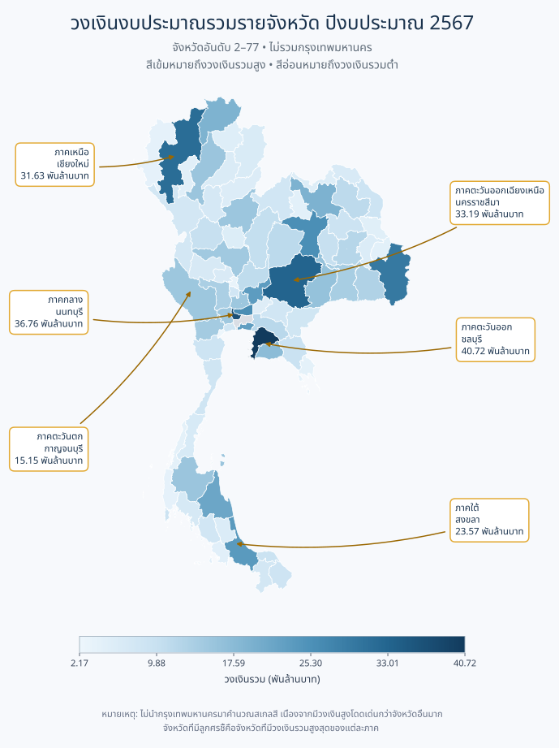
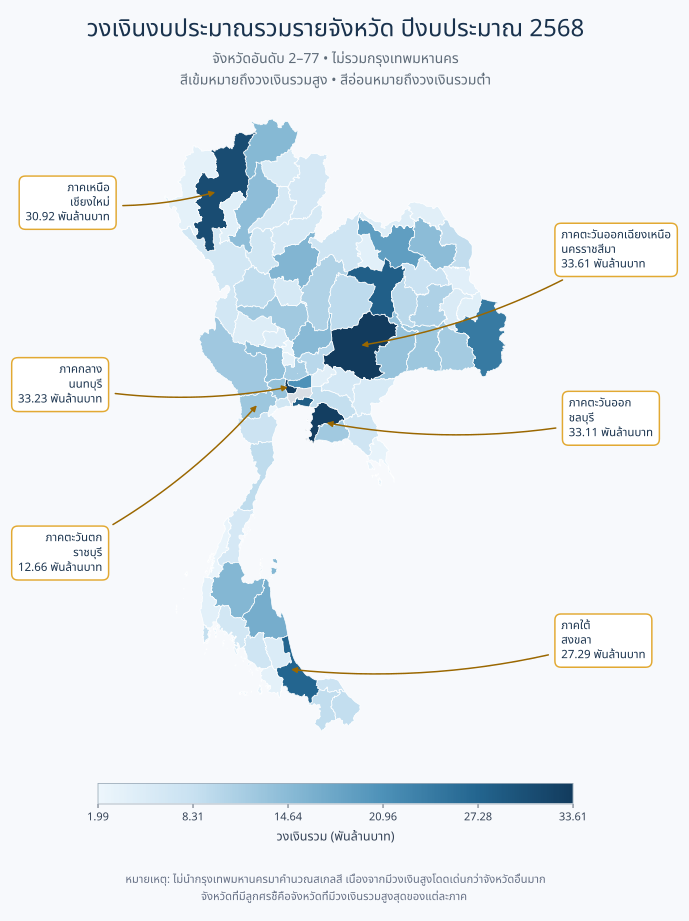
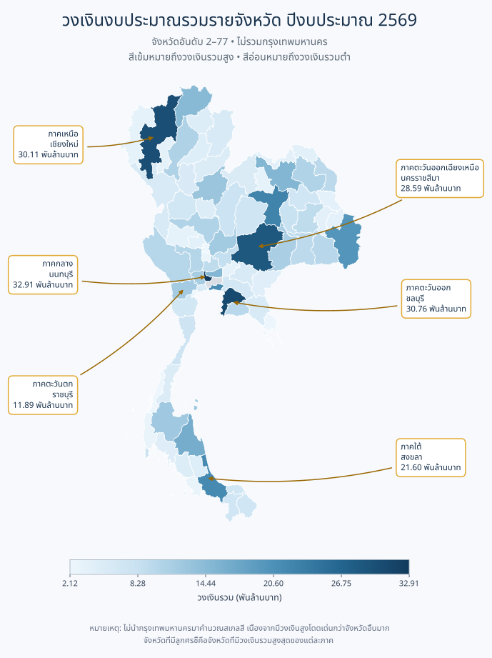
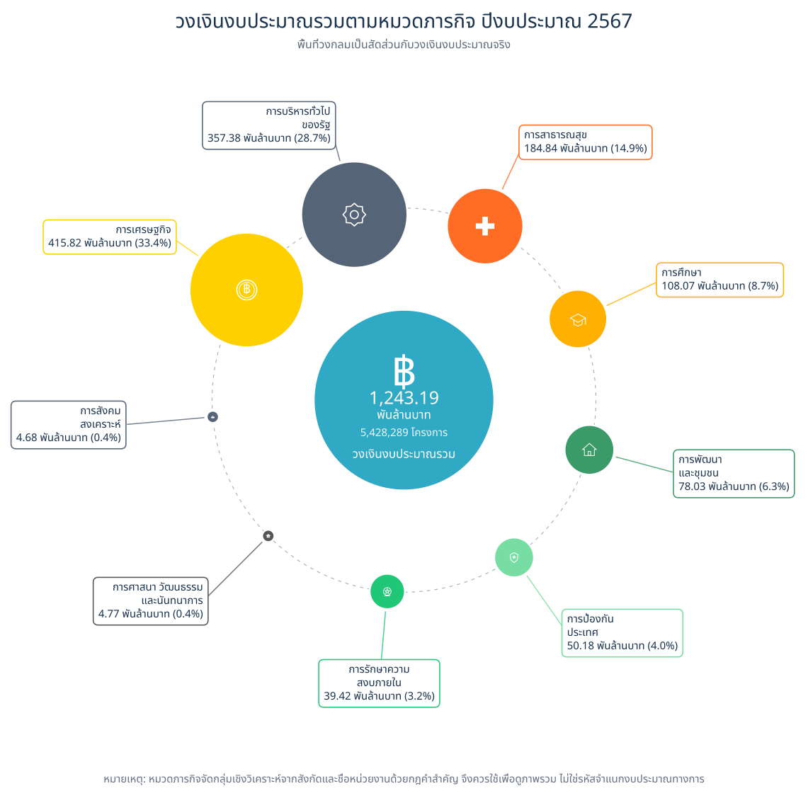
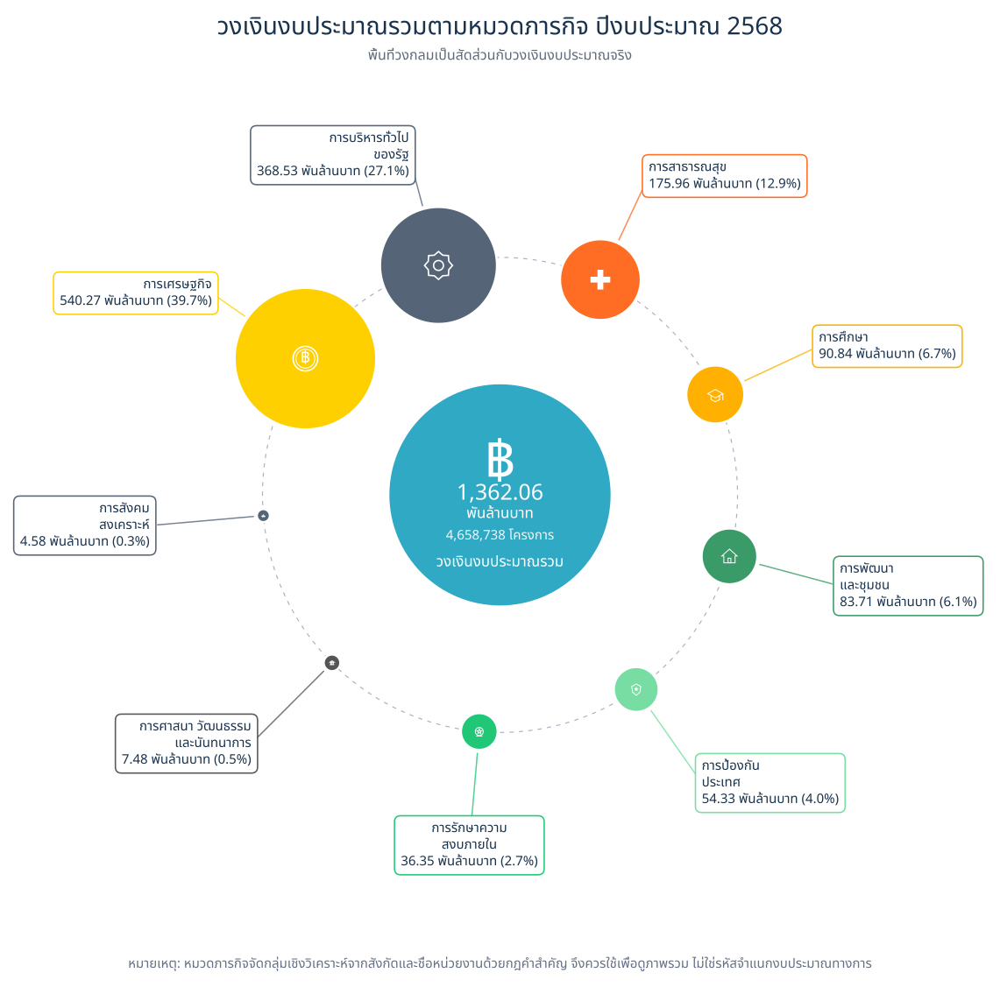
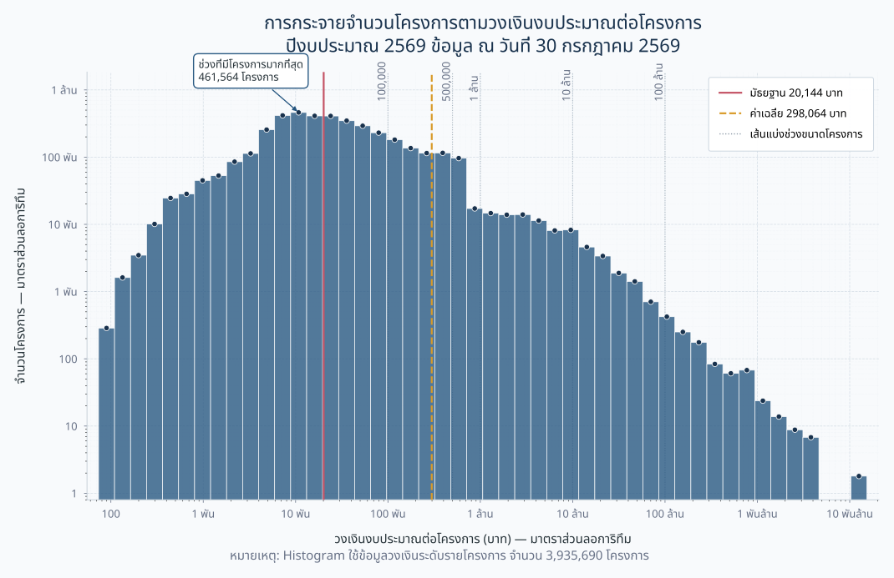

# Exploring Thailand's Government Procurement Spending

### การสำรวจการใช้จ่ายภาครัฐไทยผ่านข้อมูลการจัดซื้อจัดจ้าง

 

 

**การสำรวจโครงสร้าง แนวโน้ม และการกระจายตัวของการจัดซื้อจัดจ้างภาครัฐไทย**  
**จากข้อมูลปีงบประมาณ พ.ศ. 2567–2569**

 

[Project Overview](#project-overview) ·
[Executive Summary](#executive-summary) ·
[Analysis](#contents) ·
[Data Source](#data-source)

---

## Project Overview

โครงการนี้จัดทำขึ้นเพื่อศึกษาและสำรวจภาพรวมของ **ข้อมูลการจัดซื้อจัดจ้างภาครัฐของประเทศไทย** ในมิติต่าง ๆ โดยนำข้อมูลที่เผยแพร่ต่อสาธารณะมาผ่านกระบวนการเตรียมข้อมูล การตรวจสอบและทำความสะอาดข้อมูล การวิเคราะห์เชิงสำรวจ ตลอดจนการจัดทำกราฟและภาพประกอบ เพื่อให้สามารถมองเห็นโครงสร้าง แนวโน้ม และลักษณะสำคัญของข้อมูลได้ชัดเจนยิ่งขึ้น

การดำเนินงานแบ่งออกเป็นขั้นตอนหลักตั้งแต่การนำเข้าข้อมูลดิบ การเตรียมและปรับโครงสร้างข้อมูล การตรวจสอบคุณภาพข้อมูล การวิเคราะห์เชิงสำรวจ และการนำเสนอผลในรูปแบบ Data Visualization

### Data Analysis Workflow

---

## Procurement at a Glance

 

| ปีงบประมาณ | จำนวนโครงการ | วงเงินงบประมาณรวม | ราคาที่ตกลงซื้อ/จ้างต่อวงเงิน |
| :---: | ---: | ---: | ---: |
| **2567** | **5,428,289** โครงการ | **1,243,189.99 ล้านบาท** | **94.25%** |
| **2568** | **4,658,738** โครงการ | **1,362,057.24 ล้านบาท** | **94.26%** |
| **2569*** | **3,935,690** โครงการ | **1,173,086.06 ล้านบาท** | **94.91%** |

> [!NOTE]
> **ขอบเขตข้อมูลปีงบประมาณ 2569**  
> ข้อมูลปีงบประมาณ พ.ศ. 2569 เป็นข้อมูล ณ วันที่ **30 กรกฎาคม 2569** จึงยังไม่ครอบคลุมตลอดทั้งปีงบประมาณ โดยขอบเขตดังกล่าวใช้กับกราฟและผลการวิเคราะห์ของปีงบประมาณ 2569 ทั้งหมดในโครงการ

---

## Executive Summary

จากการสำรวจข้อมูลการจัดซื้อจัดจ้างภาครัฐในช่วงปีงบประมาณ พ.ศ. 2567–2569 สามารถสรุปภาพรวมได้ดังนี้

- ปีงบประมาณ **2567** มีจำนวนโครงการมากที่สุด จำนวน **5,428,289 โครงการ**
- ปีงบประมาณ **2568** มีวงเงินงบประมาณรวมสูงที่สุด อยู่ที่ประมาณ **1.362 ล้านล้านบาท**
- **การจ้างก่อสร้าง** เป็นประเภทโครงการที่มีวงเงินรวมสูงที่สุด แม้ว่าการซื้อจะมีจำนวนโครงการมากกว่า
- **กรุงเทพมหานคร** มีวงเงินงบประมาณรวมสูงกว่าจังหวัดอื่นอย่างชัดเจนตลอดช่วงเวลาที่ศึกษา
- **กรมทางหลวง** เป็นหน่วยงานที่มีวงเงินงบประมาณรวมสูงที่สุดในทั้งสามปี
- การกระจายของวงเงินต่อโครงการมีลักษณะ **เบ้ไปทางขวา (Right-skewed)** โดยค่าเฉลี่ยของวงเงินต่อโครงการสูงกว่าค่ามัธยฐานอย่างชัดเจน

---

## Data Source

ข้อมูลหลักที่ใช้ในโครงการมาจาก

### Thailand Government Spending

**ระบบข้อมูลการใช้จ่ายภาครัฐ**

https://govspending.data.go.th/

ขอขอบคุณหน่วยงานผู้ดูแล **ระบบข้อมูลการใช้จ่ายภาครัฐ (Thailand Government Spending)** ที่ได้รวบรวมและเผยแพร่ข้อมูลด้านการจัดซื้อจัดจ้างภาครัฐ เพื่อสนับสนุนการนำข้อมูลไปใช้ประโยชน์ในการศึกษา การวิเคราะห์ และการพัฒนางานด้านข้อมูล

ข้อมูลจากแหล่งดังกล่าวถูกนำมาผ่านกระบวนการตรวจสอบ จัดโครงสร้าง ทำความสะอาด และวิเคราะห์เพิ่มเติมเพื่อใช้ในการศึกษาครั้งนี้

**การใช้และตีความข้อมูล:** ผลการวิเคราะห์ การตีความ และการนำเสนอภายในโครงการนี้จัดทำขึ้นเพื่อวัตถุประสงค์ด้านการศึกษาและการวิเคราะห์ข้อมูล โดยเป็นผลงานของผู้จัดทำ และไม่ถือเป็นผลการวิเคราะห์หรือข้อสรุปอย่างเป็นทางการของหน่วยงานเจ้าของข้อมูล

---

## Contents

| Section | หัวข้อการวิเคราะห์ |
| :---: | --- |
| **01** | [ภาพรวมการจัดซื้อจัดจ้างภาครัฐ](#section-1) |
| **01.1** | [วงเงินงบประมาณรวมจำแนกตามหมวดภารกิจ](#section-1-1) |
| **02** | [โครงการที่มีวงเงินงบประมาณสูงสุดและต่ำสุด](#section-2) |
| **03** | [การจัดซื้อจัดจ้างจำแนกตามประเภทโครงการ](#section-3) |
| **04** | [วงเงินงบประมาณรวมจำแนกตามจังหวัด](#section-4) |
| **04.1** | [การกระจายวงเงินงบประมาณรวมรายจังหวัด](#section-4-1) |
| **05** | [ความสัมพันธ์ระหว่างจำนวนโครงการและวงเงินรวมรายจังหวัด](#section-5) |
| **06** | [หน่วยงานที่มีวงเงินงบประมาณรวมสูงสุด](#section-6) |
| **07** | [การกระจายวงเงินงบประมาณต่อโครงการ](#section-7) |

---

## 1. ภาพรวมการจัดซื้อจัดจ้างภาครัฐ ปีงบประมาณ 2567–2569

| ปีงบประมาณ 2567 | ปีงบประมาณ 2568 | ปีงบประมาณ 2569* |
| :---: | :---: | :---: |
|  |  |  |

<b>ดูภาพขยาย — ปีงบประมาณ 2567</b>

 

  

<b>ดูภาพขยาย — ปีงบประมาณ 2568</b>

 

  

<b>ดูภาพขยาย — ปีงบประมาณ 2569</b>

 

  

### การวิเคราะห์

เมื่อพิจารณาภาพรวมการจัดซื้อจัดจ้างภาครัฐทั้งสามปี พบว่า ปีงบประมาณ **2567** มีจำนวนโครงการมากที่สุด จำนวน **5,428,289 โครงการ** ขณะที่ปีงบประมาณ **2568** มีวงเงินงบประมาณรวมสูงที่สุด อยู่ที่ **1,362,057.24 ล้านบาท**

สำหรับปีงบประมาณ **2569** มีข้อมูลจำนวน **3,935,690 โครงการ** คิดเป็นวงเงินงบประมาณรวม **1,173,086.06 ล้านบาท** อย่างไรก็ตาม เนื่องจากข้อมูลดังกล่าวเป็นข้อมูล ณ วันที่ 30 กรกฎาคม 2569 จึงยังไม่ครอบคลุมตลอดทั้งปีงบประมาณ

เมื่อพิจารณาราคาที่ตกลงซื้อหรือจ้างเทียบกับวงเงินงบประมาณรวม พบว่าสัดส่วนของทั้งสามปีอยู่ในระดับใกล้เคียงกัน โดยปี 2567 อยู่ที่ **94.25%** ปี 2568 อยู่ที่ **94.26%** และปี 2569 อยู่ที่ **94.91%**

ส่วนต่างระหว่างวงเงินงบประมาณกับราคาที่ตกลงซื้อหรือจ้างอยู่ที่ **71,536.16 ล้านบาท** ในปี 2567, **78,141.58 ล้านบาท** ในปี 2568 และ **59,682.68 ล้านบาท** ในปี 2569

**สรุป:** ปีงบประมาณ 2567 มีจำนวนโครงการมากที่สุด ขณะที่ปีงบประมาณ 2568 มีวงเงินงบประมาณรวมสูงที่สุดในช่วงข้อมูลที่นำมาศึกษา

<a href="#top">กลับสู่ด้านบน</a>

---

## 1.1 วงเงินงบประมาณรวมจำแนกตามหมวดภารกิจ ปีงบประมาณ 2567–2569

| ปีงบประมาณ 2567 | ปีงบประมาณ 2568 | ปีงบประมาณ 2569* |
| :---: | :---: | :---: |
|  |  |  |

<b>ดูภาพขยาย — ปีงบประมาณ 2567</b>

 

  

<b>ดูภาพขยาย — ปีงบประมาณ 2568</b>

 

  

<b>ดูภาพขยาย — ปีงบประมาณ 2569</b>

 

  

### การวิเคราะห์

เมื่อจำแนกวงเงินงบประมาณตามหมวดภารกิจ พบว่า **การเศรษฐกิจ** เป็นหมวดที่มีวงเงินสูงที่สุดอย่างต่อเนื่องตลอดทั้งสามปี โดยมีวงเงิน **415.82 พันล้านบาท คิดเป็น 33.4%** ในปี 2567 เพิ่มขึ้นเป็น **540.27 พันล้านบาท คิดเป็น 39.7%** ในปี 2568 และอยู่ที่ **425.70 พันล้านบาท คิดเป็น 36.3%** ในปี 2569

**การบริหารทั่วไปของรัฐ** เป็นหมวดที่มีสัดส่วนวงเงินสูงในลำดับถัดมา โดยคิดเป็น **28.7%**, **27.1%** และ **26.2%** ตามลำดับ ส่วน **การสาธารณสุข** มีสัดส่วนอยู่ในช่วงประมาณ **12.9–14.9%** ของวงเงินรวมในแต่ละปี

สำหรับหมวด **การศึกษา** มีวงเงิน **108.07 พันล้านบาท** ในปี 2567 ลดลงเป็น **90.84 พันล้านบาท** ในปี 2568 และเพิ่มขึ้นเป็น **112.92 พันล้านบาท** ในปี 2569

ในภาพรวม หมวด **การเศรษฐกิจ การบริหารทั่วไปของรัฐ และการสาธารณสุข** เป็นกลุ่มภารกิจที่มีสัดส่วนวงเงินสูงเมื่อเทียบกับหมวดอื่นอย่างต่อเนื่อง

> [!NOTE]
> **การจำแนกหมวดภารกิจ**  
> การแบ่งหมวดภารกิจในส่วนนี้เป็นการจัดกลุ่มเพื่อการวิเคราะห์ โดยอาศัยข้อมูลสังกัด ชื่อหน่วยงาน และกฎคำสำคัญที่ผู้จัดทำกำหนดขึ้น เพื่อใช้สำหรับการนำเสนอภาพรวมเท่านั้น และไม่ใช่รหัสจำแนกงบประมาณอย่างเป็นทางการ

<a href="#top">กลับสู่ด้านบน</a>

---

## 2. โครงการที่มีวงเงินงบประมาณสูงสุดและต่ำสุด ปีงบประมาณ 2567–2569

| ปีงบประมาณ 2567 | ปีงบประมาณ 2568 | ปีงบประมาณ 2569* |
| :---: | :---: | :---: |
|  |  |  |

<b>ดูภาพขยาย — ปีงบประมาณ 2567</b>

 

  

<b>ดูภาพขยาย — ปีงบประมาณ 2568</b>

 

  

<b>ดูภาพขยาย — ปีงบประมาณ 2569</b>

 

  

### การวิเคราะห์

ข้อมูลแสดงให้เห็นถึงความแตกต่างของขนาดโครงการจัดซื้อจัดจ้างอย่างชัดเจน โดยในปีงบประมาณ **2567** โครงการที่มีวงเงินสูงที่สุดมีมูลค่า **18,740 ล้านบาท** ขณะที่ปี 2568 เพิ่มขึ้นเป็น **28,759 ล้านบาท** ซึ่งเป็นวงเงินสูงที่สุดในช่วงเวลาที่นำมาศึกษา

สำหรับปีงบประมาณ **2569** โครงการที่มีวงเงินสูงที่สุดมีมูลค่า **15,355.60 ล้านบาท**

โครงการที่มีวงเงินสูงส่วนใหญ่เกี่ยวข้องกับ **การพัฒนาโครงสร้างพื้นฐาน ระบบคมนาคม สาธารณูปโภค งานก่อสร้าง รวมถึงการจัดหาระบบหรืออุปกรณ์ขนาดใหญ่** ซึ่งเป็นโครงการที่ต้องใช้เงินลงทุนในระดับสูง

ในทางตรงกันข้าม โครงการที่มีวงเงินต่ำสุดมีมูลค่าเพียงหลักสิบถึงหลักร้อยบาท โดยส่วนใหญ่เป็นรายการจัดซื้อหรือจัดจ้างขนาดเล็ก เช่น อาหารเสริม (นม) วัสดุ น้ำมันเชื้อเพลิง และงานบริการทั่วไป

**สรุป:** การจัดซื้อจัดจ้างภาครัฐมีช่วงของวงเงินต่อโครงการที่กว้างมาก ตั้งแต่รายการจัดซื้อขนาดเล็กมูลค่าหลักสิบบาท ไปจนถึงโครงการขนาดใหญ่ที่มีวงเงินระดับหมื่นล้านบาท

<a href="#top">กลับสู่ด้านบน</a>

---

## 3. การจัดซื้อจัดจ้างจำแนกตามประเภทโครงการ ปีงบประมาณ 2567–2569

| ปีงบประมาณ 2567 | ปีงบประมาณ 2568 | ปีงบประมาณ 2569* |
| :---: | :---: | :---: |
|  |  |  |

<b>ดูภาพขยาย — ปีงบประมาณ 2567</b>

 

  

<b>ดูภาพขยาย — ปีงบประมาณ 2568</b>

 

  

<b>ดูภาพขยาย — ปีงบประมาณ 2569</b>

 

  

### การวิเคราะห์

เมื่อจำแนกโครงการตามประเภทการจัดซื้อจัดจ้าง พบว่า **การซื้อ** เป็นประเภทที่มีจำนวนโครงการมากที่สุดในทุกปี โดยปี 2567 มีจำนวน **3,433,701 โครงการ** ปี 2568 มีจำนวน **2,923,243 โครงการ** และปี 2569 มีจำนวน **2,474,411 โครงการ**

อย่างไรก็ตาม เมื่อพิจารณาในด้านวงเงินรวม พบว่า **การจ้างก่อสร้าง** เป็นประเภทที่มีวงเงินสูงที่สุด โดยมีวงเงินประมาณ **522.68 พันล้านบาท** ในปี 2567 เพิ่มขึ้นเป็น **672.09 พันล้านบาท** ในปี 2568 และอยู่ที่ประมาณ **475.93 พันล้านบาท** ในปี 2569

สำหรับวงเงินเฉลี่ยต่อโครงการ กลุ่ม **จ้างที่ปรึกษา** และ **จ้างควบคุมงาน** มีค่าเฉลี่ยค่อนข้างสูง โดยในปี 2569 มีวงเงินเฉลี่ยประมาณ **9.31 ล้านบาท** และ **9.30 ล้านบาทต่อโครงการ** ตามลำดับ

**สรุป:** ประเภทโครงการที่มีจำนวนรายการมากที่สุดไม่จำเป็นต้องเป็นประเภทที่มีวงเงินรวมสูงที่สุด เนื่องจากขนาดและมูลค่าของแต่ละโครงการมีความแตกต่างกัน

<a href="#top">กลับสู่ด้านบน</a>

---

## 4. วงเงินงบประมาณรวมจำแนกตามจังหวัด ปีงบประมาณ 2567–2569

| ปีงบประมาณ 2567 | ปีงบประมาณ 2568 | ปีงบประมาณ 2569* |
| :---: | :---: | :---: |
|  |  |  |

<b>ดูภาพขยาย — ปีงบประมาณ 2567</b>

 

  

<b>ดูภาพขยาย — ปีงบประมาณ 2568</b>

 

  

<b>ดูภาพขยาย — ปีงบประมาณ 2569</b>

 

  

### การวิเคราะห์

เมื่อพิจารณาวงเงินงบประมาณรวมในระดับจังหวัด พบว่า **กรุงเทพมหานคร** มีวงเงินสูงที่สุดอย่างชัดเจนในทั้งสามปี โดยมีวงเงินประมาณ **332.10 พันล้านบาท** ในปี 2567 เพิ่มขึ้นเป็น **542.08 พันล้านบาท** ในปี 2568 และอยู่ที่ **488.54 พันล้านบาท** ในปี 2569

สำหรับจังหวัดที่มีวงเงินสูงเป็นลำดับถัดมา พบว่าอันดับมีการเปลี่ยนแปลงในแต่ละปี โดยปี 2567 **ชลบุรี** มีวงเงินรวมสูงเป็นอันดับ 2 ที่ประมาณ **40.72 พันล้านบาท** ปี 2568 เป็น **นครราชสีมา** ที่ประมาณ **33.61 พันล้านบาท** และปี 2569 เป็น **นนทบุรี** ที่ประมาณ **32.91 พันล้านบาท**

ขณะที่ **สมุทรสงคราม** มีวงเงินรวมอยู่ในระดับต่ำที่สุดของทั้งสามปี โดยมีวงเงินประมาณ **2.17 พันล้านบาท**, **1.99 พันล้านบาท** และ **2.12 พันล้านบาท** ตามลำดับ

**สรุป:** กรุงเทพมหานครมีวงเงินจัดซื้อจัดจ้างรวมสูงกว่าจังหวัดอื่นอย่างเด่นชัดตลอดทั้งสามปี ขณะที่อันดับของจังหวัดในกลุ่มรองลงมามีการเปลี่ยนแปลงในแต่ละปี

<a href="#top">กลับสู่ด้านบน</a>

---

## 4.1 การกระจายวงเงินงบประมาณรวมรายจังหวัด ปีงบประมาณ 2567–2569

| ปีงบประมาณ 2567 | ปีงบประมาณ 2568 | ปีงบประมาณ 2569* |
| :---: | :---: | :---: |
|  |  |  |

<b>ดูภาพขยาย — ปีงบประมาณ 2567</b>

 

  

<b>ดูภาพขยาย — ปีงบประมาณ 2568</b>

 

  

<b>ดูภาพขยาย — ปีงบประมาณ 2569</b>

 

  

### การวิเคราะห์

แผนที่แสดงการกระจายของวงเงินงบประมาณรวมในระดับจังหวัด โดยพื้นที่ที่มีระดับสีเข้มกว่าสะท้อนถึงจังหวัดที่มีวงเงินรวมสูงกว่า

ในการจัดทำแผนที่ **กรุงเทพมหานครถูกแยกออกจากการคำนวณสเกลสี** เนื่องจากมีวงเงินสูงกว่าจังหวัดอื่นอย่างชัดเจน การเปรียบเทียบระดับสีจึงใช้ข้อมูลของจังหวัดอันดับ 2–77 เพื่อให้สามารถมองเห็นความแตกต่างระหว่างจังหวัดอื่นได้ชัดเจนยิ่งขึ้น

ในปี **2567** จังหวัดที่มีวงเงินสูงเด่นในแต่ละภูมิภาค ได้แก่ **ชลบุรี นนทบุรี นครราชสีมา เชียงใหม่ สงขลา และกาญจนบุรี**

ปี **2568** จังหวัดที่มีวงเงินสูง ได้แก่ **นครราชสีมา นนทบุรี ชลบุรี เชียงใหม่ สงขลา และราชบุรี**

ส่วนปี **2569** จังหวัดที่มีวงเงินสูงเด่น ได้แก่ **นนทบุรี ชลบุรี เชียงใหม่ นครราชสีมา สงขลา และราชบุรี**

เมื่อพิจารณาภาพรวมตลอดทั้งสามปี พบว่าจังหวัดที่ปรากฏอยู่ในกลุ่มวงเงินสูงอย่างต่อเนื่อง ได้แก่ **นนทบุรี ชลบุรี เชียงใหม่ นครราชสีมา และสงขลา**

**สรุป:** รูปแบบการกระจายของวงเงินแสดงให้เห็นว่าจังหวัดศูนย์กลางในแต่ละภูมิภาคหลายแห่งมีวงเงินจัดซื้อจัดจ้างอยู่ในระดับสูงอย่างต่อเนื่องตลอดช่วงเวลาที่ศึกษา

<a href="#top">กลับสู่ด้านบน</a>

---

## 5. ความสัมพันธ์ระหว่างจำนวนโครงการและวงเงินรวมรายจังหวัด ปีงบประมาณ 2567–2569

| ปีงบประมาณ 2567 | ปีงบประมาณ 2568 | ปีงบประมาณ 2569* |
| :---: | :---: | :---: |
|  |  |  |

<b>ดูภาพขยาย — ปีงบประมาณ 2567</b>

 

  

<b>ดูภาพขยาย — ปีงบประมาณ 2568</b>

 

  

<b>ดูภาพขยาย — ปีงบประมาณ 2569</b>

 

  

### การวิเคราะห์

จากกราฟพบว่า **จำนวนโครงการและวงเงินรวมรายจังหวัดมีแนวโน้มเปลี่ยนแปลงไปในทิศทางเดียวกัน** โดยจังหวัดที่มีจำนวนโครงการมากมักมีวงเงินรวมอยู่ในระดับสูงตามไปด้วย

การกระจายของข้อมูลบนกราฟแบบ Log–Log มีแนวโน้มจากบริเวณด้านล่างซ้ายไปยังด้านบนขวา ซึ่งแสดงถึงความสัมพันธ์เชิงบวกระหว่างจำนวนโครงการและวงเงินรวม

**กรุงเทพมหานคร** เป็นจุดข้อมูลที่แตกต่างจากจังหวัดอื่นอย่างชัดเจนในทุกปี เนื่องจากมีทั้งจำนวนโครงการและวงเงินรวมอยู่ในระดับสูงมาก

อย่างไรก็ตาม ยังพบจังหวัดบางแห่งที่มีจำนวนโครงการใกล้เคียงกัน แต่มีวงเงินรวมแตกต่างกันค่อนข้างมาก แสดงให้เห็นว่าจำนวนโครงการเพียงอย่างเดียวไม่สามารถอธิบายระดับวงเงินรวมของแต่ละจังหวัดได้ทั้งหมด

**สรุป:** จำนวนโครงการมีความสัมพันธ์กับวงเงินรวมในระดับหนึ่ง แต่ขนาดและมูลค่าของโครงการยังเป็นปัจจัยสำคัญที่ทำให้จังหวัดซึ่งมีจำนวนโครงการใกล้เคียงกันอาจมีวงเงินรวมแตกต่างกันได้

กราฟใช้มาตราส่วนลอการิทึม (Log Scale) เพื่อให้สามารถแสดงข้อมูลที่มีช่วงค่ากว้างและเปรียบเทียบการกระจายของข้อมูลได้ชัดเจนยิ่งขึ้น

<a href="#top">กลับสู่ด้านบน</a>

---

## 6. หน่วยงานที่มีวงเงินงบประมาณรวมสูงสุด ปีงบประมาณ 2567–2569

| ปีงบประมาณ 2567 | ปีงบประมาณ 2568 | ปีงบประมาณ 2569* |
| :---: | :---: | :---: |
|  |  |  |

<b>ดูภาพขยาย — ปีงบประมาณ 2567</b>

 

  

<b>ดูภาพขยาย — ปีงบประมาณ 2568</b>

 

  

<b>ดูภาพขยาย — ปีงบประมาณ 2569</b>

 

  

### การวิเคราะห์

เมื่อพิจารณาวงเงินงบประมาณรวมจำแนกตามหน่วยงาน พบว่า **กรมทางหลวง** เป็นหน่วยงานที่มีวงเงินรวมสูงที่สุดในทั้งสามปี โดยมีวงเงินประมาณ **109.26 พันล้านบาท** ในปี 2567 เพิ่มขึ้นเป็น **188.24 พันล้านบาท** ในปี 2568 และอยู่ที่ **107.31 พันล้านบาท** ในปี 2569

**กรมชลประทาน** อยู่ในอันดับ 2 อย่างต่อเนื่อง โดยมีวงเงินประมาณ **58.12 พันล้านบาท**, **88.67 พันล้านบาท** และ **92.57 พันล้านบาท** ตามลำดับ

หน่วยงานที่มีวงเงินรวมอยู่ในระดับสูงส่วนใหญ่มีภารกิจเกี่ยวข้องกับ **โครงสร้างพื้นฐาน การคมนาคม สาธารณูปโภค และงานก่อสร้าง** เช่น กรมทางหลวงชนบท การไฟฟ้าส่วนภูมิภาค กรมโยธาธิการและผังเมือง กรุงเทพมหานคร และการประปาส่วนภูมิภาค

เมื่อพิจารณาจำนวนโครงการควบคู่กับวงเงินรวม พบว่าแต่ละหน่วยงานมีลักษณะการดำเนินโครงการแตกต่างกัน บางหน่วยงานอาจมีจำนวนโครงการไม่สูงมาก แต่ประกอบด้วยโครงการที่มีวงเงินเฉลี่ยต่อโครงการสูง

**สรุป:** จำนวนโครงการไม่ใช่ปัจจัยเพียงอย่างเดียวที่กำหนดระดับวงเงินรวมของหน่วยงาน เนื่องจากลักษณะ ภารกิจ และมูลค่าของโครงการแต่ละประเภทมีความแตกต่างกัน

<a href="#top">กลับสู่ด้านบน</a>

---

## 7. การกระจายวงเงินงบประมาณต่อโครงการ ปีงบประมาณ 2567–2569

| ปีงบประมาณ 2567 | ปีงบประมาณ 2568 | ปีงบประมาณ 2569* |
| :---: | :---: | :---: |
|  |  |  |

<b>ดูภาพขยาย — ปีงบประมาณ 2567</b>

 

  

<b>ดูภาพขยาย — ปีงบประมาณ 2568</b>

 

  

<b>ดูภาพขยาย — ปีงบประมาณ 2569</b>

 

  

### การวิเคราะห์

การกระจายของวงเงินต่อโครงการในทั้งสามปีมีรูปแบบใกล้เคียงกัน โดยโครงการส่วนใหญ่กระจุกตัวอยู่ในกลุ่มวงเงินระดับต่ำถึงปานกลาง ขณะที่มีโครงการจำนวนไม่มากที่มีวงเงินสูงมาก

ปี 2567 มีค่ามัธยฐานของวงเงินต่อโครงการอยู่ที่ **20,650 บาท** ขณะที่ค่าเฉลี่ยอยู่ที่ **229,021 บาท**

ปี 2568 มีค่ามัธยฐาน **20,794 บาท** และค่าเฉลี่ย **292,366 บาท** ส่วนปี 2569 มีค่ามัธยฐาน **20,144 บาท** และค่าเฉลี่ย **298,064 บาท**

การที่ค่าเฉลี่ยสูงกว่าค่ามัธยฐานอย่างชัดเจนแสดงให้เห็นว่า การกระจายของวงเงินมีลักษณะ **เบ้ไปทางขวา (Right-skewed)** กล่าวคือ มีโครงการที่มีวงเงินสูงจำนวนหนึ่งซึ่งส่งผลให้ค่าเฉลี่ยเพิ่มสูงขึ้น แม้ว่าโครงการส่วนใหญ่จะมีวงเงินอยู่ในระดับต่ำกว่าค่าเฉลี่ยก็ตาม

สำหรับช่วงวงเงินที่มีจำนวนโครงการมากที่สุด พบว่า ปี 2567 มี **647,806 โครงการ** ปี 2568 มี **570,423 โครงการ** และปี 2569 มี **461,564 โครงการ**

**สรุป:** โครงการส่วนใหญ่มีวงเงินต่อโครงการไม่สูงมาก แต่มีโครงการขนาดใหญ่จำนวนหนึ่งที่ส่งผลให้ค่าเฉลี่ยของวงเงินต่อโครงการสูงกว่าค่ามัธยฐานอย่างชัดเจน

กราฟใช้มาตราส่วนลอการิทึม (Log Scale) ทั้งแกนวงเงินและแกนจำนวนโครงการ เพื่อให้สามารถแสดงข้อมูลที่มีช่วงค่ากว้างและมองเห็นรูปแบบการกระจายของข้อมูลได้ชัดเจนยิ่งขึ้น

<a href="#top">กลับสู่ด้านบน</a>

---

## Project Summary

  

### Thailand Government Procurement Spending Analysis

การวิเคราะห์ข้อมูลการจัดซื้อจัดจ้างภาครัฐของประเทศไทย  
ปีงบประมาณ พ.ศ. 2567–2569

 

**Data Source**

Thailand Government Spending  
https://govspending.data.go.th/

 

`Data Preprocessing` · `Data Cleaning` · `Exploratory Data Analysis` · `Data Visualization`

 

โครงการนี้จัดทำขึ้นเพื่อวัตถุประสงค์ด้านการศึกษาและการวิเคราะห์ข้อมูล

  

<a href="#top"><b>กลับสู่ด้านบน</b></a>

