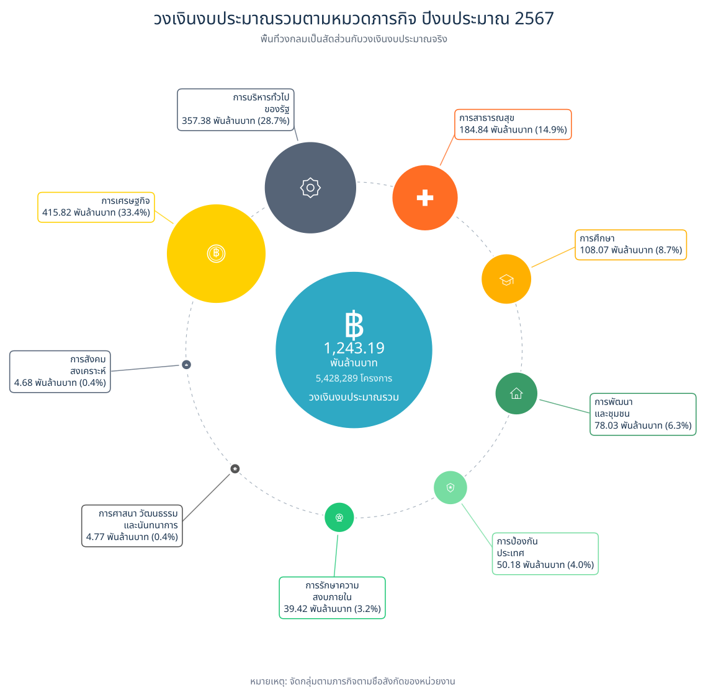
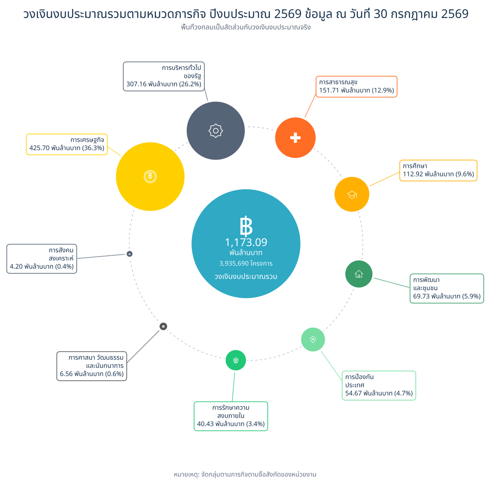
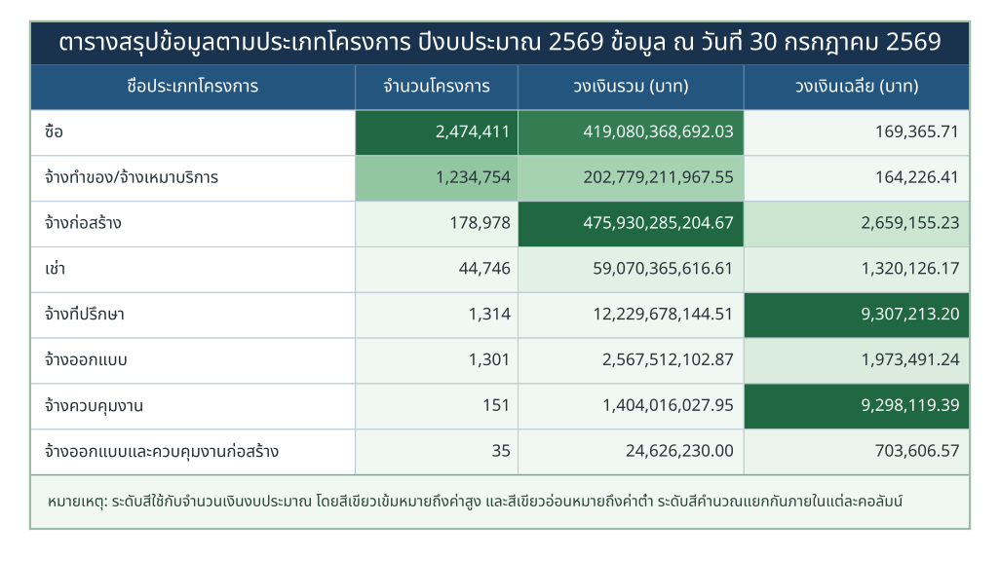
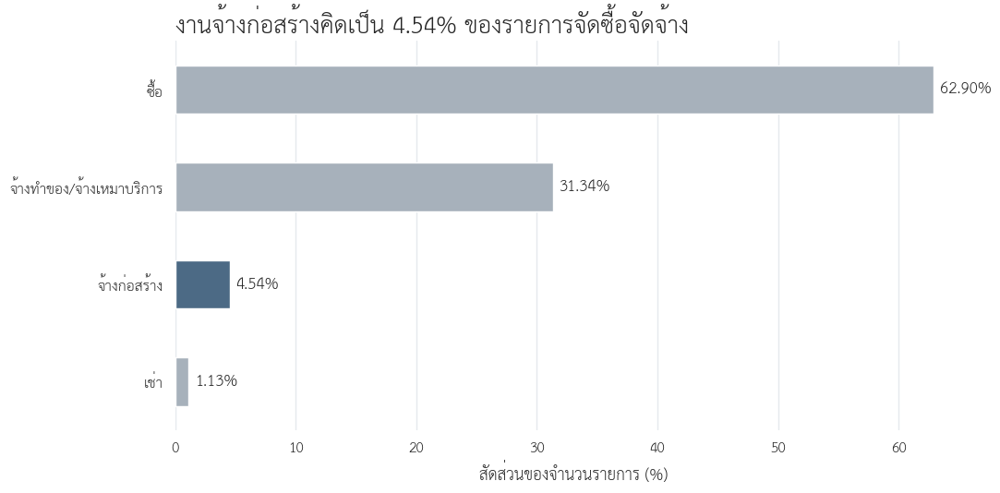
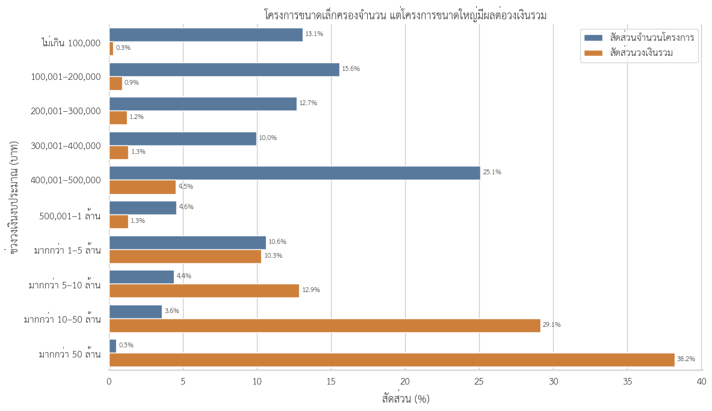
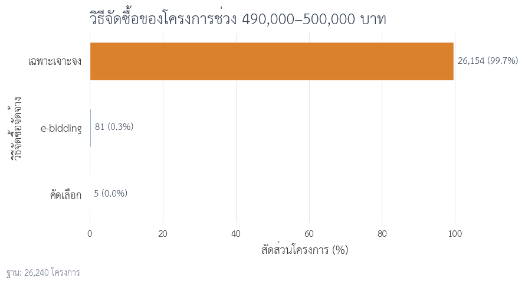

<a id="top"></a>

<div align="center">

# Exploring Thailand's Government Procurement Spending

### การสำรวจการใช้จ่ายภาครัฐไทยผ่านข้อมูลการจัดซื้อจัดจ้าง

<br>


<br>

**การสำรวจโครงสร้าง แนวโน้ม และการกระจายตัวของการจัดซื้อจัดจ้างภาครัฐไทย**  
**จากข้อมูลปีงบประมาณ พ.ศ. 2567–2569**

<br>

[Project Overview](https://github.com/panithan1991/Exploring-Thailand-s-Government-Procurement-Spending/blob/main/README.md#project-overview) ·
[Executive Summary](https://github.com/panithan1991/Exploring-Thailand-s-Government-Procurement-Spending/blob/main/README.md#executive-summary) ·
[Analysis](https://github.com/panithan1991/Exploring-Thailand-s-Government-Procurement-Spending/blob/main/README.md#contents) ·
[Data Source](https://github.com/panithan1991/Exploring-Thailand-s-Government-Procurement-Spending/blob/main/README.md#data-source)

</div>

---

<a id="data-source"></a>

## แหล่งข้อมูล (Data Source)

ข้อมูลที่ใช้ในการศึกษานี้มาจาก

**Thailand Government Spending**  
**ระบบข้อมูลการใช้จ่ายภาครัฐ**

[https://govspending.data.go.th/](https://govspending.data.go.th/)

ขอขอบคุณหน่วยงานผู้ดูแล **ระบบข้อมูลการใช้จ่ายภาครัฐ (Thailand Government Spending)** สำหรับการรวบรวมและเผยแพร่ข้อมูลการจัดซื้อจัดจ้างภาครัฐ ซึ่งเป็นประโยชน์ต่อการศึกษาและการวิเคราะห์ข้อมูลสาธารณะ

ผู้จัดทำได้นำข้อมูลดังกล่าวมาตรวจสอบโครงสร้าง ทำความสะอาด และวิเคราะห์เพิ่มเติมตามวัตถุประสงค์ของการศึกษา

**การใช้และตีความข้อมูล:** เนื้อหาและข้อสรุปในโครงการนี้เป็นผลการวิเคราะห์ของผู้จัดทำเพื่อวัตถุประสงค์ทางการศึกษา ไม่ใช่ข้อสรุปอย่างเป็นทางการของหน่วยงานเจ้าของข้อมูล

**ที่มาของภาพและกราฟ:** [Exploring Thailand's Government Procurement Spending](https://github.com/panithan1991/Exploring-Thailand-s-Government-Procurement-Spending)

---

<a id="contents"></a>

## สารบัญ (Contents)

| Section | หัวข้อการวิเคราะห์ |
| :---: | --- |
| **Data** | [แหล่งข้อมูล (Data Source)](#data-source) |
| **01** | [01 — ภาพรวมสัญญาจัดซื้อจัดจ้างภาครัฐ (Overview Contract)](#overview-contract) |
| **01.1** | [01.1 โครงสร้างวงเงินตามหมวดภารกิจ](#section-1-1) |
| **01.2** | [01.2 การจัดซื้อจัดจ้างจำแนกตามประเภทโครงการ](#section-2) |
| **01.3** | [01.3 ข้อค้นพบสำคัญ](#executive-summary) |
| **02** | [จากเพดานวงเงินสู่การจัดลำดับตรวจสอบโครงการจ้างก่อสร้าง](#construction-analysis) |
| **02.1** | [คำถามของโครงการ](#project-question) |
| **03** | [1. เตรียมข้อมูลก่อนตั้งคำถามเชิง Pattern](#contract-construction) |
| **04** | [2. โครงการก่อสร้างส่วนใหญ่อยู่ช่วงใด](#budget-band) |
| **05** | [3. เมื่อขยายดูบริเวณ 500,000 บาท](#near-500k) |
| **06** | [4. การกระจุกสัมพันธ์กับวิธีจัดซื้อใด](#procurement-method) |
| **07** | [5. กำหนดกลุ่มศึกษาภายใต้บริบทเดียวกัน](#study-scope) |
| **08** | [6. นิยาม Pattern สำหรับตรวจสอบ](#patterns) |
| **08.1** | [Pattern 1 — โครงการใกล้เพดานที่เกิดซ้ำ](#pattern-1) |
| **08.2** | [Pattern 2 — การพึ่งพาผู้รับจ้างในชื่อหน่วยงาน](#pattern-2) |
| **08.3** | [Pattern 3 — การพึ่งพาผู้รับจ้างในชื่อหน่วยงานย่อย](#pattern-3) |
| **08.4** | [Pattern 4 — การพึ่งพาผู้รับจ้างในจังหวัด](#pattern-4) |
| **09** | [7. คำตอบของโครงการ](#analysis-results) |
| **10** | [8. จากรายการคัดกรองสู่การตรวจเอกสาร](#document-review) |
| **11** | [9. ข้อจำกัดในการตีความ](#limitations) |
| **12** | [Notebook และการทำซ้ำ](#notebooks) |

---

<a id="overview-contract"></a>
<a id="project-overview"></a>

## 01 — ภาพรวมสัญญาจัดซื้อจัดจ้างภาครัฐ (Overview Contract)

> **วัตถุประสงค์:** นำเสนอภาพรวมการจัดซื้อจัดจ้างภาครัฐ และอธิบายเหตุผลในการเลือกงานจ้างก่อสร้างเป็นขอบเขตการวิเคราะห์เชิงลึก

ข้อมูลการจัดซื้อจัดจ้างภาครัฐแต่ละปีประกอบด้วยโครงการหลายล้านรายการ ทั้งการซื้อ การจ้างบริการ การก่อสร้าง การเช่า และงานวิชาชีพเฉพาะด้าน การศึกษานี้จึงเริ่มจากโครงสร้างภาพรวม 2 มิติ ได้แก่ **การจัดสรรวงเงินตามหมวดภารกิจ** และ **จำนวนกับมูลค่าของโครงการแต่ละประเภท** จากนั้นจึงกำหนดขอบเขตการวิเคราะห์ไปที่งานจ้างก่อสร้าง

> **ขอบเขตข้อมูล:** ข้อมูลปีงบประมาณ 2569 ครอบคลุมถึงวันที่ **30 กรกฎาคม 2569** และยังไม่ครบทั้งปีงบประมาณ การเปรียบเทียบกับปี 2567–2568 จึงต้องพิจารณาความแตกต่างของช่วงเวลาประกอบ

---

<a id="section-1-1"></a>

### 01.1 โครงสร้างวงเงินตามหมวดภารกิจ

| ปีงบประมาณ 2567 | ปีงบประมาณ 2568 | ปีงบประมาณ 2569* |
| :---: | :---: | :---: |
| [](figure/1_2567.svg) | [](figure/1_2568.svg) | [](figure/1_2569.svg) |

<p align="center"><em>รูปที่ 1–3 วงเงินงบประมาณรวมจำแนกตามหมวดภารกิจ (คลิกที่ภาพเพื่อดูขนาดเต็ม)</em></p>

<details>
<summary><b>ดูภาพขยาย — ปีงบประมาณ 2567</b></summary>

<br>

<p align="center">
  <a href="figure/1_2567.svg">
    
  </a>
</p>

</details>

<details>
<summary><b>ดูภาพขยาย — ปีงบประมาณ 2568</b></summary>

<br>

<p align="center">
  <a href="figure/1_2568.svg">
    
  </a>
</p>

</details>

<details>
<summary><b>ดูภาพขยาย — ปีงบประมาณ 2569</b></summary>

<br>

<p align="center">
  <a href="figure/1_2569.svg">
    
  </a>
</p>

</details>

ตลอดช่วงปีงบประมาณ 2567–2569 หมวด **การเศรษฐกิจ** ได้รับวงเงินสูงที่สุด คิดเป็น 33.4%, 39.7% และ 36.3% ของวงเงินรวมตามลำดับ รองลงมาคือ **การบริหารทั่วไปของรัฐ** และ **การสาธารณสุข** ทั้งสามหมวดรวมกันมีสัดส่วนประมาณ 75–80% ของวงเงินในแต่ละปี แสดงให้เห็นว่าวงเงินส่วนใหญ่กระจุกอยู่ในภารกิจหลักไม่กี่หมวด

การจำแนกตามหมวดภารกิจแสดงทิศทางการใช้จ่ายในภาพรวม แต่ยังไม่แสดงว่าวงเงินดังกล่าวดำเนินการผ่านโครงการประเภทใด ส่วนถัดไปจึงพิจารณาจำนวนโครงการ วงเงินรวม และวงเงินเฉลี่ยแยกตามประเภทโครงการ

> **หมายเหตุ:** หมวดภารกิจในกราฟจัดทำขึ้นเพื่อการวิเคราะห์ โดยพิจารณาจากสังกัด ชื่อหน่วยงาน และเกณฑ์คำสำคัญที่ผู้จัดทำกำหนด จึงไม่ใช่รหัสจำแนกงบประมาณอย่างเป็นทางการ

<a id="section-2"></a>

### 01.2 การจัดซื้อจัดจ้างจำแนกตามประเภทโครงการ

| ปีงบประมาณ 2567 | ปีงบประมาณ 2568 | ปีงบประมาณ 2569* |
| :---: | :---: | :---: |
| [](figure/2_2567.svg) | [](figure/2_2568.svg) | [](figure/2_2569.svg) |

<p align="center"><em>รูปที่ 4–6 จำนวนโครงการ วงเงินรวม และวงเงินเฉลี่ย จำแนกตามประเภทโครงการ (คลิกที่ภาพเพื่อดูขนาดเต็ม)</em></p>

<details>
<summary><b>ดูภาพขยาย — ปีงบประมาณ 2567</b></summary>

<br>

<p align="center">
  <a href="figure/2_2567.svg">
    
  </a>
</p>

</details>

<details>
<summary><b>ดูภาพขยาย — ปีงบประมาณ 2568</b></summary>

<br>

<p align="center">
  <a href="figure/2_2568.svg">
    
  </a>
</p>

</details>

<details>
<summary><b>ดูภาพขยาย — ปีงบประมาณ 2569</b></summary>

<br>

<p align="center">
  <a href="figure/2_2569.svg">
    
  </a>
</p>

</details>

<a id="executive-summary"></a>

### 01.3 ข้อค้นพบสำคัญ

ผลการจำแนกพบว่า **ประเภทโครงการที่มีจำนวนมากที่สุด ไม่ใช่ประเภทเดียวกับที่มีวงเงินรวมสูงที่สุด**

- โครงการประเภท **ซื้อ** มีจำนวนมากที่สุดในทุกปี ระหว่าง 2.47–3.43 ล้านโครงการ
- โครงการ **จ้างทำของ/จ้างเหมาบริการ** อยู่ในลำดับถัดมา ระหว่าง 1.23–1.63 ล้านโครงการ
- **งานจ้างก่อสร้าง** มีจำนวน 178,978–302,830 โครงการ แต่มีวงเงินรวมสูงที่สุดในทุกปีที่ศึกษา

| ปีงบประมาณ | จำนวนโครงการก่อสร้าง | สัดส่วนจำนวนโครงการทั้งหมด | วงเงินก่อสร้างรวม | สัดส่วนวงเงินทั้งหมด | วงเงินเฉลี่ยต่อโครงการ |
| :---: | ---: | ---: | ---: | ---: | ---: |
| **2567** | 302,830 | 5.58% | 522.68 พันล้านบาท | 42.04% | 1.73 ล้านบาท |
| **2568** | 292,437 | 6.28% | 672.09 พันล้านบาท | 49.34% | 2.30 ล้านบาท |
| **2569*** | 178,978 | 4.55% | 475.93 พันล้านบาท | 40.57% | 2.66 ล้านบาท |

งานจ้างก่อสร้างมีสัดส่วนเพียง 4.55–6.28% ของจำนวนโครงการทั้งหมด แต่คิดเป็น 40.57–49.34% ของวงเงินรวม ความแตกต่างระหว่างสัดส่วนจำนวนโครงการกับสัดส่วนวงเงินเป็นเหตุผลหลักที่เลือกงานจ้างก่อสร้างมาวิเคราะห์ต่อ

---

<a id="construction-analysis"></a>

# จากเพดานวงเงินสู่การจัดลำดับตรวจสอบโครงการจ้างก่อสร้าง

> DADS5001 Data Tools and Programming — Mini Project  
> ข้อมูล e-GP ปีงบประมาณ 2569 สะสมถึงวันที่ 30 กรกฎาคม 2569 ไม่ใช่ข้อมูลเต็มปี

<a id="project-question"></a>

## คำถามของโครงการ

โครงการนี้ไม่ได้เริ่มจากการกำหนดว่าโครงการใด “ผิดปกติ” แต่เริ่มจากการสำรวจข้อมูลเพื่อหาว่าควรถามอะไรต่อ

เมื่อพบว่าโครงการจ้างก่อสร้างจำนวนมากอยู่ใกล้เพดานวงเงินของวิธีเฉพาะเจาะจง คำถามหลักจึงเป็น:

> **ภายใต้โครงการจ้างก่อสร้างที่ใช้วิธีเฉพาะเจาะจงและมีวงเงินไม่เกิน 500,000 บาท มีกลุ่มโครงการใกล้เพดานที่เกิดซ้ำกับคู่หน่วยงานย่อย–ผู้รับจ้างเดิมหรือไม่ และกลุ่มเหล่านั้นซ้อนทับกับการพึ่งพาผู้รับจ้างสูงในระดับชื่อหน่วยงานหรือชื่อหน่วยงานย่อยเพียงใด?**

การวิเคราะห์แบ่งเป็นสามช่วง:

1. เตรียมข้อมูลและกำหนดหน่วยวิเคราะห์
2. สำรวจวงเงิน วิธีจัดซื้อ และบริบททางกฎหมาย
3. ตรวจรูปแบบซ้ำและซ้อนทับเงื่อนไขเพื่อจัดลำดับการเปิดเอกสาร

ผลลัพธ์เป็นรายการสำหรับตรวจสอบต่อ ไม่ใช่คะแนนทุจริตหรือหลักฐานว่ามีการกระทำผิด

<a id="contract-construction"></a>

## 1. เตรียมข้อมูลก่อนตั้งคำถามเชิง Pattern

ข้อมูลต้นทางประกอบด้วย CSV 8 ไฟล์ รวม 3,964,924 รายการ ขั้นแรกจึงนับรายการตามประเภทโครงการ ก่อนเลือกเฉพาะรายการประเภท `จ้างก่อสร้าง`

<p align="center"></p>
<p align="center"><em>รูปที่ 1 จำนวนรายการจัดซื้อจัดจ้างตามประเภทโครงการ</em></p>

พบรายการจ้างก่อสร้าง 180,079 รายการ หรือ 4.54% ของข้อมูลทั้งหมด แต่หนึ่งรายการไม่จำเป็นต้องเท่ากับหนึ่งโครงการ เพราะโครงการเดียวอาจมีหลายสัญญาหรือหลายผู้รับจ้าง

การเตรียมข้อมูลจึงประกอบด้วย:

- เลือกเฉพาะรายการประเภทจ้างก่อสร้าง
- ตัดแถวผู้ร่วมกิจการค้าที่มีรหัสผู้รับจ้างขึ้นต้นด้วย `D` จำนวน 363 แถว
- ตรวจแถวซ้ำด้วย `รหัสโครงการ + เลขที่สัญญา + เลขประจำตัวนิติบุคคล`
- เก็บข้อมูลระดับรายการสำหรับตรวจสัญญา
- สร้างข้อมูลหนึ่งแถวต่อโครงการสำหรับ EDA

หลังเตรียมข้อมูล เหลือรายการจ้างก่อสร้าง 179,716 แถว และโครงการก่อสร้างไม่ซ้ำ 178,978 โครงการ

<a id="budget-band"></a>

## 2. โครงการก่อสร้างส่วนใหญ่อยู่ช่วงใด

วงเงินงบประมาณของโครงการก่อสร้างมีค่ามัธยฐาน 395,000 บาท แต่ค่าเฉลี่ยอยู่ที่ประมาณ 2.66 ล้านบาท แสดงว่ามีโครงการมูลค่าสูงจำนวนน้อยดึงค่าเฉลี่ยขึ้น

เพื่อไม่ให้ค่าเฉลี่ยเพียงค่าเดียวบดบังโครงสร้างของข้อมูล จึงแบ่งโครงการออกเป็นช่วงวงเงินและเปรียบเทียบทั้งสัดส่วนจำนวนโครงการกับสัดส่วนวงเงินรวม

<p align="center"></p>
<p align="center"><em>รูปที่ 2 จำนวนโครงการและวงเงินรวมตามช่วงงบประมาณ</em></p>

โครงการวงเงินไม่เกิน 500,000 บาทมี 136,623 โครงการ คิดเป็น 76.34% ของจำนวนโครงการ แต่คิดเป็นเพียง 8.23% ของวงเงินรวม ในทางกลับกัน โครงการมากกว่า 10 ล้านบาทมีเพียง 4.08% แต่ครองวงเงินรวม 67.31%

ข้อมูลจึงมีสองเรื่องที่ต่างกัน: โครงการขนาดเล็กครองจำนวน ขณะที่โครงการขนาดใหญ่ครองมูลค่า การศึกษานี้สนใจรูปแบบที่เกิดซ้ำ จึงเจาะต่อในกลุ่มโครงการขนาดเล็ก

<a id="near-500k"></a>

## 3. เมื่อขยายดูบริเวณ 500,000 บาท

การแบ่งช่วงวงเงินให้ละเอียดขึ้นระหว่าง 400,000–550,000 บาท ทำให้เห็นความต่างระหว่างช่วงก่อนและหลัง 500,000 บาท

<p align="center"></p>
<p align="center"><em>รูปที่ 3 จำนวนโครงการตามช่วงวงเงินรอบ 500,000 บาท</em></p>

ช่วง 490,000–500,000 บาทมี 26,240 โครงการ ขณะที่ช่วงถัดจาก 500,000 บาทมีจำนวนลดลงมาก และวงเงิน 500,000 บาทเป็นค่าที่พบมากที่สุด ตามด้วย 499,000 และ 498,000 บาท

ข้อสังเกตนี้ยังไม่เพียงพอที่จะเรียกว่า anomaly เพราะต้องดูก่อนว่าการกระจุกสัมพันธ์กับวิธีจัดซื้อใด

<a id="procurement-method"></a>

## 4. การกระจุกสัมพันธ์กับวิธีจัดซื้อใด

เมื่อนำโครงการช่วง 490,000–500,000 บาทมาแยกตามวิธีจัดซื้อ พบว่าวิธีเฉพาะเจาะจงเป็นวิธีหลักอย่างชัดเจน

<p align="center"></p>
<p align="center"><em>รูปที่ 4 วิธีจัดซื้อของโครงการช่วง 490,000–500,000 บาท</em></p>

จาก 26,240 โครงการในช่วงนี้ มี 26,154 โครงการ หรือ 99.67% ใช้วิธีเฉพาะเจาะจง ส่วน e-bidding มี 81 โครงการ และวิธีคัดเลือกมี 5 โครงการ

<a id="legal-context"></a>

เมื่อพบความสัมพันธ์จากข้อมูลแล้วจึงนำข้อกำหนดทางกฎหมายมาอธิบาย พระราชบัญญัติการจัดซื้อจัดจ้างและการบริหารพัสดุภาครัฐ พ.ศ. 2560 มาตรา 55 กำหนดวิธีจัดซื้อจัดจ้างหลัก และมาตรา 56 วรรคหนึ่ง (2)(ข) รองรับการใช้วิธีเฉพาะเจาะจงในกรณีวงเงินไม่เกินวงเงินตามกฎกระทรวง ซึ่งกำหนดไว้ไม่เกิน 500,000 บาท

ดังนั้น การมีโครงการจำนวนมากอยู่ใต้ 500,000 บาทเป็นรูปแบบเชิงโครงสร้างที่กฎหมายอธิบายได้ การอยู่ใกล้เพดานเพียงอย่างเดียวจึงไม่ใช่เหตุผลเพียงพอสำหรับจัดลำดับตรวจสอบ

<a id="study-scope"></a>

## 5. กำหนดกลุ่มศึกษาภายใต้บริบทเดียวกัน

เพื่อเปรียบเทียบโครงการที่อยู่ภายใต้เงื่อนไขเดียวกัน กลุ่มศึกษาจึงกำหนดเป็น:

- ประเภทโครงการ: จ้างก่อสร้าง
- วิธีจัดซื้อจัดจ้าง: เฉพาะเจาะจง
- วงเงินงบประมาณ: ไม่เกิน 500,000 บาท

จากโครงการก่อสร้าง 178,978 โครงการ เหลือกลุ่มศึกษา 136,070 โครงการ หรือ 76.03%

กฎหมายอธิบายได้ว่าเหตุใดโครงการจึงกระจุกใต้เพดาน แต่ยังไม่อธิบายว่าเหตุใดบางคู่หน่วยงาน–ผู้รับจ้างจึงมีโครงการใกล้เพดานเกิดซ้ำ หรือเหตุใดบางหน่วยงานจึงพึ่งพาผู้รับจ้างรายเดียวสูง จึงตรวจต่อด้วย 4 Pattern

<a id="patterns"></a>

## 6. นิยาม Pattern สำหรับตรวจสอบ

<a id="pattern-1"></a>

### Pattern 1 — โครงการใกล้เพดานที่เกิดซ้ำ

ตรวจโครงการวงเงิน 490,000–500,000 บาท ซึ่งอยู่ในคู่ **ชื่อหน่วยงานย่อย–ผู้รับจ้าง** เดียวกันอย่างน้อย 3 โครงการ

วันที่เกิดรายการไม่ใช้เป็นเงื่อนไข เพราะการคลาดกันเพียงหนึ่งวันอาจทำให้โครงการที่มีบริบทเดียวกันหลุดจาก Pattern วันที่เก็บไว้เพื่อค้นเอกสารภายหลังเท่านั้น

<a id="pattern-2"></a>

### Pattern 2 — การพึ่งพาผู้รับจ้างในชื่อหน่วยงาน

ตรวจคู่ `ชื่อหน่วยงาน–ผู้รับจ้าง` โดยผู้รับจ้างต้อง:

- ได้รับอย่างน้อย 10 โครงการ
- คิดเป็นอย่างน้อย 75% ของจำนวนโครงการในชื่อหน่วยงาน
- คิดเป็นอย่างน้อย 75% ของวงเงินรวมในชื่อหน่วยงาน

<a id="pattern-3"></a>

### Pattern 3 — การพึ่งพาผู้รับจ้างในชื่อหน่วยงานย่อย

ใช้เกณฑ์เดียวกับ Pattern 2 แต่เปลี่ยนตัวหารเป็นคอลัมน์ `ชื่อหน่วยงานย่อย` เพื่อดูความสัมพันธ์ในระดับที่ละเอียดขึ้น

การใช้สัดส่วนทั้งจำนวนโครงการและวงเงินช่วยไม่ให้หน่วยงานขนาดใหญ่ขึ้นมาอยู่ลำดับต้นเพียงเพราะมีโครงการหรืองบประมาณมาก

<a id="pattern-4"></a>

### Pattern 4 — การพึ่งพาผู้รับจ้างในจังหวัด

ขยายตัวหารเป็นระดับจังหวัดเพื่อทดสอบว่าความสัมพันธ์ที่พบในระดับหน่วยงานขยายเป็นการครองงานเชิงพื้นที่หรือไม่ โดยกำหนดให้:

- จังหวัดมีอย่างน้อย 20 โครงการ
- ผู้รับจ้างได้รับอย่างน้อย 5 โครงการ
- ผู้รับจ้างมีสัดส่วนอย่างน้อย 50% ทั้งจำนวนโครงการและวงเงิน

Pattern 4 ใช้ทดสอบขอบเขตของสมมติฐาน ไม่ได้นำไปรวมในรายการตรวจสอบลำดับแรก

<a id="analysis-results"></a>

## 7. คำตอบของโครงการ

ผลจาก Pattern ทั้งสี่และการซ้อนทับแสดงในภาพเดียวกัน

<p align="center"></p>
<p align="center"><em>รูปที่ 5 จำนวนโครงการตามเงื่อนไขการตรวจสอบ</em></p>

| เงื่อนไข | จำนวนความสัมพันธ์ | จำนวนโครงการ |
|---|---:|---:|
| Pattern 1 — คู่ชื่อหน่วยงานย่อย–ผู้รับจ้างที่เกิดซ้ำใกล้เพดาน | 2,341 คู่ | 12,763 |
| Pattern 2 — การพึ่งพาในชื่อหน่วยงาน | 115 คู่ | 1,915 |
| Pattern 3 — การพึ่งพาในชื่อหน่วยงานย่อย | 142 คู่ | 2,421 |
| Pattern 4 — การพึ่งพาในจังหวัด | 0 คู่ | 0 |

คำตอบต่อคำถามหลักคือ **พบ** กลุ่มโครงการใกล้เพดานที่เกิดซ้ำกับคู่หน่วยงานย่อย–ผู้รับจ้างเดิม และบางส่วนซ้อนทับกับการพึ่งพาผู้รับจ้างสูงในระดับชื่อหน่วยงานหรือชื่อหน่วยงานย่อย

<a id="pattern-overlap"></a>
<a id="priority-projects"></a>

การคัดเลือกโครงการตรวจสอบลำดับแรกกำหนดเป็น:

```text
Pattern 1 และ (Pattern 2 หรือ Pattern 3)
```

ผลเหลือ **548 โครงการไม่ซ้ำ** คิดเป็น 4.29% ของโครงการใน Pattern 1 และ 0.40% ของกลุ่มศึกษา 136,070 โครงการ

โครงการหนึ่งอาจเข้า Pattern 2 และ Pattern 3 พร้อมกัน จึงอาจปรากฏมากกว่าหนึ่งแถวในตารางรายละเอียด แต่จำนวน 548 นับจากรหัสโครงการไม่ซ้ำ

การไม่พบ Pattern 4 ช่วยจำกัดข้อสรุปว่า รูปแบบการพึ่งพาที่พบเกิดในระดับหน่วยงาน ไม่ได้ขยายเป็นการครองงานทั้งจังหวัดภายใต้เกณฑ์ที่ใช้

<a id="document-review"></a>

## 8. จากรายการคัดกรองสู่การตรวจเอกสาร

548 โครงการไม่ใช่ 548 โครงการทุจริต แต่เป็นขอบเขตที่แคบลงสำหรับเริ่มตรวจเอกสาร โดยควรตรวจเป็นกลุ่มตามคู่หน่วยงาน–ผู้รับจ้าง ไม่ควรแยกดูทีละโครงการ

เอกสารที่ควรตรวจประกอบด้วย:

1. แผนจัดซื้อจัดจ้างและแหล่งงบประมาณ
2. TOR/BOQ สถานที่ และความต่อเนื่องของงาน
3. เอกสารอนุมัติและประวัติการแก้ไขโครงการหรือสัญญา
4. รายชื่อผู้เสนอราคาและราคาที่เสนอทั้งหมด
5. วิธีสืบราคาและเงื่อนไขการเชิญผู้ประกอบการ
6. เหตุผลของการเลือกผู้รับจ้างและการจัดทำหลายโครงการ

<a id="limitations"></a>

## 9. ข้อจำกัดในการตีความ

ข้อมูลชุดนี้ไม่สามารถใช้ยืนยัน:

- เจตนาหลีกเลี่ยงวิธีแข่งขันหรือแบ่งซื้อแบ่งจ้าง
- การฮั้วหรือการจำกัดการแข่งขัน
- ความสัมพันธ์ส่วนบุคคลหรืออิทธิพลของผู้รับจ้าง
- ความผิดทางกฎหมายหรือการทุจริต

ข้อมูลมีเฉพาะผู้ชนะ ไม่มีรายชื่อผู้เสนอราคาและราคาที่เสนอทั้งหมด อีกทั้ง threshold ของ Pattern เป็นเกณฑ์สำหรับจัดลำดับการตรวจ ไม่ใช่ข้อกำหนดทางกฎหมาย

<a id="notebooks"></a>

## Notebook และการทำซ้ำ

โค้ดที่ใช้เตรียมข้อมูล วิเคราะห์ และสร้างผลลัพธ์ในส่วนนี้จัดเก็บไว้ใน [notebook/](notebook/) โดยแบ่งหน้าที่ดังนี้:

| Notebook | หน้าที่ |
|---|---|
| [01_contract_overview_2567_2569.ipynb](notebook/01_contract_overview_2567_2569.ipynb) | เตรียมข้อมูลและสร้างกราฟภาพรวมการจัดซื้อจัดจ้างภาครัฐ ปีงบประมาณ 2567–2569 |
| [02_construction_data_preparation_2569.ipynb](notebook/02_construction_data_preparation_2569.ipynb) | รวมไฟล์ สกัดงานจ้างก่อสร้าง และเตรียมข้อมูลระดับรายการกับระดับโครงการ |
| [03_construction_eda_2569.ipynb](notebook/03_construction_eda_2569.ipynb) | สำรวจวงเงิน เจาะบริเวณ 500,000 บาท เปรียบเทียบวิธีจัดซื้อ และกำหนดกลุ่มศึกษา |
| [04_construction_review_indicators_2569.ipynb](notebook/04_construction_review_indicators_2569.ipynb) | ตรวจ Pattern 1–4 และจัดลำดับโครงการสำหรับเปิดเอกสาร |

รันตามลำดับ `02 → 03 → 04` บน Google Colab ไฟล์ข้อมูลขนาดใหญ่และ CSV ผลลัพธ์ไม่ได้จัดเก็บใน GitHub ส่วนรูปใน [figure/](figure/) สร้างจาก output ล่าสุดของ notebook ทั้งสามไฟล์

---

<div align="center">


<br><br>

### Thailand Government Procurement Spending Analysis

การวิเคราะห์ข้อมูลการจัดซื้อจัดจ้างภาครัฐของประเทศไทย  
ปีงบประมาณ พ.ศ. 2567–2569

<br>

**Data Source**

Thailand Government Spending  
[https://govspending.data.go.th/](https://govspending.data.go.th/)

<br>

`Data Preprocessing` · `Data Cleaning` · `Exploratory Data Analysis` · `Data Visualization`

<br>

<sub>
โครงการนี้จัดทำขึ้นเพื่อวัตถุประสงค์ด้านการศึกษาและการวิเคราะห์ข้อมูล
</sub>

<br><br>

[**กลับสู่ด้านบน**](https://github.com/panithan1991/Exploring-Thailand-s-Government-Procurement-Spending/blob/main/README.md#top)

</div>
