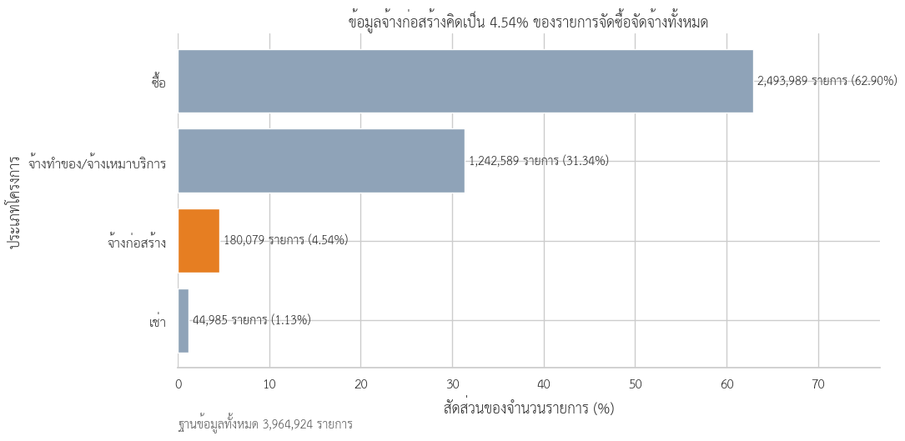
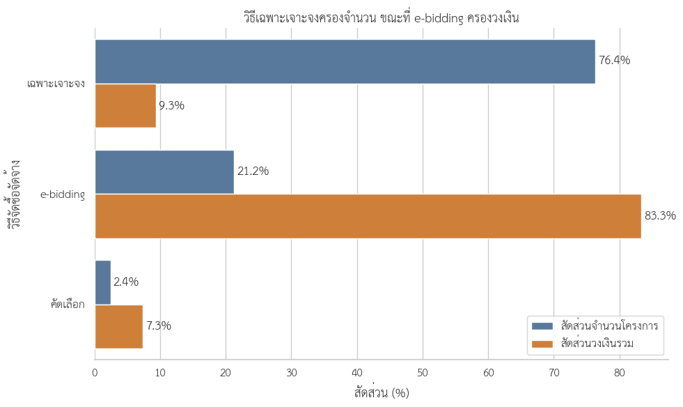
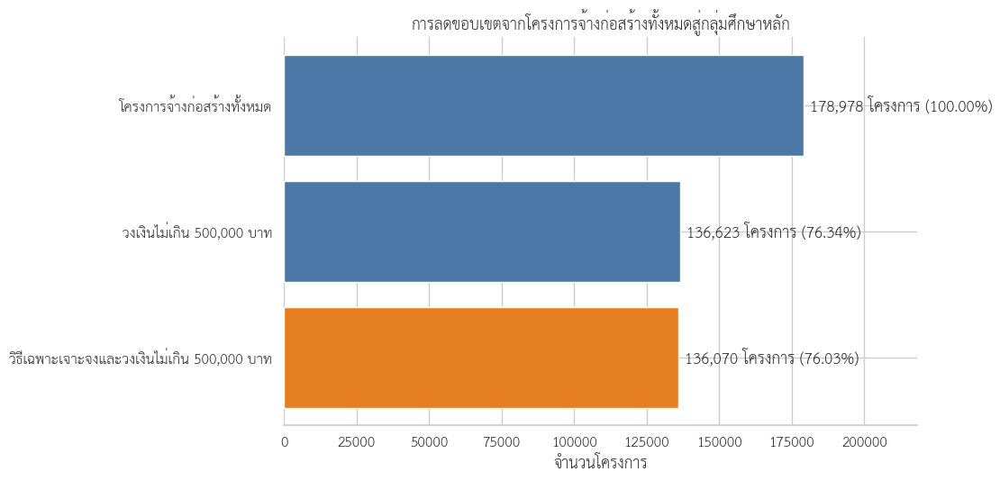
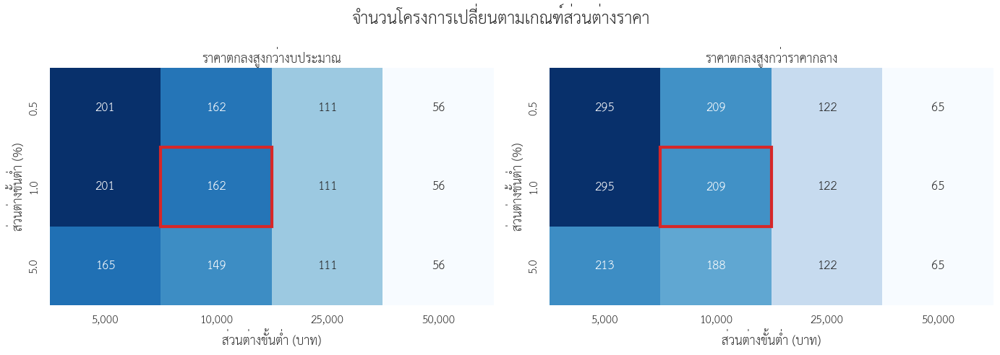
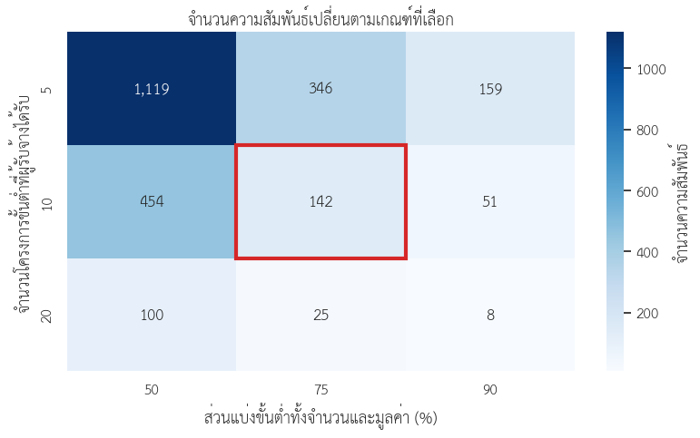
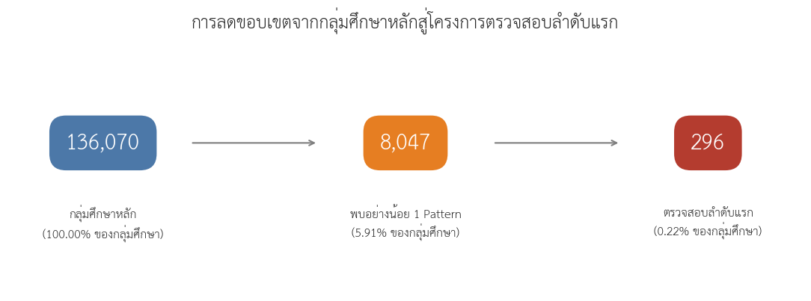

<a id="top"></a>

<div align="center">

# Exploring Thailand's Government Procurement Spending

### การสำรวจการใช้จ่ายภาครัฐไทยผ่านข้อมูลการจัดซื้อจัดจ้าง

<br>


<br>

**การสำรวจโครงสร้าง แนวโน้ม และการกระจายตัวของการจัดซื้อจัดจ้างภาครัฐไทย**  
**จากข้อมูลปีงบประมาณ พ.ศ. 2567–2569**

<br>

[Project Overview](#project-overview) ·
[Executive Summary](#executive-summary) ·
[Analysis](#contents) ·
[Data Source](#data-source)

</div>

---

<a id="project-overview"></a>

## Project Overview

โครงการนี้จัดทำขึ้นเพื่อศึกษาและสำรวจภาพรวมของ **ข้อมูลการจัดซื้อจัดจ้างภาครัฐของประเทศไทย** ในมิติต่าง ๆ โดยนำข้อมูลที่เผยแพร่ต่อสาธารณะมาผ่านกระบวนการเตรียมข้อมูล การตรวจสอบและทำความสะอาดข้อมูล การวิเคราะห์เชิงสำรวจ ตลอดจนการจัดทำกราฟและภาพประกอบ เพื่อให้สามารถมองเห็นโครงสร้าง แนวโน้ม และลักษณะสำคัญของข้อมูลได้ชัดเจนยิ่งขึ้น

การดำเนินงานแบ่งออกเป็นขั้นตอนหลักตั้งแต่การนำเข้าข้อมูลดิบ การเตรียมและปรับโครงสร้างข้อมูล การตรวจสอบคุณภาพข้อมูล การวิเคราะห์เชิงสำรวจ และการนำเสนอผลในรูปแบบ Data Visualization

### Data Analysis Workflow


---


<a id="top"></a>

<div align="center">

# Exploring Thailand's Government Procurement Spending

### การสำรวจการใช้จ่ายภาครัฐไทยผ่านข้อมูลการจัดซื้อจัดจ้าง

<br>


<br>

**การวิเคราะห์โครงสร้างและการกระจายตัวของการจัดซื้อจัดจ้างภาครัฐไทย**  
**ข้อมูลปีงบประมาณ พ.ศ. 2567–2569**

<br>

[Project Overview](#project-overview) ·
[Executive Summary](#executive-summary) ·
[Analysis](#contents) ·
[Data Source](#data-source)

</div>

---

<a id="overview-contract"></a>
<a id="project-overview"></a>

## 01 — ภาพรวมสัญญาจัดซื้อจัดจ้างภาครัฐ (Overview Contract)

> **วัตถุประสงค์:** นำเสนอภาพรวมการจัดซื้อจัดจ้างภาครัฐ และอธิบายเหตุผลในการเลือกงานจ้างก่อสร้างเป็นขอบเขตการวิเคราะห์เชิงลึก

ข้อมูลการจัดซื้อจัดจ้างภาครัฐแต่ละปีประกอบด้วยโครงการหลายล้านรายการ ทั้งการซื้อ การจ้างบริการ การก่อสร้าง การเช่า และงานวิชาชีพเฉพาะด้าน การศึกษานี้จึงเริ่มจากโครงสร้างภาพรวม 2 มิติ ได้แก่ **การจัดสรรวงเงินตามหมวดภารกิจ** และ **จำนวนกับมูลค่าของโครงการแต่ละประเภท** จากนั้นจึงกำหนดขอบเขตการวิเคราะห์ไปที่งานจ้างก่อสร้าง

> **ขอบเขตข้อมูล:** ข้อมูลปีงบประมาณ 2569 ครอบคลุมถึงวันที่ **30 กรกฎาคม 2569** และยังไม่ครบทั้งปีงบประมาณ การเปรียบเทียบกับปี 2567–2568 จึงต้องพิจารณาความแตกต่างของช่วงเวลาประกอบ

---

<a id="data-source"></a>

## แหล่งข้อมูล (Data Source)

ข้อมูลที่ใช้ในการศึกษานี้มาจาก

**Thailand Government Spending**  
**ระบบข้อมูลการใช้จ่ายภาครัฐ**

[https://govspending.data.go.th/](https://govspending.data.go.th/)

ขอขอบคุณหน่วยงานผู้ดูแล **ระบบข้อมูลการใช้จ่ายภาครัฐ (Thailand Government Spending)** สำหรับการรวบรวมและเผยแพร่ข้อมูลการจัดซื้อจัดจ้างภาครัฐ ซึ่งเป็นประโยชน์ต่อการศึกษาและการวิเคราะห์ข้อมูลสาธารณะ

ผู้จัดทำได้นำข้อมูลดังกล่าวมาตรวจสอบโครงสร้าง ทำความสะอาด และวิเคราะห์เพิ่มเติมตามวัตถุประสงค์ของการศึกษา

**การใช้และตีความข้อมูล:** เนื้อหาและข้อสรุปในโครงการนี้เป็นผลการวิเคราะห์ของผู้จัดทำเพื่อวัตถุประสงค์ทางการศึกษา ไม่ใช่ข้อสรุปอย่างเป็นทางการของหน่วยงานเจ้าของข้อมูล

**ที่มาของภาพและกราฟ:** [Exploring Thailand's Government Procurement Spending](https://github.com/panithan1991/Exploring-Thailand-s-Government-Procurement-Spending)

---

<a id="contents"></a>

## สารบัญการวิเคราะห์ (Contents)

| Section | หัวข้อการวิเคราะห์ |
| :---: | --- |
| **01** | [ภาพรวมสัญญาจัดซื้อจัดจ้างภาครัฐ (Overview Contract)](#overview-contract) |
| **02** | [การสร้างข้อมูลระดับสัญญา (Contract Construction)](#contract-construction) |
| **03** | [การกระจุกของโครงการใกล้ 500,000 บาท](#near-500k) |
| **04** | [เปรียบเทียบวิธีจัดซื้อ: วิธีเฉพาะเจาะจงมีจำนวนโครงการมากที่สุด](#procurement-method) |
| **05** | [กฎหมายอธิบายการกระจุกใกล้เพดาน](#legal-context) |
| **06** | [Pattern 1 — การเกิดซ้ำของคู่หน่วยงาน–ผู้รับจ้างเดิม](#pattern-1) |
| **07** | [Pattern 2 — การพึ่งพาผู้รับจ้างภายในหน่วยงาน](#pattern-2) |
| **08** | [Pattern 3 — การพึ่งพาผู้รับจ้างภายในจังหวัด](#pattern-3) |
| **09** | [การซ้อนทับ Pattern 1 และ Pattern 2](#pattern-overlap) |
| **10** | [เหลือ X โครงการสำหรับตรวจสอบลำดับแรก](#priority-projects) |

---

<a id="section-1-1"></a>

### 01.1 โครงสร้างวงเงินตามหมวดภารกิจ

| ปีงบประมาณ 2567 | ปีงบประมาณ 2568 | ปีงบประมาณ 2569* |
| :---: | :---: | :---: |
| [](figure/1_2567.svg) | [](figure/1_2568.svg) | [](figure/1_2569.svg) |

<p align="center"><em>รูปที่ 1–3 วงเงินงบประมาณรวมจำแนกตามหมวดภารกิจ (คลิกที่ภาพเพื่อดูขนาดเต็ม)</em></p>

<details>
<summary><b>ดูภาพขยาย — ปีงบประมาณ 2567</b></summary>

<br>

<p align="center">
  <a href="figure/1_2567.svg">
    
  </a>
</p>

</details>

<details>
<summary><b>ดูภาพขยาย — ปีงบประมาณ 2568</b></summary>

<br>

<p align="center">
  <a href="figure/1_2568.svg">
    
  </a>
</p>

</details>

<details>
<summary><b>ดูภาพขยาย — ปีงบประมาณ 2569</b></summary>

<br>

<p align="center">
  <a href="figure/1_2569.svg">
    
  </a>
</p>

</details>

ตลอดช่วงปีงบประมาณ 2567–2569 หมวด **การเศรษฐกิจ** ได้รับวงเงินสูงที่สุด คิดเป็น 33.4%, 39.7% และ 36.3% ของวงเงินรวมตามลำดับ รองลงมาคือ **การบริหารทั่วไปของรัฐ** และ **การสาธารณสุข** ทั้งสามหมวดรวมกันมีสัดส่วนประมาณ 75–80% ของวงเงินในแต่ละปี แสดงให้เห็นว่าวงเงินส่วนใหญ่กระจุกอยู่ในภารกิจหลักไม่กี่หมวด

การจำแนกตามหมวดภารกิจแสดงทิศทางการใช้จ่ายในภาพรวม แต่ยังไม่แสดงว่าวงเงินดังกล่าวดำเนินการผ่านโครงการประเภทใด ส่วนถัดไปจึงพิจารณาจำนวนโครงการ วงเงินรวม และวงเงินเฉลี่ยแยกตามประเภทโครงการ

> **หมายเหตุ:** หมวดภารกิจในกราฟจัดทำขึ้นเพื่อการวิเคราะห์ โดยพิจารณาจากสังกัด ชื่อหน่วยงาน และเกณฑ์คำสำคัญที่ผู้จัดทำกำหนด จึงไม่ใช่รหัสจำแนกงบประมาณอย่างเป็นทางการ

<a id="section-2"></a>

### 01.2 การจัดซื้อจัดจ้างจำแนกตามประเภทโครงการ

| ปีงบประมาณ 2567 | ปีงบประมาณ 2568 | ปีงบประมาณ 2569* |
| :---: | :---: | :---: |
| [](figure/2_2567.svg) | [](figure/2_2568.svg) | [](figure/2_2569.svg) |

<p align="center"><em>รูปที่ 4–6 จำนวนโครงการ วงเงินรวม และวงเงินเฉลี่ย จำแนกตามประเภทโครงการ (คลิกที่ภาพเพื่อดูขนาดเต็ม)</em></p>

<details>
<summary><b>ดูภาพขยาย — ปีงบประมาณ 2567</b></summary>

<br>

<p align="center">
  <a href="figure/2_2567.svg">
    
  </a>
</p>

</details>

<details>
<summary><b>ดูภาพขยาย — ปีงบประมาณ 2568</b></summary>

<br>

<p align="center">
  <a href="figure/2_2568.svg">
    
  </a>
</p>

</details>

<details>
<summary><b>ดูภาพขยาย — ปีงบประมาณ 2569</b></summary>

<br>

<p align="center">
  <a href="figure/2_2569.svg">
    
  </a>
</p>

</details>

<a id="executive-summary"></a>

### 01.3 ข้อค้นพบสำคัญ

ผลการจำแนกพบว่า **ประเภทโครงการที่มีจำนวนมากที่สุด ไม่ใช่ประเภทเดียวกับที่มีวงเงินรวมสูงที่สุด**

- โครงการประเภท **ซื้อ** มีจำนวนมากที่สุดในทุกปี ระหว่าง 2.47–3.43 ล้านโครงการ
- โครงการ **จ้างทำของ/จ้างเหมาบริการ** อยู่ในลำดับถัดมา ระหว่าง 1.23–1.63 ล้านโครงการ
- **งานจ้างก่อสร้าง** มีจำนวน 178,978–302,830 โครงการ แต่มีวงเงินรวมสูงที่สุดในทุกปีที่ศึกษา

| ปีงบประมาณ | จำนวนโครงการก่อสร้าง | สัดส่วนจำนวนโครงการทั้งหมด | วงเงินก่อสร้างรวม | สัดส่วนวงเงินทั้งหมด | วงเงินเฉลี่ยต่อโครงการ |
| :---: | ---: | ---: | ---: | ---: | ---: |
| **2567** | 302,830 | 5.58% | 522.68 พันล้านบาท | 42.04% | 1.73 ล้านบาท |
| **2568** | 292,437 | 6.28% | 672.09 พันล้านบาท | 49.34% | 2.30 ล้านบาท |
| **2569*** | 178,978 | 4.55% | 475.93 พันล้านบาท | 40.57% | 2.66 ล้านบาท |

งานจ้างก่อสร้างมีสัดส่วนเพียง 4.55–6.28% ของจำนวนโครงการทั้งหมด แต่คิดเป็น 40.57–49.34% ของวงเงินรวม ความแตกต่างระหว่างสัดส่วนจำนวนโครงการกับสัดส่วนวงเงินเป็นเหตุผลหลักที่เลือกงานจ้างก่อสร้างมาวิเคราะห์ต่อ

<a id="section-4"></a>

### 01.4 ขอบเขตการวิเคราะห์เชิงลึก: ปีงบประมาณ 2569

การวิเคราะห์เชิงลึกใช้ข้อมูลงานจ้างก่อสร้างปีงบประมาณ 2569 ภายใต้ขอบเขตข้อมูลถึงวันที่ 30 กรกฎาคม 2569 จุดมุ่งหมายคือศึกษาความสัมพันธ์ตั้งแต่ระดับรายการ โครงการ และสัญญา ไปจนถึงหน่วยงานและผู้รับจ้าง ไม่ใช่การเปรียบเทียบระดับความผิดปกติระหว่างปี

ข้อมูลประกอบด้วยโครงการก่อสร้างไม่ซ้ำ **178,978 โครงการ** และข้อมูลระดับรายการ **180,079 รายการ** จำนวนที่ต่างกันเกิดจากบางโครงการมีหลายสัญญา หลายผู้รับจ้าง หรือมีสมาชิกกิจการร่วมค้า (Joint Venture: JV) ดังนั้น ขั้นตอน **Contract Construction** ต้องกำหนดหน่วยวิเคราะห์และจัดการรายการซ้ำให้เรียบร้อยก่อนตรวจหารูปแบบ

<a id="section-5"></a>

### 01.5 ประเด็นวิเคราะห์ในลำดับถัดไป

จากโครงสร้างข้างต้น การวิเคราะห์ลำดับถัดไปมุ่งตอบคำถามว่า:

> **หลังจากจัดทำข้อมูลระดับโครงการและสัญญาแล้ว การกระจายของวงเงิน วิธีจัดซื้อ หน่วยงาน และผู้รับจ้าง ปรากฏรูปแบบใดที่ควรจัดลำดับเพื่อตรวจสอบเอกสารต่อ?**

การวิเคราะห์ดำเนินไปตามลำดับต่อไปนี้:

```text
ภาพรวมสัญญาจัดซื้อจัดจ้าง
→ สร้างข้อมูลสัญญางานก่อสร้าง (Contract Construction)
→ ตรวจพบการกระจุกใกล้ 500,000 บาท
→ เปรียบเทียบวิธีจัดซื้อและพบว่าวิธีเฉพาะเจาะจงมีจำนวนมากที่สุด
→ ใช้กฎหมายอธิบายการกระจุกเชิงโครงสร้าง
→ Pattern 1: การเกิดซ้ำของคู่หน่วยงาน–ผู้รับจ้างเดิม
→ Pattern 2: การพึ่งพาผู้รับจ้างภายในหน่วยงาน
→ Pattern 3: การพึ่งพาผู้รับจ้างภายในจังหวัด (ไม่พบความสัมพันธ์)
→ ซ้อนทับ Pattern 1 และ Pattern 2
→ เหลือ X โครงการสำหรับตรวจสอบลำดับแรก
```

ส่วนภาพรวมทำหน้าที่กำหนดขอบเขตการศึกษา จากข้อมูลจัดซื้อจัดจ้างหลายล้านโครงการสู่งานจ้างก่อสร้าง ก่อนพิจารณารูปแบบที่ต้องอาศัยข้อมูลด้านหน่วยงาน ผู้รับจ้าง เวลา และกฎหมายประกอบการอธิบาย

ส่วนถัดไปเริ่มจากการจัดโครงสร้างข้อมูลระดับสัญญา ก่อนตรวจการกระจุกของวงเงิน วิธีจัดซื้อ และความสัมพันธ์ระหว่างหน่วยงานกับผู้รับจ้าง

---

# การค้นหารูปแบบผิดสังเกตในโครงการจ้างก่อสร้างใกล้เพดานวิธีเฉพาะเจาะจง

> DADS5001 Data Tools and Programming — Mini Project  
> ข้อมูล e-GP ปีงบประมาณ 2569 สะสมถึงวันที่ 30 กรกฎาคม 2569 ไม่ใช่ข้อมูลเต็มปี

## คำถามของโครงการ

โครงการนี้เริ่มจากข้อมูลจัดซื้อจัดจ้างทั้งหมด แล้วเจาะลึกตามเส้นทาง:

```text
งานจัดซื้อจัดจ้างทั้งหมด
→ งานจ้างก่อสร้าง
→ พบการกระจุกใกล้ 500,000 บาท
→ ใช้กฎหมายอธิบายรูปแบบเชิงโครงสร้าง
→ ค้นหา Pattern ที่กฎหมายเพียงอย่างเดียวอธิบายไม่ได้
→ จัดลำดับกรณีสำหรับเปิดเอกสารตรวจต่อ
```

คำถามหลักคือ:

> **ภายใต้โครงการจ้างก่อสร้างที่ใช้วิธีเฉพาะเจาะจงและมีวงเงินไม่เกิน 500,000 บาท มีรูปแบบผิดสังเกตใดเกิดขึ้นซ้ำ และรูปแบบเหล่านั้นเชื่อมโยงกับหน่วยงาน ผู้รับจ้าง พื้นที่ เวลา และราคาอย่างไร?**

โครงการไม่ได้สร้าง “คะแนนทุจริต” และไม่ใช้ Pattern ใดเป็นหลักฐานว่ามีการกระทำผิด แต่ใช้ Exploratory Data Analysis (EDA) เปลี่ยนข้อมูลจำนวนมากให้เป็นกระบวนการคัดกรองที่อธิบายและทำซ้ำได้

<a id="contract-construction"></a>

## จากข้อมูลทั้งหมดสู่งานจ้างก่อสร้าง

ข้อมูลต้นทางประกอบด้วย CSV จำนวน 8 ไฟล์ รวม 3,964,924 รายการ ในจำนวนนี้เป็นรายการประเภทจ้างก่อสร้าง 180,079 รายการ หรือ 4.54%

<p align="center"></p>
<p align="center"><em>รูปที่ 1 งานจ้างก่อสร้างในข้อมูลจัดซื้อจัดจ้างทั้งหมด</em></p>

หนึ่งรายการไม่จำเป็นต้องเท่ากับหนึ่งโครงการ เพราะโครงการเดียวอาจมีหลายสัญญา หลายผู้รับจ้าง หรือมีแถวสมาชิก Joint Venture (JV) จึงต้องแยกหน่วยวิเคราะห์ก่อนคำนวณ

| ระดับข้อมูล | จำนวน | การใช้งาน |
|---|---:|---|
| รายการจ้างก่อสร้าง | 180,079 รายการ | ตรวจรายละเอียดสัญญาและผู้รับจ้าง |
| โครงการก่อสร้างไม่ซ้ำ | 178,978 โครงการ | สำรวจวงเงิน วิธีจัดซื้อ และราคา |
| กลุ่มศึกษาหลัก | 136,070 โครงการ | ตรวจหา Pattern ภายใต้บริบทเดียวกัน |
| ผู้รับจ้างหรือกลุ่มผู้รับจ้างหลังจัดการ JV | 33,570 ราย | วิเคราะห์ความสัมพันธ์กับหน่วยงานและพื้นที่ |

พบแถวสมาชิก JV 710 แถวใน 362 โครงการ หลังไม่นับแถวสมาชิกซ้ำ ยอดระดับสัญญาตรงกับยอดระดับโครงการ 178,967 จาก 178,978 โครงการ หรือ 99.99% ส่วน 11 โครงการที่ยังไม่ตรงกันถูกเก็บเป็นประเด็นคุณภาพข้อมูล ไม่ใช้เป็น Pattern ความผิดโดยอัตโนมัติ

## สิ่งที่พบก่อนตั้งเกณฑ์

### 1. โครงการขนาดเล็กครองจำนวน แต่โครงการขนาดใหญ่ครองวงเงิน

วงเงินงบประมาณมีค่ามัธยฐาน 395,000 บาท แต่มีค่าเฉลี่ยประมาณ 2.66 ล้านบาท เนื่องจากโครงการมูลค่าสูงจำนวนน้อยดึงค่าเฉลี่ยขึ้น

โครงการวงเงินไม่เกิน 500,000 บาทคิดเป็น 76.34% ของจำนวนโครงการ แต่คิดเป็นประมาณ 8.23% ของวงเงินรวม ขณะที่โครงการมากกว่า 10 ล้านบาทมีเพียง 4.08% แต่ครองวงเงินประมาณ 67.31%

<p align="center"></p>
<p align="center"><em>รูปที่ 2 “โครงการส่วนใหญ่” และ “เงินส่วนใหญ่” อยู่คนละช่วงวงเงิน</em></p>

<a id="procurement-method"></a>

### 2. วิธีเฉพาะเจาะจงครองจำนวน ส่วน e-bidding ครองมูลค่า

วิธีเฉพาะเจาะจงมี 136,651 โครงการ หรือ 76.35% ของโครงการก่อสร้าง แต่คิดเป็นประมาณ 9.33% ของวงเงินรวม ขณะที่ e-bidding มี 21.22% ของจำนวนและครองวงเงินประมาณ 83.34%

<p align="center"></p>
<p align="center"><em>รูปที่ 3 วิธีจัดซื้อแต่ละวิธีมีบทบาทต่างกันด้านจำนวนและมูลค่า</em></p>

<a id="legal-context"></a>

## กฎหมายอธิบายอะไรได้ และอธิบายอะไรไม่ได้

พระราชบัญญัติการจัดซื้อจัดจ้างและการบริหารพัสดุภาครัฐ พ.ศ. 2560 มาตรา 55 แบ่งวิธีจัดซื้อจัดจ้างหลัก และมาตรา 56 วรรคหนึ่ง (2)(ข) รองรับการใช้วิธีเฉพาะเจาะจงในกรณีที่วงเงินไม่เกินวงเงินตามกฎกระทรวง ซึ่งกำหนดไว้ที่ไม่เกิน 500,000 บาท

ดังนั้น สิ่งต่อไปนี้มีคำอธิบายเชิงโครงสร้างและ **ไม่ถือเป็น anomaly ด้วยตัวเอง**:

- โครงการวิธีเฉพาะเจาะจงจำนวนมากมีวงเงินไม่เกิน 500,000 บาท
- ค่า 500,000 บาทปรากฏบ่อยกว่าค่าบริเวณอื่น
- จำนวนโครงการกระจุกตัวใต้เส้นแบ่งดังกล่าว

กลุ่มศึกษาหลักจึงไม่ได้หมายถึง “โครงการต้องสงสัย” แต่เป็นโครงการที่อยู่ภายใต้บริบทเดียวกัน ได้แก่ วิธีเฉพาะเจาะจงและวงเงินไม่เกิน 500,000 บาท จำนวน 136,070 โครงการ

<p align="center"></p>
<p align="center"><em>รูปที่ 4 การลดขอบเขตโดยใช้หน่วยโครงการเหมือนกันทุกขั้น</em></p>

คำถามที่กฎหมายเพียงอย่างเดียวอธิบายไม่ได้คือ เหตุใดบางโครงการจึงมีส่วนต่างราคา หลายโครงการเกิดกับหน่วยงาน–ผู้รับจ้าง–วันเดียวกัน หรือผู้รับจ้างรายเดียวได้รับงานส่วนใหญ่ภายในบางหน่วยงานหรือพื้นที่

## Pattern A — ราคาและโครงสร้างสัญญา

ในกลุ่มศึกษาหลักพบราคาที่ตกลงสูงกว่างบประมาณ 256 โครงการ และสูงกว่าราคากลางที่ใช้งานได้ 550 โครงการ แต่จำนวนนี้ยังรวมส่วนต่างเล็กน้อย

จึงทดลองส่วนต่างขั้นต่ำ 5,000, 10,000, 25,000 และ 50,000 บาท ร่วมกับ 0.5%, 1% และ 5% โดยต้องผ่านทั้งจำนวนเงินและร้อยละ

<p align="center"></p>
<p align="center"><em>รูปที่ 5 จำนวนโครงการเปลี่ยนเมื่อปรับเกณฑ์ส่วนต่างราคา</em></p>

เลือกเกณฑ์มากกว่า 10,000 บาทและมากกว่า 1% เพราะ 5,000 บาทยังไวต่อส่วนต่างเล็ก ขณะที่ 25,000–50,000 บาทตัดกรณีออกมาก เกณฑ์นี้เป็น operational threshold ของการศึกษา ไม่ใช่ materiality ตามกฎหมายหรือมาตรฐานการตรวจสอบ

ผลคือ 299 โครงการไม่ซ้ำ:

| รูปแบบส่วนต่างราคา | จำนวนโครงการ |
|---|---:|
| สูงกว่าราคากลางอย่างเดียว | 137 |
| สูงกว่างบประมาณอย่างเดียว | 90 |
| สูงกว่าทั้งงบประมาณและราคากลาง | 72 |

<a id="near-500k"></a>
<a id="pattern-1"></a>

## Pattern B — โครงการใกล้เพดานที่เกิดซ้ำ

ในกลุ่มศึกษาหลักมี 26,154 โครงการอยู่ในช่วง 490,000–500,000 บาท หรือ 19.22% ช่วงนี้เป็นหน้าต่างสำรวจ 10,000 บาทใต้เพดาน ไม่ใช่เส้นแบ่งตามกฎหมาย

<p align="center"></p>
<p align="center"><em>รูปที่ 6 การกระจุกของจำนวนโครงการบริเวณก่อนถึงเพดาน</em></p>

นิยามกลุ่มจากหน่วยงานย่อย ผู้รับจ้าง และวันที่เกิดรายการเดียวกัน แล้วทดสอบทั้งหน้าต่างวงเงินและจำนวนโครงการขั้นต่ำ

<p align="center"></p>
<p align="center"><em>รูปที่ 7 ผลเมื่อเปลี่ยนหน้าต่างวงเงินและจำนวนขั้นต่ำของกลุ่ม</em></p>

ทุกหน้าต่างยังพบโครงการในกลุ่มเกิดซ้ำประมาณ 19.5–21.5% จึงเลือก 490,000–500,000 บาท เพราะแคบพอที่จะเน้นบริเวณก่อนถึงเพดานและยังมีข้อมูลเพียงพอ ส่วนขั้นต่ำ 3 โครงการใช้เป็นจุดเริ่มของ Pattern มากกว่าเหตุการณ์เดี่ยวหรือคู่

ผลคือ 1,245 กลุ่ม ครอบคลุม 5,623 โครงการ หรือ 21.50% ของโครงการในหน้าต่าง 490,000–500,000 บาท

<a id="pattern-2"></a>

## Pattern C — การพึ่งพาผู้รับจ้างภายในหน่วยงานย่อย

การวัดระดับประเทศไม่ตอบว่าหน่วยงานหนึ่งพึ่งพาผู้รับจ้างรายใดสูง จึงคำนวณสัดส่วนจำนวนโครงการและมูลค่าภายในหน่วยงานย่อยแต่ละแห่ง

ทดลองฐานงานขั้นต่ำ 5, 10 และ 20 โครงการ ร่วมกับสัดส่วน 50%, 75% และ 90% ทั้งด้านจำนวนและมูลค่า

<p align="center"></p>
<p align="center"><em>รูปที่ 8 จำนวนความสัมพันธ์เปลี่ยนตามฐานงานและส่วนแบ่งที่กำหนด</em></p>

เลือกอย่างน้อย 10 โครงการและอย่างน้อย 75% ทั้งจำนวนและมูลค่า ผลคือ 142 ความสัมพันธ์ ระหว่าง 142 หน่วยงานย่อยกับผู้รับจ้าง 130 ราย ครอบคลุม 2,421 โครงการ

ใช้คำว่า **การพึ่งพาผู้รับจ้างสูง** ไม่ใช้ “ตลาดกระจุกตัว” หรือ “ผู้มีอิทธิพล” เพราะข้อมูลไม่มีผู้เสนอราคาทั้งหมด ไม่มีนิยามตลาด และไม่มีหลักฐานด้านอำนาจหรือความสัมพันธ์ส่วนบุคคล

<a id="pattern-3"></a>

## Pattern D — เมื่อขยายจากหน่วยงานเป็นจังหวัด

เพื่อทดสอบว่าความสัมพันธ์เด่นขยายเป็นการครองงานเชิงพื้นที่หรือไม่ จึงคำนวณส่วนแบ่งจำนวนโครงการและมูลค่าของผู้รับจ้างแต่ละรายภายในจังหวัด และทดลอง:

- จังหวัดมีอย่างน้อย 20, 50 หรือ 100 โครงการ
- ผู้รับจ้างได้รับอย่างน้อย 5, 10 หรือ 20 โครงการ
- ส่วนแบ่งขั้นต่ำ 50%, 75% หรือ 90% ทั้งจำนวนและมูลค่า

ผลคือ **ไม่มีคู่จังหวัด–ผู้รับจ้างใดผ่านแม้แต่เกณฑ์ต่ำสุด 50%** ผู้รับจ้างอันดับหนึ่งของจังหวัดมีสัดส่วนสูงสุดประมาณ 14.45% ด้านจำนวนโครงการ และค่าสูงสุดประมาณ 15.12% ด้านมูลค่า

<p align="center"></p>
<p align="center"><em>รูปที่ 9 ส่วนแบ่งของผู้รับจ้างอันดับหนึ่งใน 20 จังหวัดที่มีค่าสูงสุด</em></p>

ผลเชิงลบนี้มีความหมาย: Pattern การพึ่งพาผู้รับจ้างปรากฏในระดับหน่วยงานย่อย แต่ไม่ขยายเป็นการครองงานทั้งจังหวัดภายใต้เกณฑ์ที่ทดลอง จังหวัดจึงเป็น denominator ที่กว้างเกินไปสำหรับ Pattern หลักของข้อมูลชุดนี้ และ Pattern D ไม่ถูกนำไปรวมในคะแนนจัดลำดับ

<a id="pattern-overlap"></a>

## การซ้อนทับของ Pattern

| Pattern หลัก | จำนวนโครงการ |
|---|---:|
| A — ราคา/สัญญา | 299 |
| B — ใกล้เพดานเกิดซ้ำ | 5,623 |
| C — พึ่งพาผู้รับจ้างในหน่วยงานสูง | 2,421 |

<p align="center"></p>
<p align="center"><em>รูปที่ 10 จำนวนโครงการในแต่ละ Pattern และรูปแบบการซ้อนทับ</em></p>

Pairwise overlap ประกอบด้วย:

- Pattern B + C จำนวน 291 โครงการ
- Pattern A + C จำนวน 4 โครงการ
- Pattern A + B จำนวน 1 โครงการ
- ไม่พบโครงการที่ผ่านครบ A–C พร้อมกัน

<a id="priority-projects"></a>

การพบ Pattern เดียวอาจมีคำอธิบายปกติได้หลายแบบ จึงกำหนดให้โครงการที่พบอย่างน้อย 2 Pattern หลักเป็นกลุ่มตรวจสอบลำดับแรก

| ลำดับการตรวจสอบ | จำนวนโครงการ | สัดส่วนกลุ่มศึกษา | ราคาที่ตกลงรวม |
|---|---:|---:|---:|
| ไม่พบ Pattern | 128,023 | 94.09% | 34,809.17 ล้านบาท |
| พบ 1 Pattern — ตรวจสอบตามปกติ | 7,751 | 5.70% | 3,291.11 ล้านบาท |
| พบ 2 Pattern — ตรวจสอบลำดับแรก | 296 | 0.22% | 145.43 ล้านบาท |

<p align="center"></p>
<p align="center"><em>รูปที่ 11 จากกลุ่มศึกษา 136,070 โครงการสู่ 296 โครงการตรวจสอบลำดับแรก</em></p>

## กรณีศึกษาบอกให้ตรวจอะไรต่อ

### ราคาและหลายสัญญา

โครงการ `69049225316` มีวงเงินงบประมาณและราคากลาง 491,000 บาท แต่ราคาที่ตกลงรวม 980,000 บาท ข้อมูลระดับสัญญาพบ 2 สัญญากับผู้รับจ้างรายเดียว ฉบับละ 490,000 บาท และยอดรวมสัญญาตรงกับยอดระดับโครงการ

ข้อมูลยังไม่บอกเหตุผล จึงต้องตรวจขอบเขตของแต่ละสัญญา แหล่งงบ การอนุมัติเพิ่ม และลำดับการแก้ไขโครงการ

### กลุ่มใกล้เพดานที่เกิดซ้ำ

กลุ่มใหญ่ที่สุดอยู่ภายใต้สำนักงานทรัพยากรธรรมชาติและสิ่งแวดล้อมจังหวัดมุกดาหาร ผู้รับจ้างคือบริษัท บ้านบุ่ง วิศวกรรม จำกัด และมีวันที่เกิดรายการ 29 ธันวาคม 2568

ต้องตรวจสถานที่ แผนจัดซื้อ TOR/BOQ แหล่งงบ ความต่อเนื่องของงาน และเหตุผลที่ดำเนินการเป็นหลายโครงการก่อนพิจารณาสาเหตุ

### การพึ่งพาผู้รับจ้างสูง

เทศบาลตำบลบ้านโปร่งมี 73 โครงการในกลุ่มศึกษา และผู้รับจ้างรายเดียวได้รับครบทั้ง 73 โครงการ คิดเป็น 100% ทั้งจำนวนและมูลค่า รวมประมาณ 7.97 ล้านบาท

ต้องตรวจจำนวนผู้เสนอราคา วิธีเชิญผู้ประกอบการ ความเชี่ยวชาญ จำนวนผู้ประกอบการในพื้นที่ และความสัมพันธ์ของขอบเขตงาน ไม่สามารถสรุปว่าการแข่งขันถูกจำกัดจากข้อมูลผู้ชนะเพียงด้านเดียว

## คำตอบของโครงการ

เพดาน 500,000 บาทอธิบายได้ว่าทำไมโครงการวิธีเฉพาะเจาะจงจึงกระจุกตัว แต่ไม่ได้อธิบายว่าเหตุใดบางหน่วยงาน ผู้รับจ้าง และช่วงเวลาจึงเกิดรูปแบบเดิมซ้ำหรือซ้อนทับกัน

ข้อค้นพบหลักมี 3 ประการ:

1. Pattern ที่เด่นที่สุดเกิดในระดับ **หน่วยงานย่อย–ผู้รับจ้าง–เวลา** ไม่ใช่จากวงเงินใกล้เพดานเพียงค่าเดียว
2. การซ้อนทับของ Pattern A–C ช่วยลดขอบเขตจาก 136,070 โครงการเหลือ 296 โครงการ หรือ 0.22% สำหรับเปิดเอกสารก่อน
3. เมื่อขยาย denominator เป็นระดับจังหวัด ไม่พบผู้รับจ้างครองงานตามเกณฑ์ที่ทดลอง แสดงว่าระดับพื้นที่กว้างเกินไปและไม่ควรถูกฝืนให้เป็นผล anomaly

> **EDA ที่ดีไม่ได้มีหน้าที่หาแต่สิ่งผิดสังเกต แต่ต้องแสดงด้วยว่าสมมติฐานใดไม่พบหลักฐานสนับสนุน และระดับการวิเคราะห์ใดอธิบาย Pattern ได้เหมาะสมที่สุด**

## สิ่งที่ข้อมูลยังพิสูจน์ไม่ได้

- เจตนาหลีกเลี่ยงวิธีแข่งขันหรือแบ่งโครงการ
- การฮั้วหรือจำกัดการแข่งขัน
- อำนาจตลาด อิทธิพลทางการเมือง หรือความสัมพันธ์ส่วนบุคคล
- เหตุผลของการทำหลายสัญญา การเพิ่มวงเงิน หรือการแก้ไขโครงการ
- ความผิดทางกฎหมายหรือการทุจริต

ข้อมูลชุดนี้มีเฉพาะผู้ชนะ ไม่มีรายชื่อผู้เสนอราคาและราคาที่เสนอทั้งหมด วันที่เกิดรายการอาจไม่ใช่วันที่ตัดสินใจจัดซื้อ และ threshold ทั้งหมดเป็นกติกาของการศึกษา ผลจึงใช้ตั้งคำถามและจัดลำดับการตรวจ ไม่ใช้ตัดสินความผิด

## เอกสารที่ควรตรวจต่อ

1. แผนจัดซื้อจัดจ้างและแหล่งงบประมาณ
2. TOR/BOQ สถานที่ และความเชื่อมโยงระหว่างโครงการ
3. เอกสารอนุมัติและประวัติการแก้ไขโครงการหรือสัญญา
4. รายชื่อผู้เสนอราคาและราคาที่เสนอทั้งหมด
5. วิธีสืบราคาและเงื่อนไขการเชิญผู้ประกอบการ
6. เหตุผลของการเลือกผู้รับจ้างและการจัดทำหลายโครงการหรือหลายสัญญา

## Notebook และการทำซ้ำ

| Notebook | หน้าที่ |
|---|---|
| [02_construction_data_preparation_2569.ipynb](02_construction_data_preparation_2569.ipynb) | สกัดงานจ้างก่อสร้าง ตรวจ grain จังหวัด และคู่ project–supplier |
| [03_construction_eda_2569.ipynb](03_construction_eda_2569.ipynb) | สำรวจจากโครงสร้างข้อมูลสู่บริบทกฎหมายและคำถาม residual anomaly |
| [04_construction_review_indicators_2569.ipynb](04_construction_review_indicators_2569.ipynb) | ตรวจ Pattern A–D, sensitivity, overlap และลำดับการตรวจ |

รันตามลำดับ `02 → 03 → 04` บน Google Colab ไฟล์ข้อมูลขนาดใหญ่และ CSV ผลลัพธ์ไม่จัดเก็บใน GitHub ส่วนรูปที่ใช้ในรายงานอยู่ใน [figure/](figure/)


---

<div align="center">


<br><br>

### Thailand Government Procurement Spending Analysis

การวิเคราะห์ข้อมูลการจัดซื้อจัดจ้างภาครัฐของประเทศไทย  
ปีงบประมาณ พ.ศ. 2567–2569

<br>

**Data Source**

Thailand Government Spending  
https://govspending.data.go.th/

<br>

`Data Preprocessing` · `Data Cleaning` · `Exploratory Data Analysis` · `Data Visualization`

<br>

<sub>
โครงการนี้จัดทำขึ้นเพื่อวัตถุประสงค์ด้านการศึกษาและการวิเคราะห์ข้อมูล
</sub>

<br><br>

<a href="#top"><b>กลับสู่ด้านบน</b></a>

</div>


