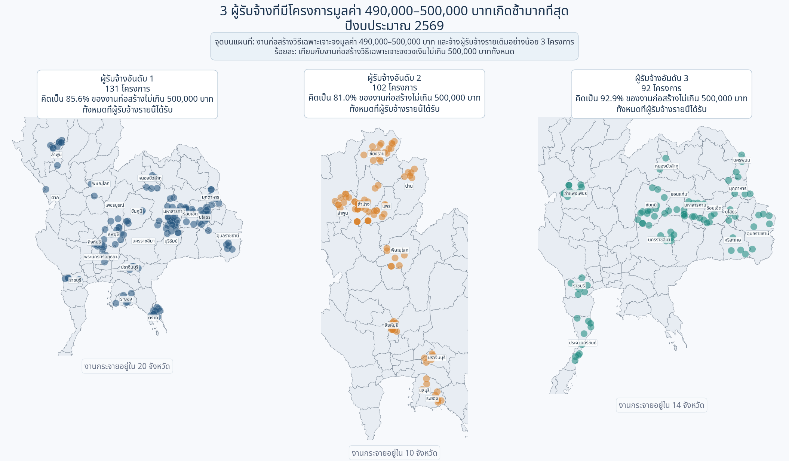
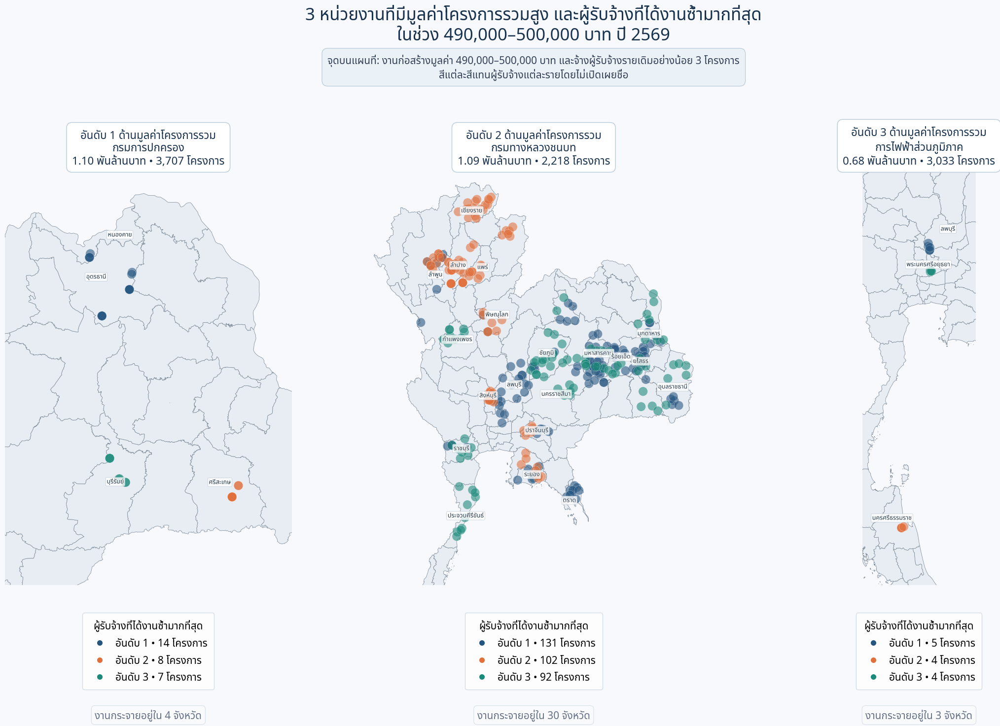

# Exploring Thailand's Government Procurement Spending

### การสำรวจการใช้จ่ายภาครัฐไทยผ่านข้อมูลการจัดซื้อจัดจ้าง

 

 

**การสำรวจโครงสร้าง แนวโน้ม และการกระจายตัวของการจัดซื้อจัดจ้างภาครัฐไทย**  
**จากข้อมูลปีงบประมาณ พ.ศ. 2567–2569**

 

[Project Overview](#project-overview) ·
[Executive Summary](#executive-summary) ·
[Analysis](#contents) ·
[Data Source](#data-source)

---

## แหล่งข้อมูล (Data Source)

ข้อมูลที่ใช้ในการศึกษานี้มาจาก

**Thailand Government Spending**  
**ระบบข้อมูลการใช้จ่ายภาครัฐ**

[https://govspending.data.go.th/](https://govspending.data.go.th/)

ขอขอบคุณหน่วยงานผู้ดูแล **ระบบข้อมูลการใช้จ่ายภาครัฐ (Thailand Government Spending)** สำหรับการรวบรวมและเผยแพร่ข้อมูลการจัดซื้อจัดจ้างภาครัฐ ซึ่งเป็นประโยชน์ต่อการศึกษาและการวิเคราะห์ข้อมูลสาธารณะ

ผู้จัดทำได้นำข้อมูลดังกล่าวมาตรวจสอบโครงสร้าง ทำความสะอาด และวิเคราะห์เพิ่มเติมตามวัตถุประสงค์ของการศึกษา

**การใช้และตีความข้อมูล:** เนื้อหาและข้อสรุปในโครงการนี้เป็นผลการวิเคราะห์ของผู้จัดทำเพื่อวัตถุประสงค์ทางการศึกษา ไม่ใช่ข้อสรุปอย่างเป็นทางการของหน่วยงานเจ้าของข้อมูล

**เอกสารและโครงการอ้างอิงเพิ่มเติม**

- [DADS5001 Data Tools — Project EDA](https://github.com/mdanmek/nida-dads-notes/blob/main/dads5001-data-tools/project/eda/README.md)
- [Exploring Thailand's Government Procurement Spending](https://github.com/panithan1991/Exploring-Thailand-s-Government-Procurement-Spending)

**ที่มาของภาพและกราฟ:** [Exploring Thailand's Government Procurement Spending](https://github.com/panithan1991/Exploring-Thailand-s-Government-Procurement-Spending)

---

## สารบัญ (Contents)

| Section | หัวข้อการวิเคราะห์ |
| :---: | --- |
| **Data** | [แหล่งข้อมูล (Data Source)](#data-source) |
| **01** | [01 — ภาพรวมสัญญาจัดซื้อจัดจ้างภาครัฐ (Overview Contract)](#overview-contract) |
| **01.1** | [01.1 โครงสร้างวงเงินตามหมวดภารกิจ](#section-1-1) |
| **01.2** | [01.2 การจัดซื้อจัดจ้างจำแนกตามประเภทโครงการ](#section-2) |
| **01.3** | [01.3 ข้อค้นพบสำคัญ](#executive-summary) |
| **02** | [จากเพดาน 500,000 บาท สู่ 161 รายการที่ควรตรวจสอบก่อน](#construction-screening) |

---

## 01 — ภาพรวมสัญญาจัดซื้อจัดจ้างภาครัฐ (Overview Contract)

> **วัตถุประสงค์:** นำเสนอภาพรวมการจัดซื้อจัดจ้างภาครัฐ และอธิบายเหตุผลในการเลือกงานจ้างก่อสร้างเป็นขอบเขตการวิเคราะห์เชิงลึก

ข้อมูลการจัดซื้อจัดจ้างภาครัฐแต่ละปีประกอบด้วยโครงการหลายล้านรายการ ทั้งการซื้อ การจ้างบริการ การก่อสร้าง การเช่า และงานวิชาชีพเฉพาะด้าน การศึกษานี้จึงเริ่มจากโครงสร้างภาพรวม 2 มิติ ได้แก่ **การจัดสรรวงเงินตามหมวดภารกิจ** และ **จำนวนกับมูลค่าของโครงการแต่ละประเภท** จากนั้นจึงกำหนดขอบเขตการวิเคราะห์ไปที่งานจ้างก่อสร้าง

> **ขอบเขตข้อมูล:** ข้อมูลปีงบประมาณ 2569 ครอบคลุมถึงวันที่ **30 กรกฎาคม 2569** และยังไม่ครบทั้งปีงบประมาณ การเปรียบเทียบกับปี 2567–2568 จึงต้องพิจารณาความแตกต่างของช่วงเวลาประกอบ

---

### 01.1 โครงสร้างวงเงินตามหมวดภารกิจ

| ปีงบประมาณ 2567 | ปีงบประมาณ 2568 | ปีงบประมาณ 2569* |
| :---: | :---: | :---: |
|  |  |  |

<em>รูปที่ 1–3 วงเงินงบประมาณรวมจำแนกตามหมวดภารกิจ (คลิกที่ภาพเพื่อดูขนาดเต็ม)</em>

<b>ดูภาพขยาย — ปีงบประมาณ 2567</b>

 

  

<b>ดูภาพขยาย — ปีงบประมาณ 2568</b>

 

  

<b>ดูภาพขยาย — ปีงบประมาณ 2569</b>

 

  

ตลอดช่วงปีงบประมาณ 2567–2569 หมวด **การเศรษฐกิจ** ได้รับวงเงินสูงที่สุด คิดเป็น 33.4%, 39.7% และ 36.3% ของวงเงินรวมตามลำดับ รองลงมาคือ **การบริหารทั่วไปของรัฐ** และ **การสาธารณสุข** ทั้งสามหมวดรวมกันมีสัดส่วนประมาณ 75–80% ของวงเงินในแต่ละปี แสดงให้เห็นว่าวงเงินส่วนใหญ่กระจุกอยู่ในภารกิจหลักไม่กี่หมวด

การจำแนกตามหมวดภารกิจแสดงทิศทางการใช้จ่ายในภาพรวม แต่ยังไม่แสดงว่าวงเงินดังกล่าวดำเนินการผ่านโครงการประเภทใด ส่วนถัดไปจึงพิจารณาจำนวนโครงการ วงเงินรวม และวงเงินเฉลี่ยแยกตามประเภทโครงการ

> **หมายเหตุ:** หมวดภารกิจในกราฟจัดทำขึ้นเพื่อการวิเคราะห์ โดยพิจารณาจากสังกัด ชื่อหน่วยงาน และเกณฑ์คำสำคัญที่ผู้จัดทำกำหนด จึงไม่ใช่รหัสจำแนกงบประมาณอย่างเป็นทางการ

### 01.2 การจัดซื้อจัดจ้างจำแนกตามประเภทโครงการ

| ปีงบประมาณ 2567 | ปีงบประมาณ 2568 | ปีงบประมาณ 2569* |
| :---: | :---: | :---: |
|  |  |  |

<em>รูปที่ 4–6 จำนวนโครงการ วงเงินรวม และวงเงินเฉลี่ย จำแนกตามประเภทโครงการ (คลิกที่ภาพเพื่อดูขนาดเต็ม)</em>

<b>ดูภาพขยาย — ปีงบประมาณ 2567</b>

 

  

<b>ดูภาพขยาย — ปีงบประมาณ 2568</b>

 

  

<b>ดูภาพขยาย — ปีงบประมาณ 2569</b>

 

  

### 01.3 ข้อค้นพบสำคัญ

ผลการจำแนกพบว่า **ประเภทโครงการที่มีจำนวนมากที่สุด ไม่ใช่ประเภทเดียวกับที่มีวงเงินรวมสูงที่สุด**

- โครงการประเภท **ซื้อ** มีจำนวนมากที่สุดในทุกปี ระหว่าง 2.47–3.43 ล้านโครงการ
- โครงการ **จ้างทำของ/จ้างเหมาบริการ** อยู่ในลำดับถัดมา ระหว่าง 1.23–1.63 ล้านโครงการ
- **งานจ้างก่อสร้าง** มีจำนวน 178,978–302,830 โครงการ แต่มีวงเงินรวมสูงที่สุดในทุกปีที่ศึกษา

| ปีงบประมาณ | จำนวนโครงการก่อสร้าง | สัดส่วนจำนวนโครงการทั้งหมด | วงเงินก่อสร้างรวม | สัดส่วนวงเงินทั้งหมด | วงเงินเฉลี่ยต่อโครงการ |
| :---: | ---: | ---: | ---: | ---: | ---: |
| **2567** | 302,830 | 5.58% | 522.68 พันล้านบาท | 42.04% | 1.73 ล้านบาท |
| **2568** | 292,437 | 6.28% | 672.09 พันล้านบาท | 49.34% | 2.30 ล้านบาท |
| **2569*** | 178,978 | 4.55% | 475.93 พันล้านบาท | 40.57% | 2.66 ล้านบาท |

งานจ้างก่อสร้างมีสัดส่วนเพียง 4.55–6.28% ของจำนวนโครงการทั้งหมด แต่คิดเป็น 40.57–49.34% ของวงเงินรวม ความแตกต่างระหว่างสัดส่วนจำนวนโครงการกับสัดส่วนวงเงินเป็นเหตุผลหลักที่เลือกงานจ้างก่อสร้างมาวิเคราะห์ต่อ

---

# จากเพดาน 500,000 บาท สู่ 161 รายการที่ควรตรวจสอบก่อน

> การวิเคราะห์ข้อมูลจัดซื้อจัดจ้างงานก่อสร้าง ปีงบประมาณ 2569  
> เป้าหมายคือจัดลำดับความสำคัญสำหรับการตรวจเอกสาร ไม่ใช่ตัดสินว่ารายการใดทุจริต

## คำถามที่เราอยากตอบ

เมื่อโครงการก่อสร้างจำนวนมากใช้วิธีเฉพาะเจาะจงและมีวงเงินอยู่ใกล้ 500,000 บาท เราจะคัดกรองรายการที่มีรูปแบบซ้ำและควรได้รับการตรวจสอบก่อนอย่างเป็นระบบได้อย่างไร

## คำตอบสั้น ๆ

จากสัญญาก่อสร้างทั้งหมด **179,716 รายการ** เราพบรายการที่อยู่ในขอบเขตวิธีเฉพาะเจาะจงและวงเงินไม่เกิน 500,000 บาท **136,122 รายการ** ภายในกลุ่มนี้มีสัญญาใกล้เพดาน 490,000–500,000 บาท **20,200 รายการ** เมื่อใช้สัญญาณ “คู่หน่วยงาน–ผู้รับจ้างซ้ำ” และ “ผู้รับจ้างครองสัดส่วนสูงในหน่วยงาน” ร่วมกัน เหลือ **161 รายการ** สำหรับตรวจเอกสารเป็นลำดับแรก

| จุดคัดกรอง | จำนวนรายการ | ความหมาย |
|---|---:|---|
| สัญญาก่อสร้างทั้งหมด | 179,716 | ฐานข้อมูลเริ่มต้น |
| วิธีเฉพาะเจาะจง และวงเงิน ≤ 500,000 บาท | 136,122 | ขอบเขตการวิเคราะห์ |
| วงเงิน 490,000–500,000 บาท | 20,200 | กลุ่มใกล้เพดาน |
| เข้าเกณฑ์ Pattern 1 | 9,413 | คู่หน่วยงาน–ผู้รับจ้างมีรายการใกล้เพดานซ้ำ |
| เข้าเกณฑ์ Pattern 2 | 1,343 | ผู้รับจ้างมีสัดส่วนสูงในหน่วยงาน |
| เข้าเกณฑ์ทั้งสองแบบ | **161** | ลำดับแรกสำหรับตรวจเอกสาร |

## 1. เริ่มจากกำหนดขอบเขตให้ชัด

การวิเคราะห์นี้สนใจสัญญาก่อสร้างที่ใช้วิธีเฉพาะเจาะจงและมีวงเงินไม่เกิน 500,000 บาท จำนวน 136,122 รายการ หรือ 75.74% ของสัญญาก่อสร้างทั้งหมด

ขอบเขตนี้ช่วยให้เราเปรียบเทียบรายการภายใต้บริบทเดียวกัน ก่อนมองหารูปแบบใกล้เพดานวงเงิน

## 2. สิ่งที่สะดุดตาคือการกระจุกใกล้ 500,000 บาท

ภายในขอบเขตการวิเคราะห์ มีสัญญา 20,200 รายการอยู่ระหว่าง 490,000–500,000 บาท คิดเป็น 11.24% ของสัญญาก่อสร้างทั้งหมด การกระจุกตัวนี้เป็น “สัญญาณให้สำรวจต่อ” แต่ยังไม่ใช่หลักฐานความผิดปกติด้วยตัวมันเอง

## 3. รายการใกล้เพดานแทบทั้งหมดใช้วิธีเฉพาะเจาะจง

เมื่อดูสัญญาใกล้เพดานทั้งหมด 20,450 รายการ พบว่า 20,200 รายการ หรือ 98.78% ใช้วิธีเฉพาะเจาะจง ส่วน e-bidding มี 238 รายการ และวิธีคัดเลือก 12 รายการ

ผลนี้ทำให้คำถามเปลี่ยนจาก “มีรายการใกล้เพดานหรือไม่” เป็น “รายการใดมีรูปแบบซ้ำที่ควรตรวจสอบก่อน”

## 4. จากรายการเดี่ยว สู่ความสัมพันธ์หน่วยงาน–ผู้รับจ้าง

เราเปลี่ยนหน่วยวิเคราะห์จากรายการสัญญาเป็นคู่ **ชื่อหน่วยงาน + ผู้รับจ้าง** เพื่อดูว่าคู่ใดเกิดรายการใกล้เพดานซ้ำหลายครั้ง Pattern 1 พบสัญญา 9,413 รายการ กระจายอยู่ใน 1,580 คู่หน่วยงาน–ผู้รับจ้าง

<b>ดูแผนที่ประกอบ — 3 หน่วยงานที่มีโครงการมูลค่า 490,000–500,000 บาทเกิดซ้ำมากที่สุด</b>

 

  

<em>แผนที่ 1 การกระจายตำแหน่งโครงการของหน่วยงานที่พบรายการใกล้เพดานซ้ำมากที่สุด</em>

<b>ดูแผนที่ประกอบ — 3 ผู้รับจ้างที่มีโครงการมูลค่า 490,000–500,000 บาทเกิดซ้ำมากที่สุด</b>

 

  

<em>แผนที่ 2 การกระจายตำแหน่งโครงการของผู้รับจ้างที่พบรายการใกล้เพดานซ้ำมากที่สุด โดยไม่เปิดเผยชื่อ</em>

<b>ดูแผนที่ประกอบ — หน่วยงานวงเงินสูงและผู้รับจ้างที่ได้งานซ้ำในช่วง 490,000–500,000 บาท</b>

 

  

<em>แผนที่ 3 มุมมองเชิงพื้นที่ของหน่วยงานที่มีมูลค่าโครงการรวมสูงและผู้รับจ้างที่ได้รับงานซ้ำ</em>

Pattern 1 ครอบคลุม 46.60% ของรายการใกล้เพดาน จึงเหมาะเป็นตัวชี้ “พื้นที่เสี่ยงกว้าง” มากกว่าจะใช้ตัดสินลำพัง

## 5. ใช้สองสัญญาณร่วมกันเพื่อลดการหว่านแห

Pattern 2 มองอีกมุมหนึ่ง: ผู้รับจ้างที่มีจำนวนสัญญาอย่างน้อย 10 รายการ และครองอย่างน้อย 80% ของทั้งจำนวนรายการและมูลค่างานภายในหน่วยงานนั้น เมื่อซ้อน Pattern 1 กับ Pattern 2 จำนวนรายการลดจากหลักพันเหลือ **161 รายการ**

จุดตัดนี้คือรายการที่ควรตรวจเอกสารก่อน เพราะมีทั้งความถี่ใกล้เพดานในคู่เดิมและการกระจุกตัวของผู้รับจ้างในหน่วยงานเดียวกัน

## 6. ผลลัพธ์สุดท้ายคือคิวตรวจสอบที่ลงมือทำได้

กราฟต่อไปแสดงคู่หน่วยงาน–ผู้รับจ้างที่มีจำนวนรายการ Priority Review สูงสุด เพื่อให้ทีมตรวจสอบเริ่มจากกลุ่มที่มีหลักฐานเชิงข้อมูลหนาแน่นที่สุด

ควรตรวจเอกสารประกอบ เช่น ขอบเขตงาน ราคากลาง วันที่ประกาศและทำสัญญา ความเชื่อมโยงของโครงการ การแข่งขันเสนอราคา และประวัติผู้รับจ้าง ก่อนสรุปผลใด ๆ

## นิยามเกณฑ์ที่ใช้

| Flag | เกณฑ์ | บทบาทในการวิเคราะห์ |
|---|---|---|
| Pattern 1 | คู่ชื่อหน่วยงาน + ผู้รับจ้างเดียวกัน มีรายการวงเงิน 490,000–500,000 บาทอย่างน้อย 3 รายการ | ค้นหารูปแบบซ้ำใกล้เพดาน |
| Pattern 2 | ผู้รับจ้างมีอย่างน้อย 10 รายการ และครอง ≥80% ทั้งสัดส่วนจำนวนรายการและมูลค่าในหน่วยงาน | ค้นหาการกระจุกตัวสูง |
| Priority Review | Pattern 1 และ Pattern 2 เป็นจริงพร้อมกัน | จัดลำดับตรวจสอบเอกสาร |
| จังหวัด | แสดงและจัดเรียงผลลัพธ์เช่นเดียวกับ grain อื่น | ใช้เป็นบริบทเท่านั้น ไม่เข้า criteria |
| หน่วยงานย่อย | ไม่นำมาใช้ | ตัด mapping และ grain นี้ออก เพราะส่วนใหญ่ซ้ำกับหน่วยงาน |

ตัวเลข 3, 10 และ 80% เป็น **analyst-defined screening thresholds** ไม่ใช่เกณฑ์ทางกฎหมาย สามารถทำ sensitivity analysis เพิ่มเติมเพื่อดูว่าผลลัพธ์เปลี่ยนอย่างไรเมื่อปรับ threshold

## ข้อจำกัด

- Flag เป็นเครื่องมือคัดกรอง ไม่ใช่ข้อพิสูจน์การทุจริตหรือการหลีกเลี่ยงกฎ
- ชื่อหน่วยงานและผู้รับจ้างอาจมีความคลาดเคลื่อนจากการสะกดหรือรูปแบบการบันทึก
- การวิเคราะห์ยังไม่รวมเนื้อหา TOR ราคากลาง คุณสมบัติผู้เสนอราคา และความสัมพันธ์เชิงนิติบุคคล
- จังหวัดใช้เพื่ออธิบายบริบท ไม่ได้มีผลต่อการเข้าเกณฑ์
- ผลลัพธ์ขึ้นกับช่วงวงเงินและ threshold ที่กำหนด

## ลำดับการทำงาน

| Notebook | หน้าที่ |
|---|---|
| `02_construction_data_preparation_2569.ipynb` | เตรียมและตรวจคุณภาพข้อมูลก่อสร้าง |
| `03_construction_eda_2569.ipynb` | สำรวจการกระจายวงเงินและวิธีจัดซื้อจัดจ้าง |
| `04_construction_pattern_analysis_2569.ipynb` | สร้าง flag และตารางวิเคราะห์ระดับหน่วยงาน/คู่ผู้รับจ้าง |
| `05_construction_storytelling_visuals_2569.ipynb` | สร้างภาพเล่าเรื่องและสรุปผลสำหรับนำเสนอ |

## การทำซ้ำผลลัพธ์

รัน Notebook 02 → 03 → 04 → 05 ตามลำดับ โดย Notebook 05 จะสร้างภาพสำหรับ README ไว้ในโฟลเดอร์ `figure/`

---

**ข้อสรุป:** ข้อมูลไม่ได้บอกว่า 161 รายการ “ผิด” แต่บอกว่า 161 รายการนี้มีเหตุผลเชิงข้อมูลเพียงพอที่จะถูกตรวจสอบก่อนรายการอื่น

---

  

### Thailand Government Procurement Spending Analysis

การวิเคราะห์ข้อมูลการจัดซื้อจัดจ้างภาครัฐของประเทศไทย  
ปีงบประมาณ พ.ศ. 2567–2569

 

**Data Source**

Thailand Government Spending  
[https://govspending.data.go.th/](https://govspending.data.go.th/)

 

`Data Preprocessing` · `Data Cleaning` · `Exploratory Data Analysis` · `Data Visualization`

 

โครงการนี้จัดทำขึ้นเพื่อวัตถุประสงค์ด้านการศึกษาและการวิเคราะห์ข้อมูล

  

[**กลับสู่ด้านบน**](#top)

