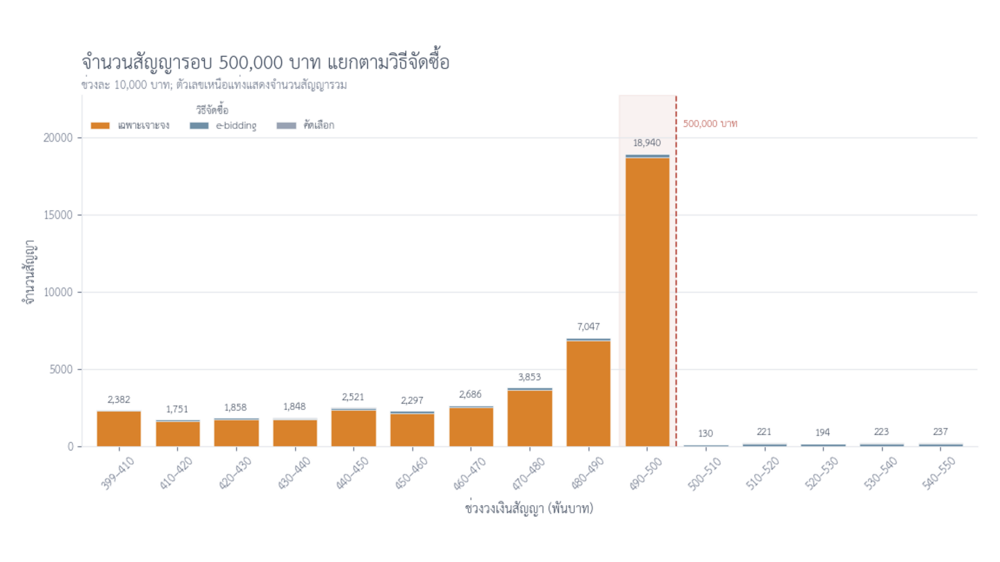
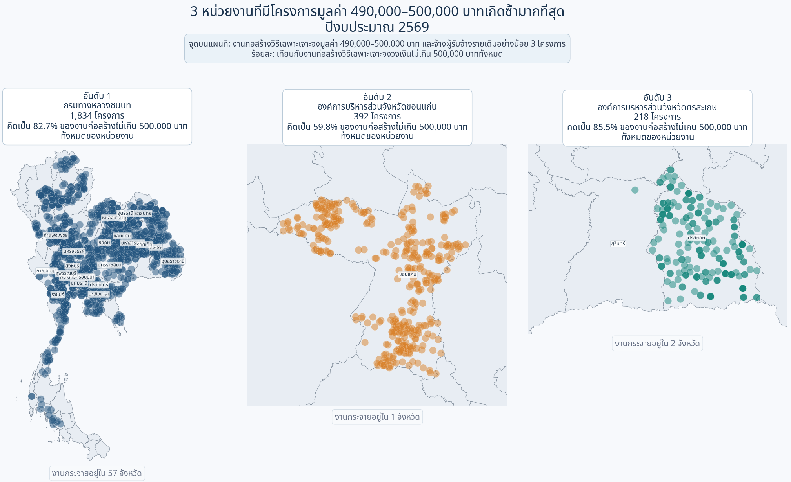
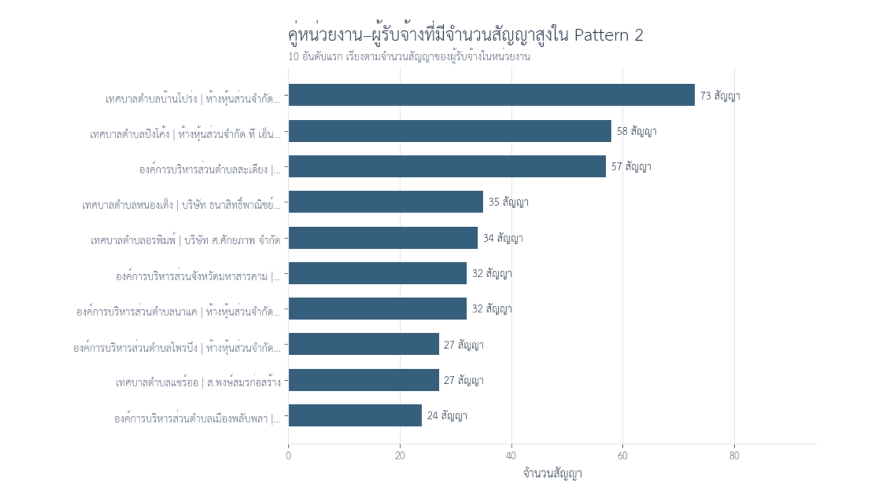
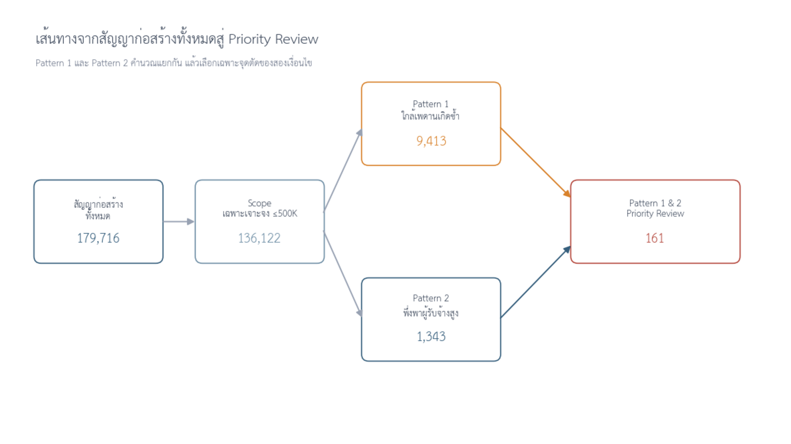

# Small Contracts, Big Picture: Procurement Below the 500,000 THB Threshold

### สัญญาขนาดเล็กในภาพรวมมหภาค: การจัดซื้อจัดจ้างภาครัฐที่มีวงเงินต่ำกว่า 500,000 บาท

 

 

**การสำรวจข้อมูลเชิงลึก (Exploratory Data Analysis: EDA) พฤติกรรมของข้อมูลการจัดซื้อจัดจ้างภาครัฐ (e-GP) สำหรับโครงการประเภทงานก่อสร้างที่มีวงเงินงบประมาณไม่เกิน 500,000 บาท **  

 

[Project Overview](#project-overview) ·
[Executive Summary](#executive-summary) ·
[Analysis](#contents) ·
[Data Source](#data-source)

---

## แหล่งข้อมูล (Data Source)
ข้อมูลที่ใช้ในการศึกษานี้มาจาก
**ระบบข้อมูลการใช้จ่ายภาครัฐ (Thailand Government Spending)**
[https://govspending.data.go.th/home](https://govspending.data.go.th/home)

คณะผู้จัดทำโครงการศึกษานี้ได้นำข้อมูลดังกล่าวมาตรวจสอบโครงสร้าง ทำความสะอาดข้อมูล และวิเคราะห์เพิ่มเติมตามวัตถุประสงค์ของการศึกษา โดยคณะผู้จัดทำขอขอบคุณสำนักงานพัฒนารัฐบาลดิจิทัล (องค์การมหาชน) (สพร.) ซึ่งเป็นรวบรวม เผยแพร่ และดูแลระบบข้อมูลการใช้จ่ายภาครัฐ (Thailand Government Spending) อันเป็นประโยชน์ต่อการศึกษาและการวิเคราะห์ข้อมูลสาธารณะมา ณ ทีนี้

**การใช้และตีความข้อมูล:** เนื้อหาและข้อสรุปในโครงการนี้เป็นผลการวิเคราะห์ของผู้จัดทำเพื่อวัตถุประสงค์ทางการศึกษา ไม่ใช่ข้อสรุปอย่างเป็นทางการของหน่วยงานเจ้าของข้อมูล

---

## สารบัญ (Contents)

| ลำดับ | หัวข้อหลัก |
| :---: | --- |
| — | [แหล่งข้อมูล (Data Source)](#data-source) |
| 1 | [ความเป็นมาของการศึกษา (Background)](#background) |
| 2 | [ภาพรวมงบประมาณและจำนวนโครงการจัดซื้อจัดจ้างของภาครัฐ (Overview)](#overview-contract) |
| 3 | [การสำรวจสัญญาจ้างก่อสร้าง ปีงบประมาณ พ.ศ. 2569](#construction-screening) |
| 4 | [การวิเคราะห์รูปแบบในระดับคู่หน่วยงาน–ผู้รับจ้าง](#study-scope) |
| 5 | [การคัดกรองสัญญาสำหรับตรวจสอบในลำดับแรก](#combined-signals) |
| 6 | [สรุปผลการศึกษา ข้อเสนอแนะ และข้อจำกัด](#limitations) |
| — | [เอกสารอ้างอิง](#reference) |
| — | [คู่มือสำหรับผู้ที่ต้องการทดลองรันโค้ด](#reader-guide) |

---

## 1. ความเป็นมาของการศึกษา
การใช้จ่ายและการลงทุนของภาครัฐ (Government Spending) เป็นปัจจัยสำคัญในการขับเคลื่อนเศรษฐกิจของประเทศเนื่องจากการลงทุนในโครงสร้างพื้นฐานและบริการสาธารณะเป็นการเสริมสร้างสิ่งอำนวยความสะดวกในการดำเนินธุรกิจและยกระดับคุณภาพชีวิตของประชาชนและสังคม ทั้งนี้ เพื่อให้การใช้งบประมาณเป็นไปอย่างมีประสิทธิภาพและตรวจสอบได้ภาครัฐได้มีความพยายามในการปฏิรูประบบราชการผ่านการบังคับใช้ พ.ร.บ. การจัดซื้อจัดจ้างและการบริหารพัสดุภาครัฐ พ.ศ. 2560 กฎระเบียบที่เกี่ยวข้อง รวมถึงการพัฒนาโครงสร้างพื้นฐานดิจิทัลผ่านระบบจัดซื้อจัดจ้างภาครัฐด้วยอิเล็กทรอนิกส์ (e-GP) ของกรมบัญชีกลางเพื่อเสริมสร้างความโปร่งใสในการใช้งบประมาณของทางภาครัฐ

การจัดซื้อจัดจ้างพัสดุภาครัฐตามมาตรา 55 แห่งพระราชบัญญัติการจัดซื้อจัดจ้างและการบริหารพัสดุภาครัฐ พ.ศ. 2560 อาจกระทำได้โดยวิธี 
1) วิธีประกาศเชิญชวนทั่วไป (วิธีตลาดอิเล็กทรอนิกส์ วิธีประกวดราคาอิเล็กทรอนิกส์ และวิธีสอบราคา) 
2) วิธีคัดเลือก และ 
3) วิธีเฉพาะเจาะจง 
ทั้งนี้ ระเบียบกระทรวงการคลังว่าด้วยการจัดซื้อจัดจ้างและการบริหารพสัดุภาครัฐ พ.ศ. 2560 ซึ่งออกตาม พระราชบัญญัติฯ ดังกล่าวได้เปิดโอกาสให้งานจัดซื้อจัดจ้างที่มีมูลค่าต่ำกว่า 500,000 บาท สามารถดำเนินการจัดซื้อจัดจ้างโดยวิธีเฉพาะเจาะจงเพื่อให้การดำเนินงานของภาครัฐเกิดความคล่องตัวในการดำเนินงาน ในขณะเดียวกันก็อาจเป็นการสร้างช่องว่าง (Gap) และทำให้เกิดความเสี่ยงในการบริหารจัดการ

การศึกษาในครั้งนี้ จึงมุ่งสำรวจข้อมูลเชิงลึก (Exploratory Data Analysis: EDA) เพื่อศึกษาพฤติกรรมและรูปแบบของข้อมูลการจัดซื้อจัดจ้างสำหรับโครงการประเภทงานก่อสร้างที่มีวงเงินงบประมาณไม่เกิน 500,000 บาท โดยเฉพาะการจัดซื้อจัดจ้างที่เกิดขึ้นในปีงบประมาณ พ.ศ. 2569 โดยมีประเด็นคำถามที่สำคัญ คือ
> **ประเด็นคำถามที่ 1:** ข้อมูลการตั้งงบประมาณ ราคากลาง และค่างานสัญญาสำหรับงานจ้างก่อสร้างภายใต้วงเงิน 500,000 บาท มีการกระจายตัวแบบผิดปกติหรือไม่
> 
> **ประเด็นคำถามที่ 2:** การกระจายตัวของผู้รับจ้างสำหรับงานจ้างก่อสร้างภายใต้วงเงิน 500,000 บาท มีการกระจายตัวของการรับจ้างงานแบบผิดปกติหรือไม่

## 2. ภาพรวมงบประมาณและจำนวนโครงการจัดซื้อจัดจ้างของภาครัฐ (Overview)

> **ขอบเขตข้อมูล:** ข้อมูลปีงบประมาณ พ.ศ. 2567 และ 2568 เป็นข้อมูลเต็มปีงบประมาณ ส่วนข้อมูลปีงบประมาณ พ.ศ. 2569 เป็นข้อมูล ณ 30 กรกฎาคม 2569

งบประมาณโครงการจัดซื้อและจัดจ้างภาครัฐในช่วงปีงบประมาณ พ.ศ. 2567 ถึงปีงบประมาณ พ.ศ. 2569 มีวงเงินประมาณ 1,243 ล้านบาท ถึง 1,362 ล้านบาท (ทั้งนี้ ปีงบประมาณ พ.ศ.2569 เป็นข้อมูล ณ วันที่ 30 กรกฎาคม 2569) ประกอบกับข้อมูลการจัดซื้อจัดจ้างของภาครัฐในแต่ละปีงบประมาณประกอบด้วยโครงการที่มีความหลากหลายการศึกษานี้จึงเริ่มจากการพิจารณาโครงสร้างในภาพรวม จำวนวน 2 มิติ ได้แก่ การจัดสรรวงเงินตามหมวดภารกิจ (ตามเกณฑ์การจำแนกประเภทที่ผู้จัดทำกำหนด) และจำนวนกับมูลค่าของโครงการแต่ละประเภทตามการจำแนกที่ระบุไว้ใน พ.ร.บ. การจัดซื้อจัดจ้างและการบริหารพัสดุภาครัฐ พ.ศ. 2560 และกฎระเบียบที่เกี่ยวข้อง ซึ่งมีรายละเอียดดังนี้

---

### 2.1. โครงสร้างการจัดสรรงบประมาณตามหมวดภารกิจ

คณะผู้จัดทำได้ดำเนินการจัดหมวดรายการเพื่อการวิเคราะห์เพิ่มเติม จำนวน 9 หมวด โดยพิจารณาจากสังกัด และชื่อหน่วยงาน ดังนี้
1. **การเศรษฐกิจ** — หน่วยงานด้านคมนาคมและโครงสร้างพื้นฐาน เกษตรกรรม อุตสาหกรรม พลังงาน การค้า การท่องเที่ยว และการคลัง เช่น กรมทางหลวง กรมชลประทาน และหน่วยงานด้านการไฟฟ้า
2. **การบริหารทั่วไปของรัฐ** — หน่วยงานด้านการบริหารราชการ การคลังภาครัฐ และการกำกับดูแล เช่น สำนักงานจังหวัด กรมบัญชีกลาง และรัฐสภา หมวดนี้ยังรวมหน่วยงานที่ชื่อและสังกัดไม่เพียงพอให้จำแนกภารกิจเฉพาะได้ ซึ่งอาจมีองค์กรปกครองส่วนท้องถิ่นรวมอยู่ด้วย
3. **การสาธารณสุข** — หน่วยงานด้านบริการรักษาพยาบาล การป้องกันโรค และสุขภาพประชาชน เช่น โรงพยาบาลและสำนักงานสาธารณสุข
4. **การศึกษา** — หน่วยงานด้านการเรียนการสอนและการบริหารการศึกษา เช่น โรงเรียน มหาวิทยาลัย และสำนักงานเขตพื้นที่การศึกษา
5. **การพัฒนาและชุมชน** — หน่วยงานด้านที่อยู่อาศัย ผังเมือง ประปา การระบายน้ำ การจัดการขยะ และสภาพแวดล้อมชุมชน เช่น การเคหะแห่งชาติและหน่วยงานด้านโยธาธิการ
6. **การป้องกันประเทศ** — หน่วยงานด้านกลาโหมและกิจการทหาร เช่น กองทัพและหน่วยงานในกระทรวงกลาโหม
7. **การรักษาความสงบภายใน** — หน่วยงานด้านตำรวจ กระบวนการยุติธรรม ราชทัณฑ์ และการป้องกันบรรเทาสาธารณภัย เช่น สำนักงานตำรวจแห่งชาติและกรมราชทัณฑ์
8. **การศาสนา วัฒนธรรม และนันทนาการ** — หน่วยงานด้านศาสนา ศิลปวัฒนธรรม พิพิธภัณฑ์ และกีฬา เช่น กรมศิลปากรและหน่วยงานด้านการกีฬา
9. **การสังคมสงเคราะห์** — หน่วยงานด้านสวัสดิการและการคุ้มครองประชาชนกลุ่มต่าง ๆ รวมถึงแรงงาน เช่น หน่วยงานด้านผู้สูงอายุ คนพิการ เด็ก และประกันสังคม

> **หมายเหตุ:** หมวดภารกิจดังกล่าวจัดทำขึ้นเพื่อการวิเคราะห์ตามเกณฑ์ของคณะผู้จัดทำ ไม่ใช่เกณฑ์การจำแนกงบประมาณที่ใช้เป็นทางการของภาครัฐ

ตาม**ภาพที่ 1-3** ตลอดช่วงปีงบประมาณ 2567–2569 (ข้อมูลปี 2569 ณ 30 กรกฎาคม 2569) หมวด **การเศรษฐกิจ** ได้รับวงเงินสูงที่สุด คิดเป็น 33.4%, 39.7% และ 36.3% ของวงเงินรวมตามลำดับ รองลงมาคือ **การบริหารทั่วไปของรัฐ** และ **การสาธารณสุข** ทั้งสามหมวดรวมกันมีสัดส่วนประมาณ 75–80% ของวงเงินในแต่ละปี แสดงให้เห็นว่าวงเงินส่วนใหญ่กระจุกอยู่ในภารกิจหลักไม่กี่หมวด

| ปีงบประมาณ พ.ศ. 2567 | ปีงบประมาณ พ.ศ. 2568 | ปีงบประมาณ พ.ศ. 2569* (ข้อมูล ณ 30 กรกฎาคม 2569) |
| :---: | :---: | :---: |
|  |  |  |

<em>ภาพที่ 1–3 วงเงินงบประมาณรวมจำแนกตามหมวดภารกิจ ปีงบประมาณ พ.ศ. 2567 - 2569 </em>

<b>ดูภาพขยาย — ปีงบประมาณ พ.ศ. 2567</b>

 

  

<b>ดูภาพขยาย — ปีงบประมาณ พ.ศ. 2568</b>

 

  

<b>ดูภาพขยาย — ปีงบประมาณ พ.ศ. 2569 (ข้อมูล ณ 30 กรกฎาคม 2569)</b>

 

  

### 2.2. การจัดซื้อจัดจ้างจำแนกตามประเภทโครงการ

สำหรับการพิจารณาจำนวนกับมูลค่าของโครงการแต่ละประเภทตามประเภทงานที่ระบุไว้ใน พ.ร.บ. การจัดซื้อจัดจ้างและการบริหารพัสดุภาครัฐ พ.ศ. 2560 และกฎระเบียบที่เกี่ยวข้องาน สามารถแบ่งได้เป็น 8 ประเภท ได้แก่ งานซื้อ งานจ้างทำของ/จ้างเหมาบริการ งานจ้างก่อสร้าง งานเช่า งานจ้างออกแบบ งานจ้างที่ปรึกษา งานจ้างควบคุมงาน และงานจ้างออกแบบและควบคุมงานก่อสร้าง (**ภาพที่ 4-6**)

| ปีงบประมาณ พ.ศ. 2567 | ปีงบประมาณ พ.ศ. 2568 | ปีงบประมาณ พ.ศ. 2569* (ข้อมูล ณ 30 กรกฎาคม 2569) |
| :---: | :---: | :---: |
|  |  |  |

<em>ภาพที่ 4–6 จำนวนโครงการ วงเงินรวม และวงเงินเฉลี่ย จำแนกตามประเภทโครงการ ช่วงปีงบประมาณ พ.ศ. 2567 - 2569 (คลิกที่ภาพเพื่อดูขนาดเต็ม)</em>

<b>ดูภาพขยาย — ปีงบประมาณ พ.ศ. 2567</b>

 

  

<b>ดูภาพขยาย — ปีงบประมาณ พ.ศ. 2568</b>

 

  

<b>ดูภาพขยาย — ปีงบประมาณ พ.ศ. 2569 (ข้อมูล ณ 30 กรกฎาคม 2569)</b>

 

  

ผลการจำแนกพบว่า **ประเภทของงานที่มีจำนวนโครงการที่มีจำนวนมากที่สุดไม่สอดคล้องกับประเภทของงานที่มีวงเงินรวมสูงที่สุด** หรือ กล่าวได้ว่าจำนวนโครงการกับวงเงินงบประมาณในการจัดซื้อจัดจ้างรวมมิใช่งานประเภทเดียวกัน

- โครงการประเภท **ซื้อ** มีจำนวนมากที่สุดในทุกปี ระหว่าง 2.47–3.43 ล้านโครงการ
- โครงการ **จ้างทำของ/จ้างเหมาบริการ** อยู่ในลำดับถัดมา ระหว่าง 1.23–1.63 ล้านโครงการ
- **งานจ้างก่อสร้าง** มีจำนวน 178,978–302,830 โครงการ (ปี 2569 ข้อมูล ณ 30 กรกฎาคม 2569: 178,978 โครงการ) แต่มีวงเงินรวมในการจัดซื้อจัดจ้างสูงที่สุดในทุกปีที่ศึกษา สรุปได้ดังนี้

| ปีงบประมาณ | จำนวนโครงการก่อสร้าง | สัดส่วนจำนวนโครงการทั้งหมด | วงเงินก่อสร้างรวม | สัดส่วนวงเงินทั้งหมด | วงเงินเฉลี่ยต่อโครงการ |
| :---: | ---: | ---: | ---: | ---: | ---: |
| **2567** | 302,830 | 5.58% | 522.68 พันล้านบาท | 42.04% | 1.73 ล้านบาท |
| **2568** | 292,437 | 6.28% | 672.09 พันล้านบาท | 49.34% | 2.30 ล้านบาท |
| **2569*** (ข้อมูล ณ 30 กรกฎาคม 2569) | 178,978 | 4.55% | 475.93 พันล้านบาท | 40.57% | 2.66 ล้านบาท |

จำนวนโครงการงานจ้างก่อสร้างแม้จะคิดเป็นสัดส่วนเพียง 4.55 – 6.28% ของจำนวนโครงการทั้งหมด แต่มีมูลค่างานคิดเป็น 40.57 – 49.34% ของวงเงินรวม ดังนั้น คณะผู้ศึกษาจึงได้พิจารณาศึกษาจึงพิจารณาเลือกงานจ้างก่อสร้างเป็นหลักในการศึกษาในครั้งนี้ ทั้งนี้ เนื่องจากปริมาณข้อมูลมีเป็นจำนวนมาก ประกอบกับทรัพยากรอันจำกัด คณะผู้ศึกษาจึงพิจารณาเฉพาะงานจ้างก่อสร้างในปีงบประมาณ พ.ศ. 2569 มาใช้ในการศึกษา

### 2.3. การกระจายตัวของวงเงินสัญญาก่อสร้างสำหรับหน่วยงานที่มีสัญญามากที่สุด

**ภาพที่ 7** แสดงภาพการกระจายตัววงเงินต่อสัญญาสำหรับโครงการที่มีมูลค่าต่ำกว่า 1 ล้านบาท ของ **8 หน่วยงานที่มีจำนวนสัญญาก่อสร้างมากที่สุด** ในปีงบประมาณ พ.ศ. 2569 และภาพขยายสำหรับช่วง 300,000–600,000 บาท

<em>ภาพที่ 7 การกระจายวงเงินสัญญาก่อสร้างของ 8 หน่วยงาน ปีงบประมาณ 2569 (คลิกที่ภาพเพื่อดูขนาดเต็ม)</em>

จากภาพดังกล่าวชี้ให้เห็นว่า **สัญญาก่อสร้างของบางหน่วยงานมีวงเงินกระจุกตัวอยู่ใกล้ 500,000 บาท** เช่น กรมทางหลวงชนบทมี 1,860 จาก 5,547 สัญญาอยู่ในช่วง 490,000–500,000 บาท (33.5%) แต่การกระจุกตัวของราคาเพียงอย่างเดียวยังไม่สามารถบ่งชี้ความผิดปกติได้ ทางคณะผู้จัดทำจึงได้ดำเนินการวิเคราะห์เพิ่มเติมตามรายละเอียดในหัวข้อถัดไป

---

## 3. การสำรวจสัญญาจ้างก่อสร้าง ปีงบประมาณ พ.ศ. 2569

จากภาพรวมในหัวข้อก่อนหน้า งานจ้างก่อสร้างมีจำนวนโครงการน้อยกว่างานซื้อและงานจ้างบริการ แต่มีวงเงินรวมสูงที่สุดในทุกปีที่ศึกษา อีกทั้งภาพที่ 7 ยังแสดงให้เห็นว่า สัญญาของบางหน่วยงานมีการกระจุกตัวบริเวณ 500,000 บาทอย่างชัดเจน คณะผู้จัดทำจึงเลือกศึกษางานจ้างก่อสร้างในปีงบประมาณ พ.ศ. 2569 ต่อในระดับสัญญา เพื่อทำความเข้าใจว่า การกระจุกตัวดังกล่าวเกิดขึ้นในภาพรวมอย่างไร สัมพันธ์กับวิธีจัดซื้อจัดจ้างประเภทใด และสามารถใช้ข้อมูลช่วยลดขอบเขตการตรวจสอบได้หรือไม่

การวิเคราะห์ในส่วนนี้เป็นการสำรวจข้อมูล หรือ Exploratory Data Analysis (EDA) จุดประสงค์ไม่ได้อยู่ที่การตัดสินว่าสัญญาใดมีการกระทำผิด แต่เป็นการค้นหารูปแบบที่เกิดขึ้นซ้ำ กำหนดคำถามจากสิ่งที่พบในข้อมูล และสร้างรายการสำหรับศึกษารายละเอียดเชิงเอกสารในขั้นต่อไป

### 3.1 การเตรียมข้อมูลให้อยู่ในระดับสัญญา

ข้อมูล e-GP ปีงบประมาณ พ.ศ. 2569 ที่ใช้เป็นจุดเริ่มต้นมีจำนวน 3,964,924 ระเบียน เมื่อตรวจประเภทโครงการและเลือกเฉพาะงานจ้างก่อสร้าง พบข้อมูล 180,079 สัญญา จากนั้นตัดข้อมูลที่รหัสผู้รับจ้างขึ้นต้นด้วย `D` จำนวน 363 สัญญาออกตามเงื่อนไขการเตรียมข้อมูล จึงเหลือข้อมูลสำหรับวิเคราะห์ 179,716 สัญญา

ในการศึกษานี้ หนึ่งสัญญากำหนดจากชุดคีย์ `รหัสโครงการ + รหัสผู้รับจ้าง + เลขที่สัญญา` การกำหนดหน่วยวิเคราะห์ก่อนเริ่มคำนวณมีความสำคัญ เพราะหนึ่งโครงการอาจปรากฏมากกว่าหนึ่งแถว หรือมีข้อมูลผู้รับจ้างและสัญญามากกว่าหนึ่งชุด หากนับจำนวนแถวจากไฟล์ต้นทางโดยตรง ผลลัพธ์อาจไม่สะท้อนจำนวนสัญญาที่แท้จริง

<em>ภาพที่ 8 การเตรียมข้อมูลจากระเบียน e-GP สู่ข้อมูลวิเคราะห์ระดับสัญญา</em>

ภาพที่ 8 ช่วยแยกความหมายของตัวเลขแต่ละระดับให้ชัดเจน กล่าวคือ 3,964,924 เป็นจำนวนระเบียนต้นทาง 180,079 เป็นจำนวนสัญญาจ้างก่อสร้างก่อนใช้เงื่อนไขกับรหัสผู้รับจ้าง และ 179,716 เป็นจำนวนสัญญาที่ผ่านการเตรียมข้อมูลและนำไปใช้ในการวิเคราะห์จริง ตั้งแต่หัวข้อนี้เป็นต้นไป คำว่า “สัญญา” จึงหมายถึงข้อมูลตาม grain ที่กำหนดไว้ข้างต้น ไม่ใช่จำนวนแถวหรือจำนวนรหัสโครงการไม่ซ้ำ

### 3.2 ภาพรวมวงเงินและวิธีจัดซื้อจัดจ้าง

ก่อนกำหนดขอบเขตหรือเกณฑ์คัดกรอง คณะผู้จัดทำเริ่มจากสัญญาจ้างก่อสร้างทั้ง 179,716 สัญญา เพื่อพิจารณาการกระจายตามช่วงวงเงินควบคู่กับองค์ประกอบของวิธีจัดซื้อจัดจ้าง การเริ่มจากประชากรทั้งหมดช่วยลดโอกาสที่การศึกษาเลือกมองเฉพาะข้อมูลที่ตรงกับข้อสันนิษฐานเดิม

<em>ภาพที่ 9 การกระจายของสัญญาจ้างก่อสร้างตามช่วงวงเงินและวิธีจัดซื้อจัดจ้าง</em>

ภาพด้านซ้ายแสดงให้เห็นว่า ช่วงวงเงิน 400,000–500,000 บาทมีจำนวนสัญญามากที่สุดเมื่อเปรียบเทียบกับช่วงวงเงินอื่น ขณะที่ภาพด้านขวาแสดงว่าวิธีเฉพาะเจาะจงเป็นวิธีจัดซื้อจัดจ้างหลักของสัญญาก่อสร้างในชุดข้อมูลนี้ เมื่ออ่านภาพทั้งสองส่วนร่วมกันจึงเกิดคำถามว่า ความหนาแน่นของสัญญาบริเวณ 500,000 บาทสัมพันธ์กับวิธีเฉพาะเจาะจงมากน้อยเพียงใด

ข้อค้นพบดังกล่าวยังไม่เพียงพอที่จะบอกว่ามีความผิดปกติ เพราะการกระจุกตัวอาจเกิดจากกฎเกณฑ์ กระบวนการจัดซื้อจัดจ้าง ขนาดของงาน หรือข้อจำกัดในการดำเนินงานของหน่วยงาน กราฟนี้จึงทำหน้าที่เป็นจุดเริ่มต้นของคำถาม ไม่ใช่ข้อสรุปของการศึกษา

### 3.3 การกระจายตัวของสัญญาบริเวณ 500,000 บาท

เพื่อให้เห็นรายละเอียดที่อาจถูกบดบังในภาพรวม คณะผู้จัดทำจึงขยายช่วงวงเงินเป็น 400,000–550,000 บาท และแบ่งสีของแท่งตามวิธีจัดซื้อจัดจ้าง วิธีนี้ช่วยให้เห็นพร้อมกันทั้งจำนวนสัญญาในแต่ละช่วงวงเงินและองค์ประกอบของวิธีจัดซื้อจัดจ้างภายในช่วงนั้น

<em>ภาพที่ 10 การกระจายของสัญญาจ้างก่อสร้างช่วง 400,000–550,000 บาท จำแนกตามวิธีจัดซื้อจัดจ้าง</em>

ภาพที่ 10 แสดงยอดกระจุกตัวทันทีใต้ 500,000 บาทอย่างชัดเจน และองค์ประกอบส่วนใหญ่เป็นวิธีเฉพาะเจาะจง หากกรองสัญญาทุกวิธีในช่วง 490,000–500,000 บาทแบบรวมค่าปลายทั้งสองด้าน พบทั้งหมด 20,450 สัญญา ในจำนวนนี้เป็นวิธีเฉพาะเจาะจง 20,200 สัญญา หรือร้อยละ 98.78 ส่วนวิธีประกวดราคาอิเล็กทรอนิกส์มี 238 สัญญา และวิธีคัดเลือกมี 12 สัญญา

ตัวเลขดังกล่าวอธิบายได้ว่า การกระจุกตัวบริเวณใกล้ 500,000 บาทสัมพันธ์กับวิธีเฉพาะเจาะจงอย่างมาก แต่ยังไม่สามารถอธิบายสาเหตุหรือเจตนาของการกำหนดวงเงินได้ นอกจากนี้ จำนวนในกราฟอาจขึ้นอยู่กับขอบเขตของช่วง bin เมื่อต้องรายงานจำนวนช่วง 490,000–500,000 บาทอย่างเจาะจง การศึกษานี้จึงใช้ผลจากการกรองค่าจริง ไม่อ่านจำนวนจากความสูงของแท่งเพียงอย่างเดียว

### 3.4 การกำหนดขอบเขตสำหรับวิเคราะห์รูปแบบ

จากสิ่งที่พบในภาพรวม คณะผู้จัดทำจึงลดขอบเขตการศึกษาตามลำดับ เริ่มจากสัญญาจ้างก่อสร้างทั้งหมด 179,716 สัญญา เลือกสัญญาที่มีวงเงินไม่เกิน 500,000 บาท เหลือ 138,512 สัญญา และเลือกเฉพาะสัญญาที่ดำเนินการโดยวิธีเฉพาะเจาะจง เหลือ 136,122 สัญญา หรือร้อยละ 75.74 ของสัญญาก่อสร้างที่ใช้วิเคราะห์ทั้งหมด

<em>ภาพที่ 11 การลดขอบเขตจากสัญญาจ้างก่อสร้างทั้งหมดสู่ขอบเขตสำหรับวิเคราะห์รูปแบบ</em>

ดังนั้น ขอบเขตการศึกษาในขั้นต่อไป คือ **สัญญาจ้างก่อสร้างที่ใช้วิธีเฉพาะเจาะจงและมีวงเงินไม่เกิน 500,000 บาท จำนวน 136,122 สัญญา** การลดขอบเขตนี้ไม่ได้หมายความว่าสัญญาทั้งหมดเป็นกลุ่มผิดปกติ แต่เป็นการควบคุมบริบทให้สัญญาที่นำมาเปรียบเทียบอยู่ภายใต้เงื่อนไขพื้นฐานเดียวกัน

ในขั้นนี้ยังไม่ได้ใช้ช่วงใกล้เพดาน 490,000–500,000 บาทเป็นนิยามของขอบเขตการศึกษา เพราะเงื่อนไขดังกล่าวจะถูกใช้เป็นส่วนหนึ่งของ Pattern 1 การแยก Study Scope ออกจากเกณฑ์ของ Pattern ช่วยให้ประชากรฐานและตัวกรองเชิงวิเคราะห์ไม่ปะปนกัน

---

## 4. การวิเคราะห์รูปแบบในระดับคู่หน่วยงาน–ผู้รับจ้าง

เมื่อได้ขอบเขตข้อมูลที่อยู่ภายใต้เงื่อนไขเดียวกันแล้ว คณะผู้จัดทำเปลี่ยนมุมมองจากสัญญาแต่ละฉบับไปยังความสัมพันธ์ระหว่าง **ชื่อหน่วยงานผู้จัดจ้างและผู้รับจ้าง** เหตุผลที่วิเคราะห์เป็นคู่ คือ จำนวนสัญญาสูงของหน่วยงานขนาดใหญ่อาจเกิดจากภารกิจตามปกติ และผู้รับจ้างรายใหญ่อาจรับงานจากหลายหน่วยงาน แต่เมื่อความสัมพันธ์คู่เดิมมีรูปแบบเกิดขึ้นซ้ำ จะกลายเป็นหน่วยวิเคราะห์ที่สามารถติดตามเอกสารและบริบทได้ชัดเจนกว่า

การศึกษากำหนดรูปแบบสำหรับคัดกรอง 2 ประเภท ซึ่งตอบคำถามต่างกันและคำนวณแยกจากกัน ได้แก่ Pattern 1 สำหรับค้นหาการเกิดสัญญาใกล้เพดานซ้ำ และ Pattern 2 สำหรับค้นหาการพึ่งพาผู้รับจ้างรายเดิมในสัดส่วนสูง

### 4.1 Pattern 1: การเกิดสัญญาใกล้เพดานซ้ำกับคู่เดิม

Pattern 1 กำหนดให้คู่ชื่อหน่วยงาน–ผู้รับจ้างเดียวกันมีสัญญาวงเงิน 490,000–500,000 บาทอย่างน้อย 3 สัญญา เกณฑ์ขั้นต่ำ 3 สัญญาใช้เพื่อแยกเหตุการณ์รายสัญญาออกจากรูปแบบที่เกิดซ้ำ แต่เป็นเกณฑ์ที่ผู้วิเคราะห์กำหนดเพื่อการคัดกรอง ไม่ใช่เกณฑ์ตามกฎหมาย

<em>ภาพที่ 12 คู่หน่วยงาน–ผู้รับจ้าง 10 อันดับแรกตามจำนวนสัญญาใกล้เพดานที่เกิดซ้ำ</em>

ผลการวิเคราะห์พบสัญญาที่เข้า Pattern 1 จำนวน 9,413 สัญญา ครอบคลุม 1,580 คู่หน่วยงาน–ผู้รับจ้าง ภาพที่ 12 จัดอันดับด้วยจำนวนสัญญาใกล้เพดาน และแสดงสัดส่วนของสัญญาใกล้เพดานเมื่อเทียบกับสัญญาทั้งหมดของคู่เดียวกัน เพื่อให้เห็นทั้งขนาดและความเข้มข้นของการเกิดซ้ำ

Pattern 1 มีผลลัพธ์จำนวนค่อนข้างมาก จึงมีลักษณะเป็นการคัดกรองแบบกว้าง และไม่ควรใช้เป็นรายการตรวจสอบสุดท้ายเพียงเงื่อนไขเดียว จำนวนสัญญาที่สูงยังอาจมีคำอธิบายจากลักษณะภารกิจ ประเภทงาน หรือโครงสร้างการบันทึกข้อมูล จึงต้องพิจารณาร่วมกับสัญญาณด้านอื่น

<em>ภาพที่ 13 การกระจายสัญญาเข้า Pattern 1 ของ 3 หน่วยงานที่มีจำนวนสูงสุด (คลิกที่ภาพเพื่อดูขนาดเต็ม)</em>

กรมทางหลวงชนบทมีงานกระจายใน 57 จังหวัด ขณะที่งานขององค์การบริหารส่วนจังหวัดขอนแก่นและศรีสะเกษกระจายใน 1 และ 2 จังหวัดตามลำดับ แผนที่ช่วยให้เห็นว่าจำนวนสัญญาใกล้เพดานที่เกิดซ้ำอาจมาจากงานที่กระจายหลายพื้นที่หรืออยู่ในพื้นที่จำกัด

<em>ภาพที่ 14 การกระจายสัญญาเข้า Pattern 1 ของผู้รับจ้าง 3 อันดับแรกในกรมทางหลวงชนบท (คลิกที่ภาพเพื่อดูขนาดเต็ม)</em>

ผู้รับจ้างทั้ง 3 รายมีสัญญาเข้าเกณฑ์รวม 325 รายการ โดยจุดที่มีพิกัดแสดงงานใน 30 จังหวัด สีและรูปทรงแยกผู้รับจ้างแต่ละราย ทำให้เปรียบเทียบพื้นที่ที่แต่ละรายได้รับงานได้โดยไม่เปิดเผยชื่อ

### 4.2 Pattern 2: การพึ่งพาผู้รับจ้างรายเดิมภายในหน่วยงาน

Pattern 2 พิจารณาว่า ภายใน Study Scope ของหน่วยงานหนึ่ง มีผู้รับจ้างรายใดได้รับสัญญาเป็นสัดส่วนสูงทั้งด้านจำนวนและมูลค่าหรือไม่ เกณฑ์ที่ใช้กำหนดให้คู่หน่วยงาน–ผู้รับจ้างมีอย่างน้อย 10 สัญญา และผู้รับจ้างต้องครองทั้งจำนวนสัญญาและมูลค่าสัญญาภายในหน่วยงานตั้งแต่ร้อยละ 80 ขึ้นไป

<em>ภาพที่ 15 คู่หน่วยงาน–ผู้รับจ้างที่เข้า Pattern 2 สูงสุด 10 อันดับ จัดเรียงตามจำนวนสัญญา</em>

Pattern 2 พบ 1,343 สัญญา ครอบคลุม 79 คู่หน่วยงาน–ผู้รับจ้าง ภาพจัดอันดับด้วยจำนวนสัญญา เพราะหลายคู่มีสัดส่วนการครองงานร้อยละ 100 เท่ากัน การใช้จำนวนสัญญาจึงช่วยแสดงขนาดของความสัมพันธ์ได้ชัดเจนกว่าเปอร์เซ็นต์เพียงอย่างเดียว

เหตุผลที่ใช้ทั้งสัดส่วนจำนวนและสัดส่วนมูลค่าร่วมกัน คือ ผู้รับจ้างอาจได้รับสัญญาจำนวนมากแต่มูลค่าต่ำ หรือได้รับสัญญาไม่กี่ฉบับแต่มูลค่าสูง การให้ผ่านทั้งสองมิติจึงสะท้อนความต่อเนื่องของความสัมพันธ์ทั้งในเชิงความถี่และขนาดทางการเงิน ขณะที่เงื่อนไขขั้นต่ำ 10 สัญญาช่วยลดกรณีที่สัดส่วนสูงเพราะฐานมีขนาดเล็ก

อย่างไรก็ตาม การพึ่งพาผู้รับจ้างรายเดิมสูงอาจมีคำอธิบายที่สมเหตุสมผล เช่น จำนวนผู้ประกอบการในพื้นที่ ความเชี่ยวชาญเฉพาะงาน ความต่อเนื่องของโครงการ หรือข้อจำกัดด้านการขนส่ง Pattern 2 จึงเป็นเหตุผลให้ตรวจบริบทเพิ่มเติม ไม่ใช่ข้อสรุปว่าความสัมพันธ์นั้นไม่เหมาะสม

---

## 5. การคัดกรองสัญญาสำหรับตรวจสอบในลำดับแรก

### 5.1 นิยามเกณฑ์ที่ใช้

เกณฑ์ที่ใช้ในโครงการนี้สรุปได้ดังตารางต่อไปนี้

| องค์ประกอบ | เกณฑ์ | บทบาทในการวิเคราะห์ |
|---|---|---|
| หน่วยวิเคราะห์ | `รหัสโครงการ + รหัสผู้รับจ้าง + เลขที่สัญญา` | กำหนดหนึ่งแถววิเคราะห์ให้เท่ากับหนึ่งสัญญา |
| Study Scope | งานก่อสร้าง + วิธีเฉพาะเจาะจง + วงเงินไม่เกิน 500,000 บาท | ควบคุมบริบทพื้นฐานของประชากรศึกษา |
| Pattern 1 | คู่ชื่อหน่วยงาน–ผู้รับจ้างเดียวกัน มีสัญญา 490,000–500,000 บาทอย่างน้อย 3 สัญญา | ค้นหาการเกิดซ้ำใกล้เพดาน |
| Pattern 2 | คู่เดียวกันมีอย่างน้อย 10 สัญญา และครองทั้งจำนวนกับมูลค่าในหน่วยงานตั้งแต่ร้อยละ 80 | ค้นหาการพึ่งพาผู้รับจ้างสูง |
| Priority Review | สัญญาที่เข้า Pattern 1 และ Pattern 2 พร้อมกัน | สร้างรายการสำหรับเปิดเอกสารก่อน |
| จังหวัด | ใช้แสดงบริบทและเรียงลำดับผลลัพธ์ | ไม่เข้าเกณฑ์คัดกรอง |
| หน่วยงานย่อย | ไม่นำมาใช้เป็น grain หรือเกณฑ์ | ลดมิติที่ส่วนใหญ่ซ้ำกับชื่อหน่วยงาน |

เกณฑ์ 3 สัญญา 10 สัญญา และร้อยละ 80 เป็น **Analyst-defined Screening Thresholds** ที่กำหนดขึ้นเพื่อทดลองลดขอบเขตข้อมูล ไม่ใช่เกณฑ์ตามกฎหมาย ก่อนนำไปใช้จริงควรทำ Sensitivity Analysis เพื่อประเมินว่าผลลัพธ์เปลี่ยนแปลงมากเพียงใดเมื่อปรับ threshold

### 5.2 จุดร่วมของ Pattern 1 และ Pattern 2

Pattern 1 และ Pattern 2 ตอบคนละคำถามและถูกคำนวณแบบคู่ขนานจาก Study Scope เดียวกัน หลังจากนั้นจึงเลือกสัญญาที่เข้าเงื่อนไขทั้งสองพร้อมกันเป็น Priority Review

<em>ภาพที่ 16 เส้นทางจากสัญญาจ้างก่อสร้างทั้งหมดสู่สัญญาที่เข้า Pattern 1 และ Pattern 2 พร้อมกัน</em>

เส้นทางการวิเคราะห์เริ่มจากสัญญาจ้างก่อสร้าง 179,716 สัญญา ลดเหลือ Study Scope 136,122 สัญญา จากนั้น Pattern 1 พบ 9,413 สัญญา และ Pattern 2 พบ 1,343 สัญญา เมื่อหาจุดร่วมของสอง Pattern เหลือ **161 สัญญา** สำหรับตรวจเอกสารเป็นลำดับแรก

ภาพที่ 16 ไม่ใช่ funnel ที่ Pattern 2 เป็นขั้นถัดจาก Pattern 1 แต่เป็นการแสดงสองเส้นทางที่มาบรรจบกัน การใช้จุดร่วมช่วยเพิ่มความเฉพาะเจาะจงและลดภาระการตรวจเอกสาร แต่มีข้อแลกเปลี่ยน คือ สัญญาที่เข้าเพียง Pattern เดียวอาจยังมีประเด็นน่าสนใจ เพียงแต่ไม่ได้อยู่ในคิวแรกของโครงการนี้ ดังนั้น 161 สัญญาจึงหมายถึง “ลำดับแรก” ไม่ใช่ขอบเขตทั้งหมดของสัญญาที่อาจต้องศึกษา

### 5.3 คู่หน่วยงาน–ผู้รับจ้างที่ควรเริ่มเปิดเอกสาร

ขั้นสุดท้าย คณะผู้จัดทำสรุป 161 สัญญากลับเป็นคู่หน่วยงาน–ผู้รับจ้าง และจัดอันดับตามจำนวนสัญญาของแต่ละคู่ เพื่อสร้าง Work Queue สำหรับกำหนดลำดับการตรวจเอกสาร

<em>ภาพที่ 17 คู่หน่วยงาน–ผู้รับจ้าง 10 อันดับแรกตามจำนวนสัญญาที่เข้า Pattern 1 และ Pattern 2 พร้อมกัน</em>

Top 10 ในภาพไม่ได้หมายถึงคู่ที่มีความผิดมากที่สุด แต่หมายถึงคู่ที่มีจำนวนสัญญาเข้าเงื่อนไขร่วมมากที่สุด หากทรัพยากรในการตรวจสอบมีจำกัด รายการนี้ช่วยชี้ว่าควรเริ่มตรวจจากคู่ใดก่อน

การตรวจสอบควรเริ่มจาก TOR หรือขอบเขตงาน การกำหนดราคากลาง ใบเสนอราคา จำนวนและรายชื่อผู้เสนอราคา วันที่ประกาศและลงนาม สถานที่ก่อสร้าง แหล่งงบประมาณ และความเชื่อมโยงของเนื้องานระหว่างสัญญา หากพบว่างานเป็นคนละพื้นที่ มีเหตุผลในการแยกสัญญา หรือมีข้อจำกัดด้านผู้ประกอบการในท้องถิ่น รูปแบบที่พบอาจได้รับคำอธิบายโดยไม่จำเป็นต้องขยายการตรวจสอบ แต่หากพบว่างานมีขอบเขตต่อเนื่องกัน วงเงินใกล้เคียงกัน เกิดในช่วงเวลาเดียวกัน และมีการแข่งขันจำกัด กรณีนั้นจึงควรถูกทบทวนเอกสารในรายละเอียดต่อไป

---

## 6. สรุปผลการศึกษา ข้อเสนอแนะ และข้อจำกัด

### 6.1 สรุปผลการศึกษา

การศึกษานี้เริ่มจากข้อมูล e-GP ปีงบประมาณ พ.ศ. 2569 จำนวน 3,964,924 ระเบียน และเตรียมข้อมูลจนได้สัญญาจ้างก่อสร้างสำหรับวิเคราะห์ 179,716 สัญญา การสำรวจภาพรวมพบว่า สัญญากระจุกตัวในช่วงวงเงิน 400,000–500,000 บาท และวิธีเฉพาะเจาะจงเป็นองค์ประกอบหลัก เมื่อขยายดูบริเวณ 500,000 บาท พบสัญญาช่วง 490,000–500,000 บาททั้งหมด 20,450 สัญญา โดย 20,200 สัญญา หรือร้อยละ 98.78 ใช้วิธีเฉพาะเจาะจง

ข้อค้นพบดังกล่าวนำไปสู่การกำหนด Study Scope เป็นสัญญาจ้างก่อสร้างที่ใช้วิธีเฉพาะเจาะจงและมีวงเงินไม่เกิน 500,000 บาท จำนวน 136,122 สัญญา ภายในขอบเขตนี้ Pattern 1 พบการเกิดสัญญาใกล้เพดานซ้ำ 9,413 สัญญาใน 1,580 คู่หน่วยงาน–ผู้รับจ้าง ส่วน Pattern 2 พบการพึ่งพาผู้รับจ้างรายเดิมในสัดส่วนสูง 1,343 สัญญาใน 79 คู่ เมื่อพิจารณาจุดร่วมของทั้งสอง Pattern เหลือ 161 สัญญาที่เหมาะสำหรับจัดลำดับการเปิดเอกสาร

สาระสำคัญของโครงการจึงไม่ใช่ข้อสรุปว่า “สัญญาใกล้ 500,000 บาทเป็นสัญญาที่ผิดปกติ” แต่เป็นการแสดงว่า EDA สามารถพาเราจากข้อสังเกตในข้อมูล ไปสู่คำถามที่เฉพาะเจาะจง และช่วยลดขอบเขตการตรวจสอบอย่างเป็นระบบได้อย่างไร ผลลัพธ์มีทั้งมิติเชิงพรรณนา ซึ่งอธิบายการกระจายของสัญญา และมิติเชิงปฏิบัติ ซึ่งสร้าง Work Queue จากสัญญาจำนวนมากให้เหลือกลุ่มที่สามารถตรวจเอกสารต่อได้

### 6.2 สิ่งที่ผลการศึกษาตอบได้และยังตอบไม่ได้

ข้อมูลสามารถตอบได้ว่า สัญญาใดเข้าเงื่อนไขที่กำหนด คู่หน่วยงาน–ผู้รับจ้างใดมีรูปแบบเกิดซ้ำ ผู้รับจ้างรายใดครองสัดส่วนสูงภายใน Study Scope และจุดร่วมของ Pattern ช่วยลดจำนวนสัญญาที่ต้องตรวจได้เท่าใด

อย่างไรก็ตาม ข้อมูลเชิงธุรกรรมยังไม่สามารถตอบได้ว่า เหตุใดหน่วยงานจึงเลือกผู้รับจ้างรายนั้น เหตุใดวงเงินจึงถูกกำหนดในระดับดังกล่าว งานแต่ละสัญญามีความต่อเนื่องกันหรือไม่ หรือมีเจตนาหลีกเลี่ยงการแข่งขันหรือไม่ คำถามเหล่านี้ต้องอาศัยเอกสารและบริบทอื่นประกอบ

ดังนั้น ผลลัพธ์และเกณฑ์ทั้งหมดจึงเป็นสัญญาณทางสถิติสำหรับจัดลำดับความสำคัญ มิใช่หลักฐานหรือข้อวินิจฉัยเรื่องการทุจริต การสมยอมราคา การแบ่งซื้อแบ่งจ้าง หรือการละเมิดกฎหมายและระเบียบการจัดซื้อจัดจ้างภาครัฐ

### 6.3 ข้อจำกัดของการศึกษา

- ข้อมูลที่ใช้เป็นข้อมูลเชิงธุรกรรม จึงอธิบายรูปแบบที่เกิดขึ้นได้ แต่ไม่สามารถระบุเจตนาของผู้เกี่ยวข้อง
- ความถูกต้องของการสรุปคู่หน่วยงาน–ผู้รับจ้างขึ้นอยู่กับคุณภาพและความสม่ำเสมอของชื่อและรหัสที่บันทึกในข้อมูลต้นทาง
- การวิเคราะห์ยังไม่ได้ตรวจรายละเอียด TOR ใบเสนอราคา ผู้เสนอราคา สถานที่ก่อสร้าง หรือเหตุผลในการเลือกผู้รับจ้าง
- เกณฑ์ 3 สัญญา 10 สัญญา และร้อยละ 80 เป็นเกณฑ์เชิงสำรวจ และยังไม่ได้ทดสอบความไวอย่างเป็นระบบ
- การกระจุกตัวบริเวณเพดานวงเงินอาจเกิดจากกฎระเบียบและกระบวนการจัดซื้อจัดจ้าง จึงไม่ควรถูกตีความเป็นความผิดปกติโดยอัตโนมัติ
- ข้อมูลปีงบประมาณ พ.ศ. 2569 เป็นข้อมูล ณ วันที่ 30 กรกฎาคม 2569 ไม่ใช่ข้อมูลครบทั้งปี จึงไม่ควรเปรียบเทียบจำนวนตรงกับปีเต็มโดยไม่คำนึงถึงระยะเวลาที่ครอบคลุม

### 6.4 ข้อเสนอแนะและแนวทางศึกษาต่อ

การศึกษารอบถัดไปควรทำ Sensitivity Analysis โดยเปรียบเทียบ Pattern 1 ที่จำนวนซ้ำ 2, 3 และ 5 สัญญา รวมทั้งเปรียบเทียบ Pattern 2 ที่จำนวนขั้นต่ำและสัดส่วนหลายระดับ เช่น ร้อยละ 75, 80 และ 90 เพื่อประเมินว่าอันดับและจำนวนสัญญาที่ได้มีความคงทนเพียงใด

นอกจากนี้ ควรสุ่มตรวจเอกสารของคู่ใน Top 10 เพื่อประเมินว่า Pattern ที่ค้นพบสามารถชี้ไปยังกรณีที่มีสาระสำคัญต่อการตรวจสอบจริงหรือไม่ หากมีข้อมูลเพิ่ม สามารถขยายไปสู่มิติของเวลา ความคล้ายคลึงของชื่อหรือขอบเขตโครงการ จำนวนผู้เสนอราคา และความสัมพันธ์ของผู้รับจ้างข้ามหน่วยงานได้

ในเชิงระบบ ควรแยกกระบวนการออกเป็นสองชั้น ชั้นแรกคือการคัดกรองจากข้อมูลโดยใช้เกณฑ์ที่ตรวจสอบย้อนกลับได้ ชั้นที่สองคือการทบทวนโดยผู้มีความรู้ด้านการจัดซื้อจัดจ้างและงานก่อสร้าง ซึ่งพิจารณาเอกสารและบริบทที่ข้อมูล e-GP ไม่ได้บันทึกไว้ การมีมนุษย์อยู่ในกระบวนการช่วยป้องกันการใช้ Flag เป็นคำตัดสินอัตโนมัติ

สุดท้าย การเปิดเผยข้อมูลเชิงคุณภาพเพิ่มเติมควบคู่กับข้อมูลการใช้จ่ายภาครัฐ เช่น TOR ข้อมูลผู้เสนอราคา ผลการดำเนินงาน และสถานะการส่งมอบ จะช่วยให้ภาควิชาการ ภาคเอกชน และภาคประชาสังคมสามารถวิเคราะห์ประสิทธิภาพ ความโปร่งใส และผลลัพธ์ของการใช้จ่ายภาครัฐได้รอบด้านยิ่งขึ้น

---

## เอกสารอ้างอิง
1. สำนักงานพัฒนารัฐบาลดิจิทัล (2569). ระบบข้อมูลการใช้จ่ายภาครัฐ (Thailand Government Spending). สืบค้นข้อมูลเมื่อวันที่ 30 สิงหาคม 2569. https://govspending.data.go.th/home
2. พระราชบัญญัติการจัดซื้อจัดจ้างและการบริหารพัสดุภาครัฐ พ.ศ. 2560. ราชกิจจานุเบกษา, เล่ม 134, ตอนที่ 24 ก, หน้า 13, วันที่ 24 กุมภาพันธ์ 2560
3. กระทรวงการคลัง. (2560). ระเบียบกระทรวงการคลังว่าด้วยการจัดซื้อจัดจ้างและการบริหารพัสดุภาครัฐ พ.ศ. 2560. ราชกิจจานุเบกษา, เล่ม 134, ตอนที่ 132 ก, หน้า 1-35.

## คู่มือสำหรับผู้ที่ต้องการทดลองรันโค้ด

**เริ่มรันใน Google Colab**

1. เปิด [รายการ Notebook ทั้ง 7 ไฟล์และลิงก์ Open in Colab](notebook/README.md) แล้วเลือกหัวข้อที่สนใจตามตารางด้านล่าง สามารถเปิดดูรูปผลลัพธ์ที่ฝังไว้ใน Notebook ก่อนตัดสินใจรันได้
2. ตรวจว่าเข้าถึง [ข้อมูลบน Google Drive](https://drive.google.com/drive/folders/1ssVrUcY4TiYee9T2B0pwgr5SwvPp_lAq) ได้ หากเปิดไม่ได้ ให้ติดต่อเจ้าของข้อมูล
3. สำหรับ Notebook 01 ตั้งค่า `YEAR` เป็น 2567, 2568 หรือ 2569 ส่วน Notebook 02–07 ใช้ปี 2569
4. กด **Runtime → Run all** เพื่อคำนวณผลจากข้อมูลอีกครั้ง ค่าเริ่มต้นแสดงตารางและกราฟใน Colab โดยไม่ต้อง Mount Drive หรือกำหนดโฟลเดอร์บันทึกผล Notebook 07 จะบันทึก PNG/SVG ลง Drive เฉพาะเมื่อเปลี่ยน `SAVE_FIGURE = True`

| Notebook | ใช้ทำอะไร |
|---|---|
| [01 — ภาพรวม](notebook/01_overview_plot.ipynb) | ดูภาพรวมการจัดซื้อจัดจ้างปีที่เลือก |
| [02 — เตรียมข้อมูล](notebook/02_construction_data_preparation_2569.ipynb) | คัดเลือกและตรวจข้อมูลก่อสร้าง |
| [03 — สำรวจข้อมูล](notebook/03_construction_eda_2569.ipynb) | ดูการกระจายวงเงินและวิธีจัดซื้อจัดจ้าง |
| [04 — ตัวชี้วัด](notebook/04_construction_review_indicators_2569.ipynb) | วิเคราะห์ตัวชี้วัดระดับโครงการ |
| [05 — กราฟสรุป](notebook/05_construction_storytelling_visuals_2569.ipynb) | ดูกราฟจากไฟล์ผลวิเคราะห์โครงการก่อสร้าง |
| [06 — แผนที่](notebook/06_top_entities_longlat_maps_2569.ipynb) | ดูการกระจายงานของหน่วยงานและผู้รับจ้าง |
| [07 — Violin plot](notebook/07_construction_contract_value_violin_2569.ipynb) | เปรียบเทียบวงเงินสัญญาก่อสร้างของ 8 หน่วยงานที่มีสัญญามากที่สุด |

แต่ละ Notebook รันแยกได้ ไม่ต้องส่งไฟล์ผลลัพธ์ต่อกัน หากต้องการศึกษาขั้นตอนวิเคราะห์ แนะนำอ่าน 02 → 03 → 04 ส่วน 05–07 ใช้สำหรับดูกราฟและแผนที่

**ข้อมูลที่ใช้**

ข้อมูล CSV อยู่ใน Drive รวม 21 ไฟล์ ประมาณ 9.08 GB โดยแต่ละ Notebook ดาวน์โหลดเฉพาะไฟล์ที่ใช้ลงพื้นที่ชั่วคราวของ Colab; Notebook 07 สามารถตั้ง `LOCAL_DATA_DIR` ในเซลล์ตั้งค่าเพื่ออ่านไฟล์ที่มีอยู่แล้วใน Drive แทนการดาวน์โหลดได้

| Notebook | ข้อมูลที่ใช้ |
|---|---|
| 01 | `project_overview`, `07_top10_project_budget` และ `07_lower10_project_budget` ของปีที่เลือก |
| 02–04 | `2569-egp-contract-1.csv` ถึง `2569-egp-contract-8.csv` |
| 05 | `construction_contract_supplier_study_scope_2569.csv`, `construction_contract_review_indicators_2569.csv`, `repeated_near_500k_agency_supplier_2569.csv` และ `priority_review_contracts_2569.csv` |
| 06 | `construction_contract_review_indicators_2569.csv` |
| 07 | `construction_contract_supplier_study_scope_2569.csv` |

ดูชื่อไฟล์ ลิงก์ดาวน์โหลด และตำแหน่งต้นทางทั้งหมดใน [DATA_FILES.md](DATA_FILES.md) หรือดูรายการสำหรับตรวจสอบใน [data_manifest.json](data_manifest.json)

**ข้อควรทราบก่อนรัน**

- Notebook 01–06 ไม่บันทึกผล CSV/PNG/SVG ลง Drive และไม่เขียนทับรูปใน `figure/` เมื่อรันจบจะลบไฟล์พัก แต่เก็บ DataFrame ไว้ใช้งานต่อ ส่วน Notebook 07 ค่าเริ่มต้นแสดงผลอย่างเดียว และจะบันทึก PNG/SVG ลง Drive เมื่อ `SAVE_FIGURE = True`

---

  

### Thailand Government Procurement Spending Analysis

การวิเคราะห์ข้อมูลการจัดซื้อจัดจ้างภาครัฐของประเทศไทย  
ปีงบประมาณ พ.ศ. 2567–2569

 

**Data Source**

Thailand Government Spending  
[https://govspending.data.go.th/](https://govspending.data.go.th/)

 

`Data Preprocessing` · `Data Cleaning` · `Exploratory Data Analysis` · `Data Visualization`

 

โครงการนี้จัดทำขึ้นเพื่อวัตถุประสงค์ด้านการศึกษาและการวิเคราะห์ข้อมูล

  

[**กลับสู่ด้านบน**](#top)

