

<h1 align="center">
  🙏 แหล่งที่มาของข้อมูล
</h1>
> โครงการนี้ได้รับความอนุเคราะห์ข้อมูลจาก  
> **ระบบข้อมูลการใช้จ่ายภาครัฐ (Thailand Government Spending)**  
> ภายใต้เว็บไซต์  
> **[https://govspending.data.go.th/](https://govspending.data.go.th/)**

ขอขอบคุณหน่วยงานผู้ดูแล **ระบบข้อมูลการใช้จ่ายภาครัฐ (Thailand Government Spending)**  
ที่ได้เผยแพร่ข้อมูลด้านการจัดซื้อจัดจ้างภาครัฐในรูปแบบที่สามารถนำไปใช้ประโยชน์ในการศึกษา วิเคราะห์ และพัฒนางานด้านข้อมูลได้

ข้อมูลดังกล่าวเป็นแหล่งข้อมูลสำคัญที่ทำให้โครงการนี้สามารถนำมาศึกษาในกระบวนการตั้งแต่  
**Data Preprocessing → Data Cleaning → Exploratory Data Analysis (EDA) → Data Visualization**  
เพื่อสำรวจและนำเสนอภาพรวมของข้อมูลการจัดซื้อจัดจ้างภาครัฐของประเทศไทย

  <b>ขอขอบคุณสำหรับการสนับสนุนข้อมูลเพื่อการศึกษาและการวิเคราะห์ในโครงการนี้</b>

  🔗 <a href="https://govspending.data.go.th/"><b>Thailand Government Spending</b></a>

---

--------------------------------------------

## 1. ข้อมูลในภาพรวม ของปีงบประมาณ 2567 - 2569 
| ปีงบประมาณ 2567 | ปีงบประมาณ 2568 | ปีงบประมาณ 2569 |
| :---: | :---: | :---: |
| [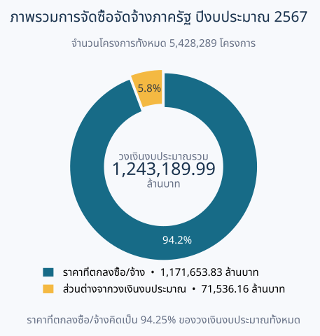](https://github.com/panithan1991/Exploring-Thailand-s-Government-Procurement-Spending/blob/main/figures/1_2567.svg) |  | [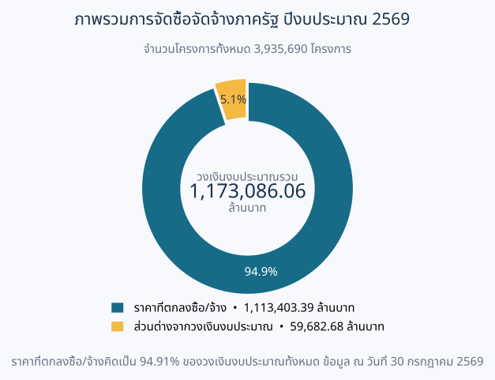](https://github.com/panithan1991/Exploring-Thailand-s-Government-Procurement-Spending/blob/main/figures/1_2569.svg) |
| :---: | :---: | :-ข้อมูล ณ วันที่ 30 กรกฎาคม 2569-: |

เติมคำอธิบายคำอธิบาย 

----------------------------------------------------------------

## 2. โครงการที่มีวงเงินงบประมาณสูงสุดและต่ำสุด ปีงบประมาณ 2567–2569
| ปีงบประมาณ 2567 | ปีงบประมาณ 2568 | ปีงบประมาณ 2569* |
| :---: | :---: | :---: |
| [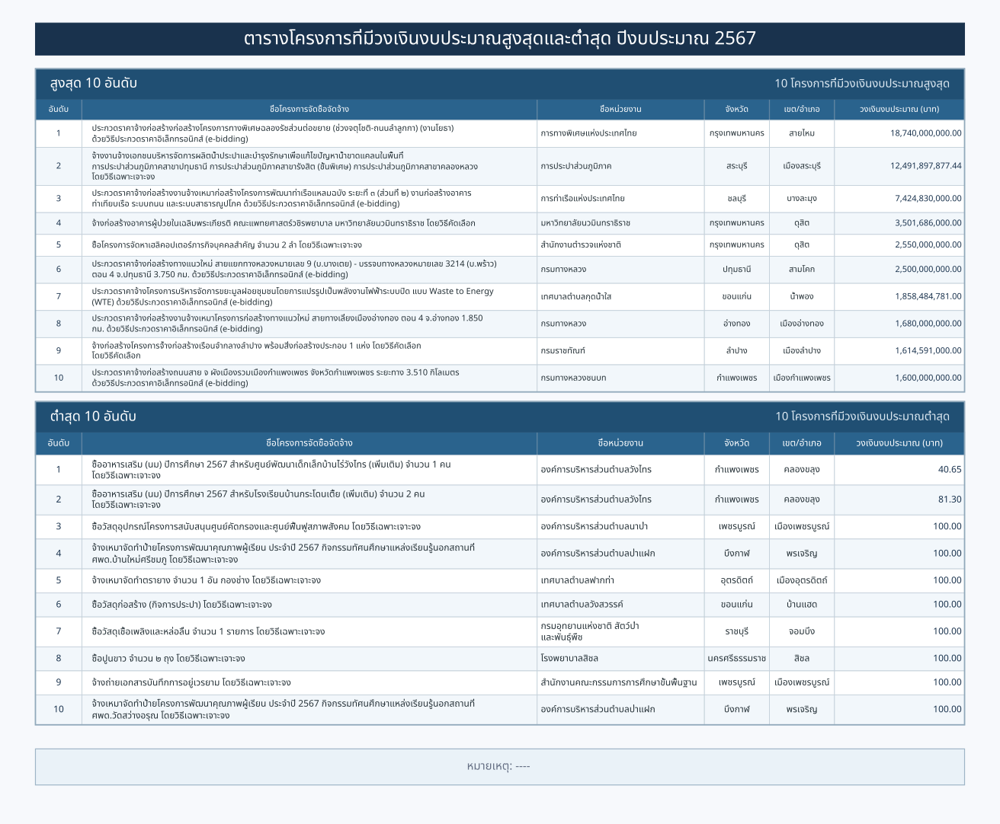](https://raw.githubusercontent.com/panithan1991/Exploring-Thailand-s-Government-Procurement-Spending/main/figures/2_2567.svg) | [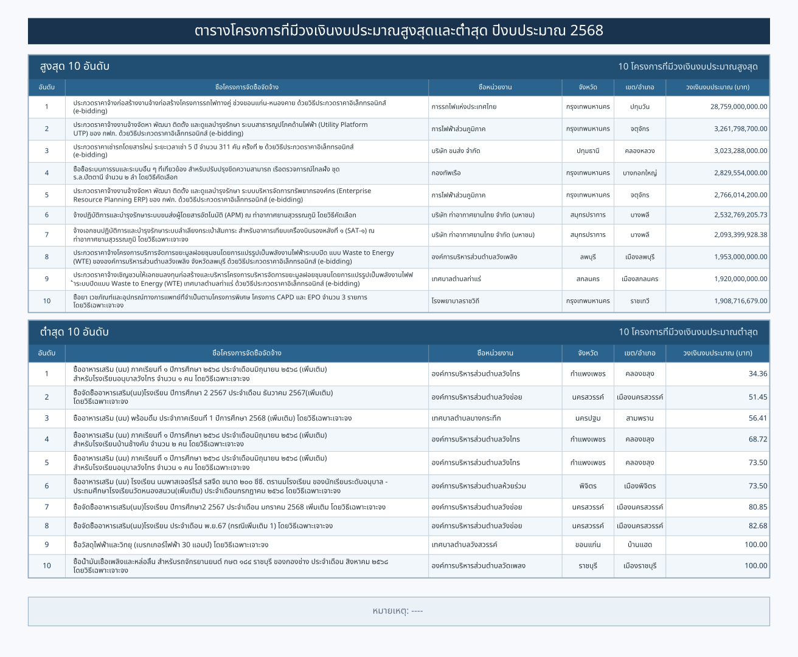](https://raw.githubusercontent.com/panithan1991/Exploring-Thailand-s-Government-Procurement-Spending/main/figures/2_2568.svg) | [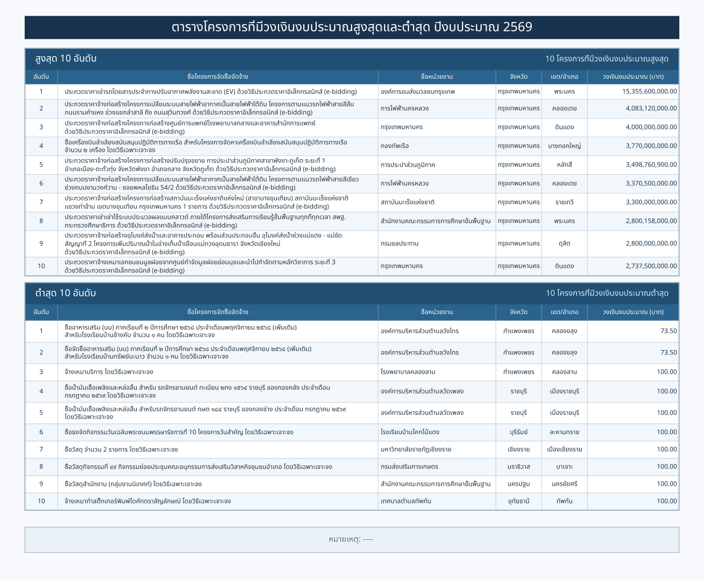](https://raw.githubusercontent.com/panithan1991/Exploring-Thailand-s-Government-Procurement-Spending/main/figures/2_2569.svg) |

### การวิเคราะห์

เมื่อพิจารณาโครงการที่มีวงเงินงบประมาณสูงสุดและต่ำสุด พบว่าขนาดของโครงการจัดซื้อจัดจ้างมีความแตกต่างกันอย่างมาก ในปี 2567 โครงการที่มีวงเงินสูงสุดมีวงเงิน **18,740 ล้านบาท** ขณะที่ปี 2568 เพิ่มขึ้นเป็น **28,759 ล้านบาท** ซึ่งเป็นวงเงินสูงสุดในกลุ่มข้อมูลที่แสดง และปี 2569 มีวงเงินสูงสุด **15,355.60 ล้านบาท** โครงการในกลุ่มวงเงินสูงส่วนใหญ่เกี่ยวข้องกับ **โครงสร้างพื้นฐาน ระบบขนส่ง สาธารณูปโภค การก่อสร้าง และการจัดหาระบบหรืออุปกรณ์ขนาดใหญ่** ขณะที่โครงการที่มีวงเงินต่ำสุดมีมูลค่าเพียงหลักสิบถึงหลักร้อยบาท โดยส่วนใหญ่เป็นการจัดซื้อหรือจ้างในรายการขนาดเล็ก เช่น **อาหารเสริม (นม) วัสดุ น้ำมันเชื้อเพลิง และงานบริการทั่วไป** แสดงให้เห็นถึงช่วงของวงเงินโครงการที่กว้างมากภายในข้อมูลการจัดซื้อจัดจ้างภาครัฐ

> **หมายเหตุ:** ข้อมูลปีงบประมาณ 2569 เป็นข้อมูล ณ วันที่ **30 กรกฎาคม 2569** จึงยังไม่ใช่ข้อมูลครบทั้งปีงบประมาณ
> 
----------------------------------------------------------------

## 3. การจัดซื้อจัดจ้างจำแนกตามประเภทโครงการ ปีงบประมาณ 2567–2569

| ปีงบประมาณ 2567 | ปีงบประมาณ 2568 | ปีงบประมาณ 2569* |
| :---: | :---: | :---: |
| [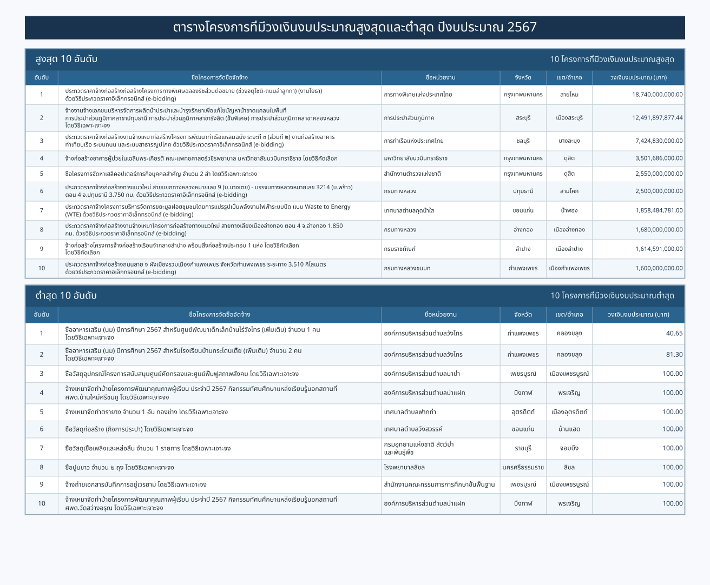](https://raw.githubusercontent.com/panithan1991/Exploring-Thailand-s-Government-Procurement-Spending/main/figures/3_2567.svg) | [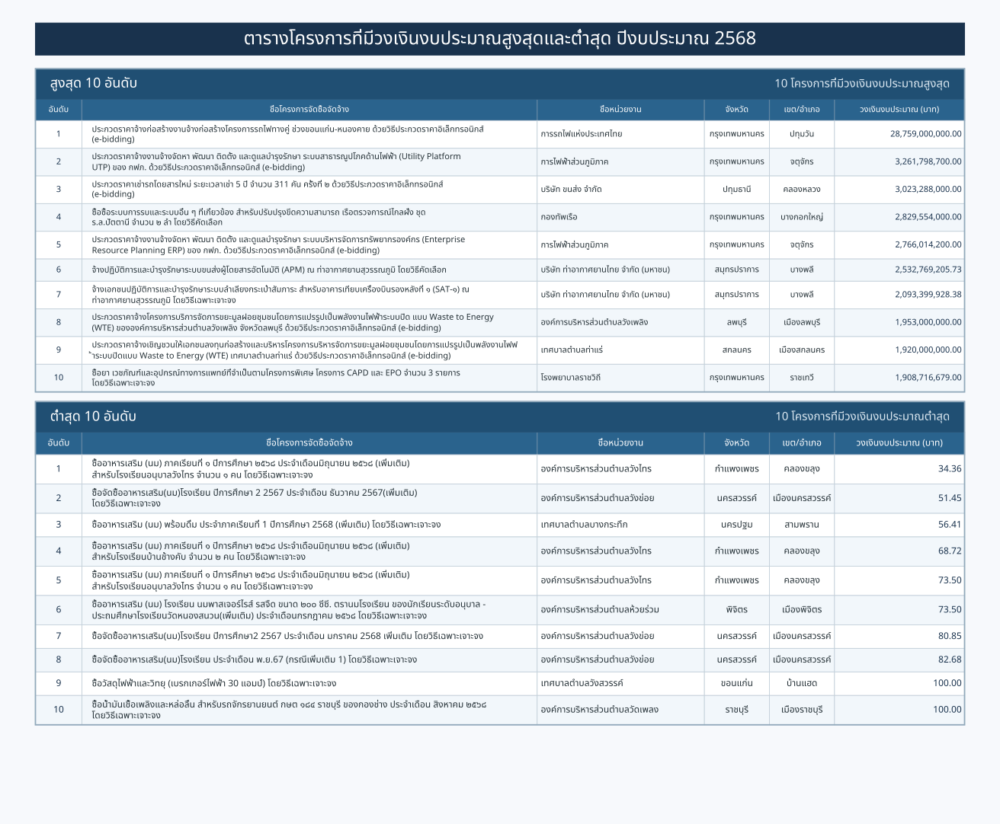](https://raw.githubusercontent.com/panithan1991/Exploring-Thailand-s-Government-Procurement-Spending/main/figures/3_2568.svg) | [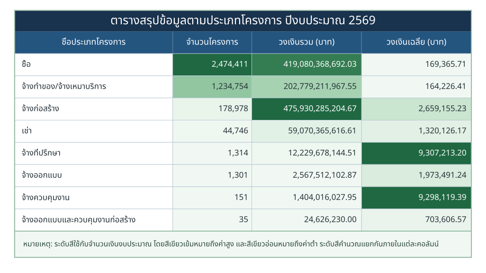](https://raw.githubusercontent.com/panithan1991/Exploring-Thailand-s-Government-Procurement-Spending/main/figures/3_2569.svg) |

### การวิเคราะห์

เมื่อจำแนกข้อมูลตามประเภทโครงการ พบว่า **การซื้อ** มีจำนวนโครงการมากที่สุดในทั้งสามปี โดยปี 2567 มี **3,433,701 โครงการ** ปี 2568 มี **2,923,243 โครงการ** และปี 2569 มี **2,474,411 โครงการ** ขณะที่ **การจ้างก่อสร้าง** เป็นประเภทที่มีวงเงินรวมสูงที่สุด โดยมีวงเงินประมาณ **522.68 พันล้านบาท** ในปี 2567 เพิ่มเป็น **672.09 พันล้านบาท** ในปี 2568 และอยู่ที่ประมาณ **475.93 พันล้านบาท** ในปี 2569 สำหรับวงเงินเฉลี่ยต่อโครงการ กลุ่ม **จ้างที่ปรึกษา** และ **จ้างควบคุมงาน** มีค่าเฉลี่ยสูงเมื่อเทียบกับประเภทอื่น โดยปี 2569 มีวงเงินเฉลี่ยประมาณ **9.31 ล้านบาท** และ **9.30 ล้านบาทต่อโครงการ** ตามลำดับ

ข้อมูลดังกล่าวแสดงให้เห็นความแตกต่างระหว่าง **จำนวนโครงการ วงเงินรวม และวงเงินเฉลี่ย** ของการจัดซื้อจัดจ้างแต่ละประเภท โดยประเภทที่มีจำนวนโครงการมากที่สุดไม่จำเป็นต้องเป็นประเภทที่มีวงเงินรวมสูงที่สุด

> **หมายเหตุ:** ข้อมูลปีงบประมาณ 2569 เป็นข้อมูล ณ วันที่ **30 กรกฎาคม 2569** จึงยังไม่ใช่ข้อมูลครบทั้งปีงบประมาณ
> 
> ---------------------------------------------------------------------
> 
> ## 4. วงเงินงบประมาณรวมจำแนกตามจังหวัด ปีงบประมาณ 2567–2569

| ปีงบประมาณ 2567 | ปีงบประมาณ 2568 | ปีงบประมาณ 2569* |
| :---: | :---: | :---: |
| [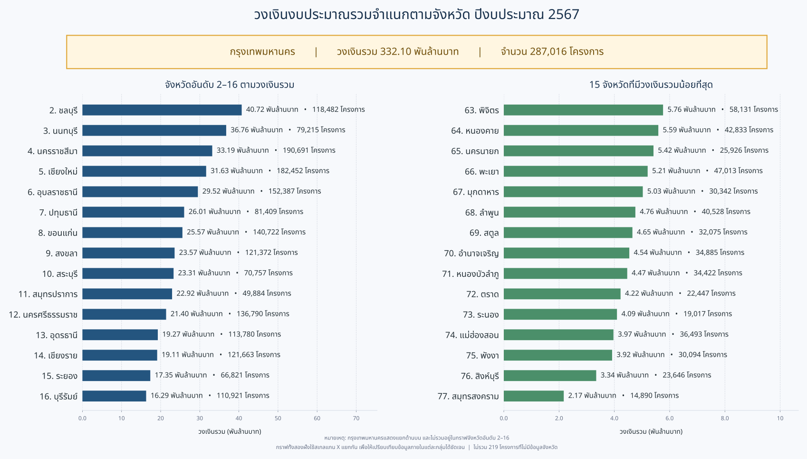](https://raw.githubusercontent.com/panithan1991/Exploring-Thailand-s-Government-Procurement-Spending/main/figures/4_2567.svg) | [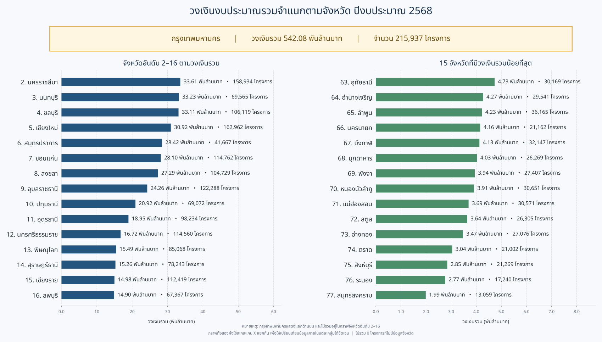](https://raw.githubusercontent.com/panithan1991/Exploring-Thailand-s-Government-Procurement-Spending/main/figures/4_2568.svg) | [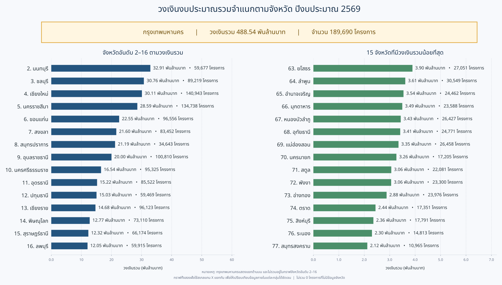](https://raw.githubusercontent.com/panithan1991/Exploring-Thailand-s-Government-Procurement-Spending/main/figures/4_2569.svg) |

### การวิเคราะห์

จากข้อมูลพบว่า **กรุงเทพมหานครมีวงเงินงบประมาณรวมสูงที่สุดในทั้งสามปี** โดยมีวงเงินประมาณ **332.10 พันล้านบาท** ในปี 2567 เพิ่มเป็น **542.08 พันล้านบาท** ในปี 2568 และอยู่ที่ **488.54 พันล้านบาท** ในปี 2569

สำหรับจังหวัดลำดับถัดมา พบว่าอันดับมีการเปลี่ยนแปลงในแต่ละปี โดยปี 2567 **ชลบุรี** มีวงเงินรวมสูงสุดรองจากกรุงเทพมหานครที่ประมาณ **40.72 พันล้านบาท** ขณะที่ปี 2568 **นครราชสีมา** อยู่ในอันดับ 2 ที่ประมาณ **33.61 พันล้านบาท** และในปี 2569 **นนทบุรี** อยู่ในอันดับ 2 ที่ประมาณ **32.91 พันล้านบาท**

ในกลุ่มจังหวัดที่มีวงเงินรวมน้อยที่สุด **สมุทรสงคราม** อยู่ในลำดับต่ำสุดของทั้งสามปี โดยมีวงเงินรวมประมาณ **2.17 พันล้านบาท** ในปี 2567, **1.99 พันล้านบาท** ในปี 2568 และ **2.12 พันล้านบาท** ในปี 2569 แสดงให้เห็นว่าระดับวงเงินงบประมาณรวมมีความแตกต่างกันอย่างชัดเจนระหว่างจังหวัด

> **หมายเหตุ:** กรุงเทพมหานครแสดงแยกออกจากกราฟจังหวัดอันดับ 2–16 เนื่องจากมีวงเงินรวมสูงกว่าจังหวัดอื่นอย่างชัดเจน และข้อมูลปีงบประมาณ 2569 เป็นข้อมูล ณ วันที่ **30 กรกฎาคม 2569**
> 
> --------------------------------------------------------------------------
> 
> ## 5. ความสัมพันธ์ระหว่างจำนวนโครงการและวงเงินรวมรายจังหวัด ปีงบประมาณ 2567–2569

| ปีงบประมาณ 2567 | ปีงบประมาณ 2568 | ปีงบประมาณ 2569* |
| :---: | :---: | :---: |
| [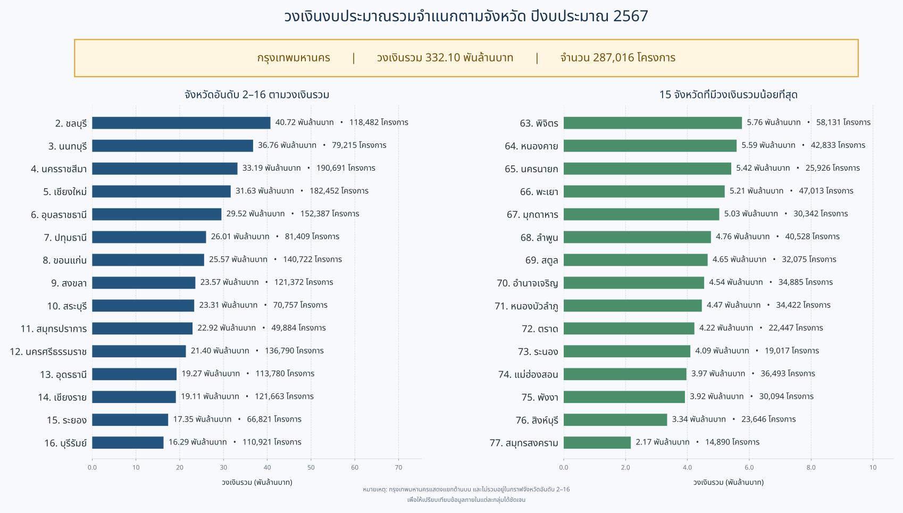](https://raw.githubusercontent.com/panithan1991/Exploring-Thailand-s-Government-Procurement-Spending/main/figures/5_2567.svg) | [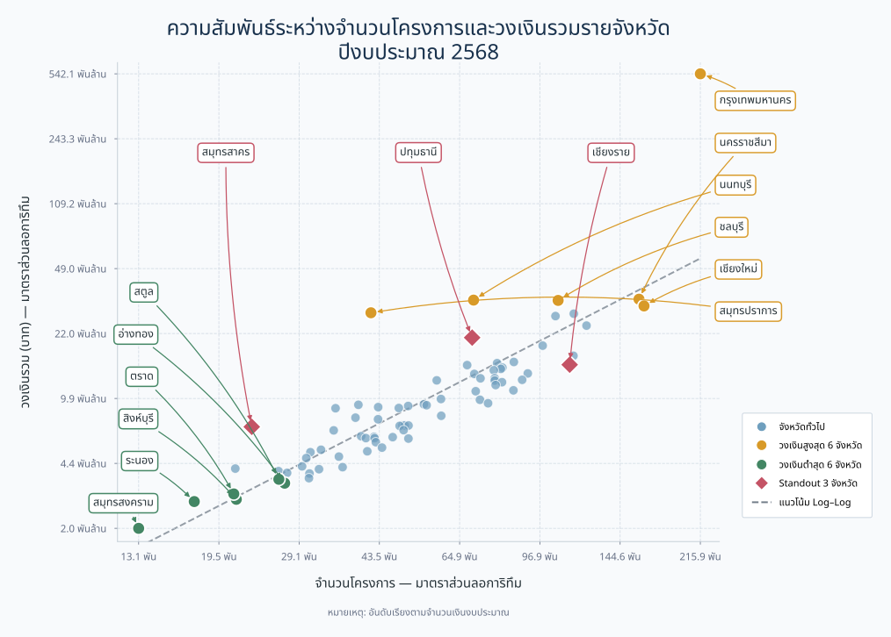](https://raw.githubusercontent.com/panithan1991/Exploring-Thailand-s-Government-Procurement-Spending/main/figures/5_2568.svg) | [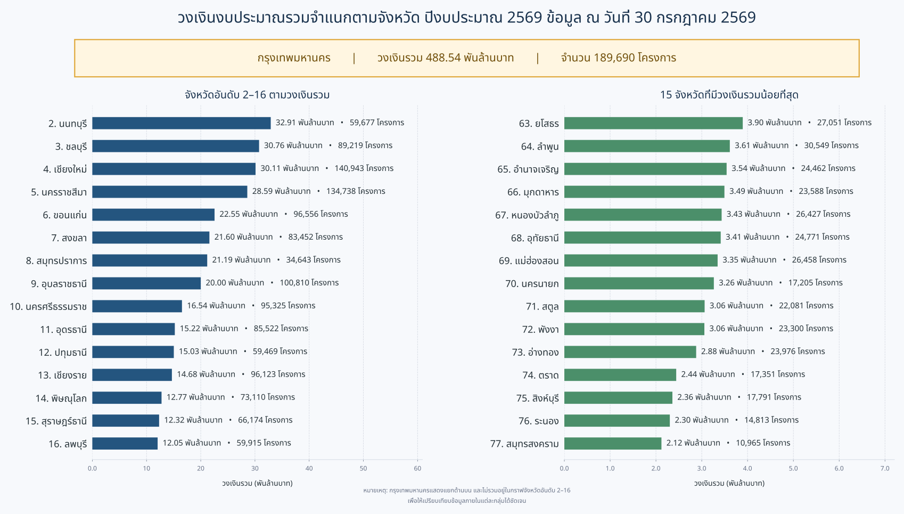](https://raw.githubusercontent.com/panithan1991/Exploring-Thailand-s-Government-Procurement-Spending/main/figures/5_2569.svg) |

### การวิเคราะห์

จากกราฟทั้งสามปีพบว่า **จำนวนโครงการและวงเงินรวมรายจังหวัดมีแนวโน้มเพิ่มขึ้นไปในทิศทางเดียวกัน** โดยจังหวัดที่มีจำนวนโครงการมากมักปรากฏอยู่ในระดับวงเงินรวมที่สูงกว่า ขณะที่จังหวัดที่มีจำนวนโครงการน้อยส่วนใหญ่อยู่ในกลุ่มวงเงินรวมระดับต่ำ ซึ่งเห็นได้จากการกระจายของจุดที่เรียงตัวตามแนวโน้ม Log–Log จากด้านล่างซ้ายไปยังด้านบนขวาของกราฟ

**กรุงเทพมหานคร** เป็นจุดที่โดดเด่นที่สุดในทั้งสามปี โดยมีทั้งจำนวนโครงการและวงเงินรวมสูงกว่าจังหวัดอื่นอย่างชัดเจน ส่วนจังหวัดที่มีวงเงินรวมสูงกลุ่มถัดมาแตกต่างกันในแต่ละปี เช่น ชลบุรี นนทบุรี นครราชสีมา เชียงใหม่ และขอนแก่น ขณะที่จังหวัดในกลุ่มวงเงินรวมต่ำ เช่น สมุทรสงคราม สิงห์บุรี ระนอง และตราด ปรากฏอยู่บริเวณด้านล่างซ้ายของกราฟอย่างต่อเนื่อง

นอกจากนี้ ยังพบจังหวัดบางแห่งที่อยู่ห่างจากแนวโน้มโดยรวม ซึ่งหมายความว่า **จำนวนโครงการใกล้เคียงกับจังหวัดอื่น แต่มีวงเงินรวมแตกต่างออกไปอย่างเห็นได้ชัด** แสดงให้เห็นว่าจำนวนโครงการเพียงอย่างเดียวไม่สามารถอธิบายระดับวงเงินรวมของแต่ละจังหวัดได้ทั้งหมด

> **หมายเหตุ:** แกนจำนวนโครงการและวงเงินรวมใช้มาตราส่วนลอการิทึม (Log Scale) เพื่อให้เห็นการกระจายของข้อมูลที่มีช่วงค่ากว้างได้ชัดเจนขึ้น และข้อมูลปีงบประมาณ 2569 เป็นข้อมูล ณ วันที่ **30 กรกฎาคม 2569**
> 
> ---------------------------------------------------------------------------
> 
> ## 6. หน่วยงานที่มีวงเงินงบประมาณรวมสูงสุด ปีงบประมาณ 2567–2569

| ปีงบประมาณ 2567 | ปีงบประมาณ 2568 | ปีงบประมาณ 2569* |
| :---: | :---: | :---: |
| [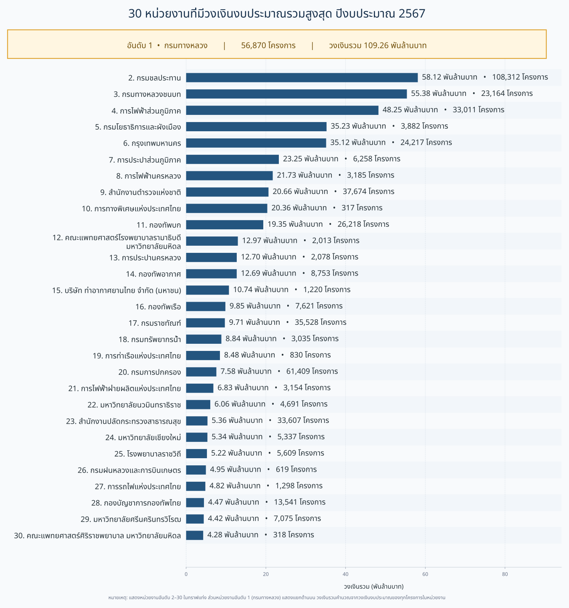](https://raw.githubusercontent.com/panithan1991/Exploring-Thailand-s-Government-Procurement-Spending/main/figures/6_2567.svg) | [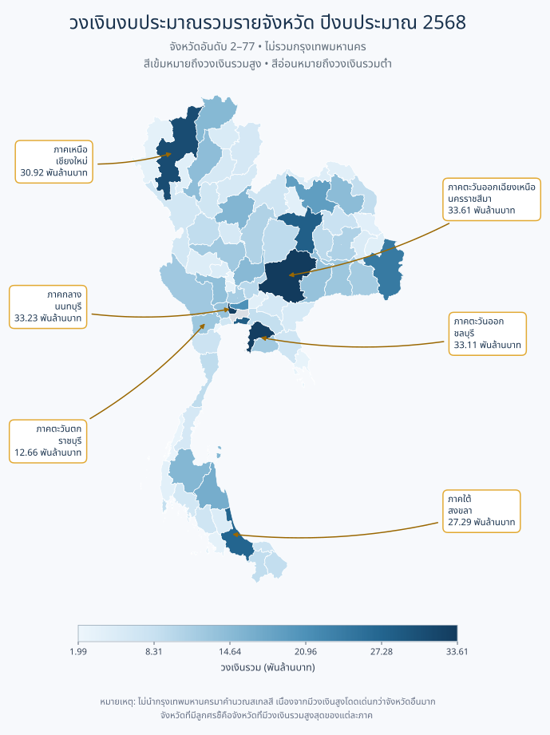](https://raw.githubusercontent.com/panithan1991/Exploring-Thailand-s-Government-Procurement-Spending/main/figures/6_2568.svg) | [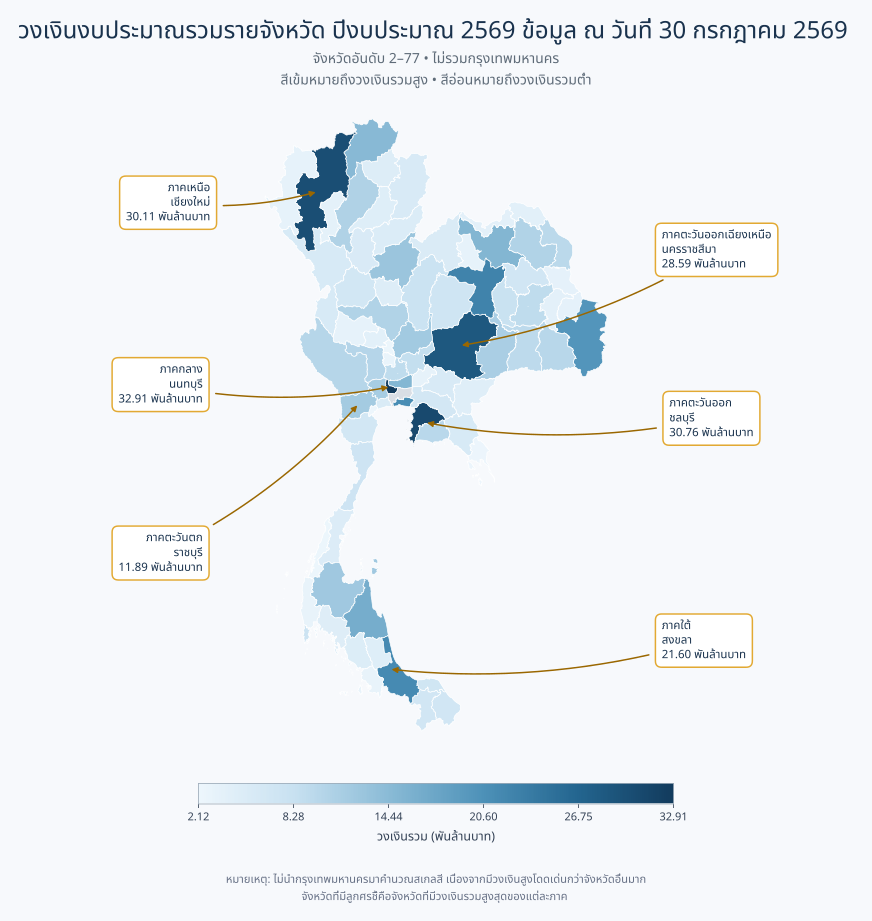](https://raw.githubusercontent.com/panithan1991/Exploring-Thailand-s-Government-Procurement-Spending/main/figures/6_2569.svg) |

### การวิเคราะห์

จากข้อมูลพบว่า **กรมทางหลวงเป็นหน่วยงานที่มีวงเงินงบประมาณรวมสูงที่สุดในทั้งสามปี** โดยมีวงเงินรวมประมาณ **109.26 พันล้านบาท** ในปี 2567, **188.24 พันล้านบาท** ในปี 2568 และ **107.31 พันล้านบาท** ในปี 2569 ขณะที่ **กรมชลประทาน** อยู่ในอันดับ 2 อย่างต่อเนื่อง โดยมีวงเงินรวมประมาณ **58.12 พันล้านบาท**, **88.67 พันล้านบาท** และ **92.57 พันล้านบาท** ตามลำดับ

ในกลุ่มหน่วยงานที่มีวงเงินรวมสูง ยังปรากฏหน่วยงานด้าน **โครงสร้างพื้นฐาน สาธารณูปโภค การคมนาคม และงานก่อสร้าง** หลายแห่ง เช่น กรมทางหลวงชนบท การไฟฟ้าส่วนภูมิภาค กรมโยธาธิการและผังเมือง กรุงเทพมหานคร และการประปาส่วนภูมิภาค โดยลำดับและวงเงินของแต่ละหน่วยงานมีการเปลี่ยนแปลงในแต่ละปี

นอกจากนี้ จำนวนโครงการของแต่ละหน่วยงานแตกต่างกันอย่างมาก แม้จะอยู่ในกลุ่มที่มีวงเงินรวมสูง แสดงให้เห็นว่า **หน่วยงานที่มีจำนวนโครงการมากไม่ได้จำเป็นต้องมีวงเงินรวมสูงที่สุดเสมอไป** เนื่องจากขนาดวงเงินต่อโครงการแตกต่างกัน

> **หมายเหตุ:** กราฟแสดงหน่วยงานอันดับ 2–30 ส่วนอันดับ 1 คือ **กรมทางหลวง** แสดงแยกไว้ด้านบนของแต่ละกราฟ และข้อมูลปีงบประมาณ 2569 เป็นข้อมูล ณ วันที่ **30 กรกฎาคม 2569**
>
> -------------------------------
>
> ## 7. การกระจายวงเงินงบประมาณต่อโครงการ ปีงบประมาณ 2567–2569

| ปีงบประมาณ 2567 | ปีงบประมาณ 2568 | ปีงบประมาณ 2569* |
| :---: | :---: | :---: |
| [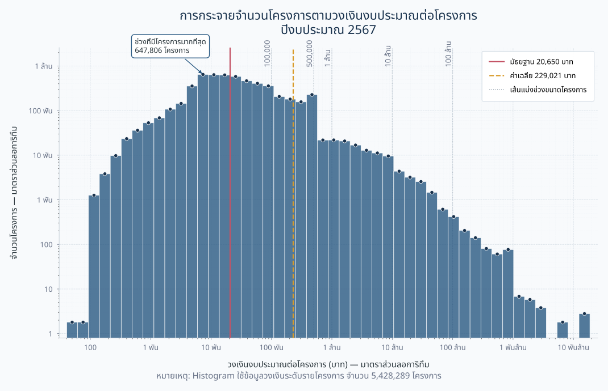](https://raw.githubusercontent.com/panithan1991/Exploring-Thailand-s-Government-Procurement-Spending/main/figures/7_2567.svg) |  | [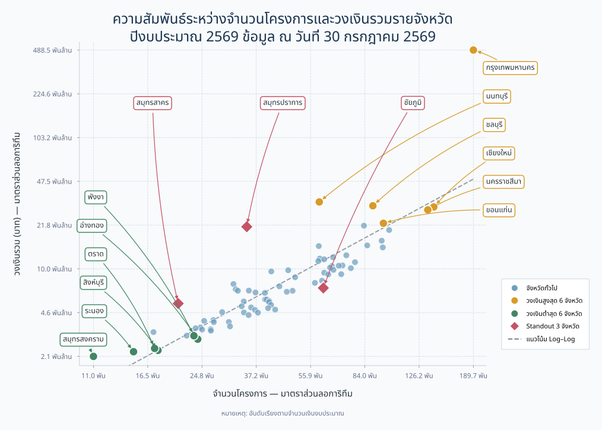](https://raw.githubusercontent.com/panithan1991/Exploring-Thailand-s-Government-Procurement-Spending/main/figures/7_2569.svg) |

### การวิเคราะห์

จากการกระจายวงเงินงบประมาณต่อโครงการ พบว่าในทั้งสามปี **ค่าเฉลี่ยของวงเงินต่อโครงการสูงกว่าค่ามัธยฐานอย่างชัดเจน** โดยปี 2567 มีค่ามัธยฐาน **20,650 บาท** และค่าเฉลี่ย **229,021 บาท** ปี 2568 มีค่ามัธยฐาน **20,794 บาท** และค่าเฉลี่ย **292,366 บาท** ส่วนปี 2569 มีค่ามัธยฐาน **20,144 บาท** และค่าเฉลี่ย **298,064 บาท**

รูปแบบการกระจายของทั้งสามปีมีลักษณะคล้ายกัน โดยจำนวนโครงการกระจุกตัวอยู่ในช่วงวงเงินระดับต่ำถึงปานกลาง และลดจำนวนลงเมื่อวงเงินต่อโครงการสูงขึ้น ขณะที่ยังมีโครงการบางส่วนที่มีวงเงินสูงมากจนกระจายต่อเนื่องไปถึงระดับพันล้านบาท จึงทำให้ช่วงของข้อมูลมีความกว้างมาก

สำหรับช่วงที่มีจำนวนโครงการมากที่สุด พบว่า ปี 2567 มี **647,806 โครงการ** ปี 2568 มี **570,423 โครงการ** และปี 2569 มี **461,564 โครงการ** ตามลำดับ

> **หมายเหตุ:** กราฟใช้มาตราส่วนลอการิทึม (Log Scale) ทั้งแกนวงเงินและแกนจำนวนโครงการ เพื่อให้สามารถแสดงข้อมูลที่มีช่วงค่ากว้างได้ชัดเจนยิ่งขึ้น และข้อมูลปีงบประมาณ 2569 เป็นข้อมูล ณ วันที่ **30 กรกฎาคม 2569**
>
> -----------------------------------------------
