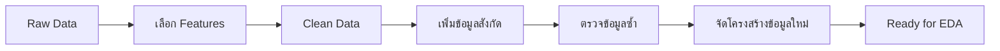
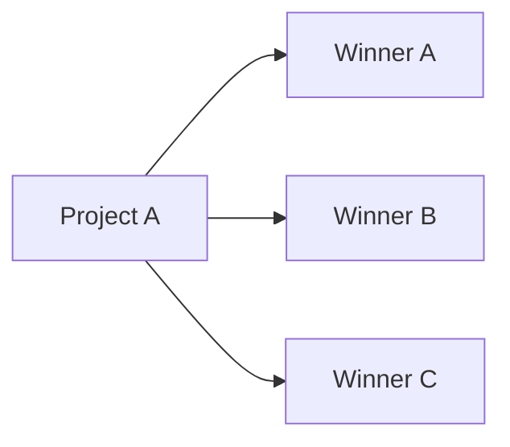
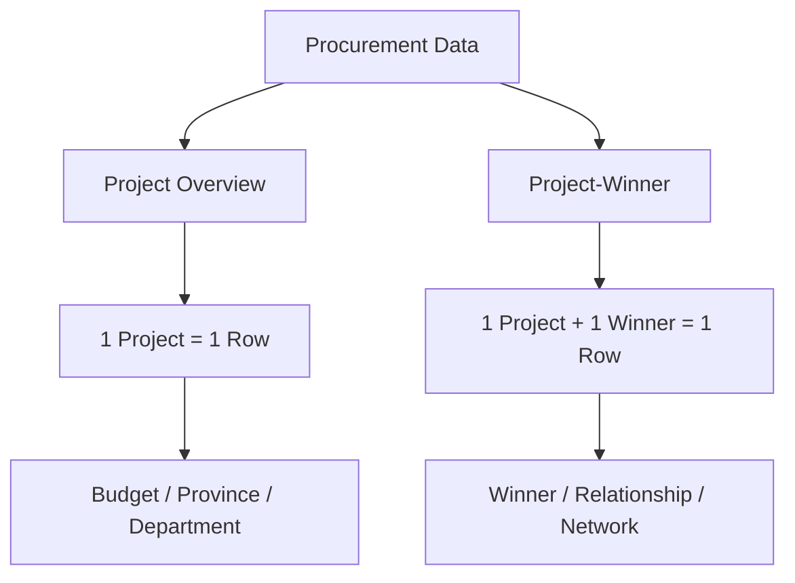
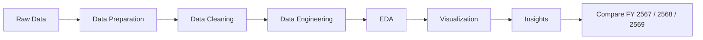

<h1 align="center">
  🚧 ✨ 🌟 COMING SOON 🌟 ✨ 🚧
</h1>

<h3 align="center">
  🟦 Stay Tuned — Something Awesome Is Coming! 🟨
</h3>

# Exploring-Thailand-s-Government-Procurement-Spending
สำรวจการใช้จ่ายภาครัฐไทยผ่านข้อมูลการจัดซื้อจัดจ้าง

# 🏛️ Exploring Thailand’s Government Procurement Spending
### สำรวจการใช้จ่ายภาครัฐไทยผ่านข้อมูลการจัดซื้อจัดจ้าง

> **เงินภาครัฐถูกใช้ไปกับอะไร? ที่ไหน? โดยหน่วยงานใด? และมีมูลค่าเท่าไร?**

โปรเจกต์นี้นำข้อมูลการจัดซื้อจัดจ้างภาครัฐของประเทศไทยมาสำรวจ เพื่อเปลี่ยนข้อมูลหลายล้านรายการให้กลายเป็นภาพรวมที่เข้าใจง่าย และค้นหารูปแบบที่น่าสนใจเกี่ยวกับการใช้จ่ายภาครัฐ

ข้อมูลชุดแรกที่นำมาวิเคราะห์คือ **ปีงบประมาณ พ.ศ. 2567**

---

# 🎯 Why This Project?

ข้อมูลการจัดซื้อจัดจ้างภาครัฐมีรายละเอียดจำนวนมาก

ถ้ามองจากข้อมูลดิบทีละแถว เราอาจไม่เห็นว่า...

- 💰 ภาครัฐตั้งงบประมาณไว้ทั้งหมดเท่าไร?
- 🧾 ราคากลางกับราคาที่ตกลงซื้อ/จ้างต่างกันแค่ไหน?
- 🏢 หน่วยงานหรือสังกัดใดมีโครงการมากที่สุด?
- 🗺️ จังหวัดไหนมีมูลค่าโครงการสูง?
- 🏗️ โครงการประเภทใดเกิดขึ้นบ่อย?
- 🏆 ในหนึ่งโครงการมีผู้ชนะกี่ราย?
- 🔍 มีรูปแบบหรือข้อมูลที่น่าสนใจซ่อนอยู่หรือไม่?

นี่จึงเป็นจุดเริ่มต้นของโปรเจกต์นี้

---

# 📦 Data Source

ข้อมูลต้นทางมาจาก

## **ระบบข้อมูลการใช้จ่ายภาครัฐ | Thailand Government Spending**

🔗 https://govspending.data.go.th/home

ข้อมูลที่ใช้ในโปรเจกต์นี้เกี่ยวข้องกับข้อมูล  
**การจัดซื้อจัดจ้างภาครัฐ (Government Procurement / e-GP)**

> ข้อมูลต้นทางเป็นข้อมูลจาก **ระบบข้อมูลการใช้จ่ายภาครัฐ (Thailand Government Spending)**  
> โปรเจกต์นี้นำข้อมูลมาจัดเตรียม ปรับโครงสร้าง และวิเคราะห์เพื่อวัตถุประสงค์ทางการศึกษา

---

# 🧩 What Data Do We Use?

เราไม่ได้ใช้ทุกคอลัมน์จากข้อมูลดิบ

แต่เลือกเฉพาะ Features ที่ช่วยตอบคำถามของโปรเจกต์

| กลุ่มข้อมูล | Features |
|---|---|
| 🆔 โครงการ | รหัสโครงการ, ประเภทโครงการ |
| 🏢 หน่วยงาน | ชื่อหน่วยงาน, สังกัด |
| 💰 มูลค่า | วงเงินงบประมาณ, ราคากลาง, ราคาที่ตกลงซื้อ/จ้าง |
| 🗺️ พื้นที่ | จังหวัด, เขต/อำเภอ |
| 📌 สถานะ | สถานะโครงการ |
| 🏆 ผู้ชนะ | เลขประจำตัวผู้ชนะ, ชื่อผู้ชนะการเสนอราคา |

---

## 👀 ข้อมูลหนึ่งโครงการมีหน้าตาประมาณนี้

```text
โครงการหนึ่งโครงการ
│
├── ประเภทโครงการ
├── หน่วยงาน
├── สังกัด
│
├── วงเงินงบประมาณ
├── ราคากลาง
├── ราคาที่ตกลงซื้อ / จ้าง
│
├── จังหวัด
├── เขต / อำเภอ
├── สถานะโครงการ
│
└── ผู้ชนะการเสนอราคา
```

---

# 🧹 Before Analysis

ข้อมูลจริงไม่ได้พร้อมสำหรับการวิเคราะห์ทันที

ก่อนเริ่ม EDA เราจึงทำการจัดระเบียบข้อมูลให้

- อ่านง่ายขึ้น
- ใช้ชื่อและรหัสในรูปแบบเดียวกัน
- เชื่อมข้อมูลหน่วยงานกับสังกัด
- ตรวจข้อมูลที่ซ้ำกัน
- ตรวจข้อมูลที่กำกวม
- ป้องกันการนับยอดเงินซ้ำ
- แยกข้อมูลตามวัตถุประสงค์ในการวิเคราะห์

ภาพรวมของขั้นตอน:



---

# 🏢 เพิ่มข้อมูล “สังกัด”

ข้อมูลโครงการมีชื่อหน่วยงานอยู่แล้ว

แต่เราต้องการรู้เพิ่มว่า

> **หน่วยงานนั้นอยู่ในสังกัดประเภทใด?**

จึงนำข้อมูลหน่วยงานอีกชุดมาเชื่อมกับข้อมูลโครงการ

```text
ชื่อหน่วยงาน
      ↓
ค้นหาข้อมูลสังกัด
      ↓
เพิ่ม "สังกัด"
      ↓
ข้อมูลโครงการสมบูรณ์มากขึ้น
```

อย่างไรก็ตาม บางชื่อหน่วยงานสามารถเชื่อมไปได้มากกว่า 1 สังกัด

เราจึงไม่เดาข้อมูล แต่แบ่งออกเป็น 3 สถานะ

| Status | ความหมาย |
|---|---|
| ✅ `Matched` | ระบุสังกัดได้ชัดเจน |
| ⚠️ `Ambiguous` | ชื่อเดียวมีมากกว่า 1 สังกัด |
| ❓ `Not Found` | ไม่พบชื่อหน่วยงานในข้อมูลอ้างอิง |

ผลระดับโครงการของปี 2567:

| Status | จำนวนโครงการ |
|---|---:|
| ✅ Matched | 5,249,727 |
| ⚠️ Ambiguous | 163,547 |
| ❓ Not Found | 15,015 |
| **รวม** | **5,428,289** |

ประมาณ **96.7% ของโครงการสามารถระบุสังกัดได้**

---

# 🔁 Interesting Problem: 1 Project ≠ 1 Row

ตอนแรกข้อมูลมีประมาณ **5.46 ล้านแถว**

แต่เมื่อดู `รหัสโครงการ` พบว่า

> บางโครงการปรากฏมากกว่า 1 แถว

สาเหตุสำคัญคือ

### **หนึ่งโครงการสามารถมีผู้ชนะหลายราย**



ตัวอย่าง:

| Project | Budget | Winner |
|---|---:|---|
| Project A | 1,000,000 | Winner A |
| Project A | 1,000,000 | Winner B |
| Project A | 1,000,000 | Winner C |

ถ้านำงบประมาณจากทุกแถวมาบวกกันทันที

```text
1,000,000
+ 1,000,000
+ 1,000,000
----------------
= 3,000,000 บาท ❌
```

แต่เงินจริงของ Project A คือ

```text
1,000,000 บาท ✅
```

นี่คือปัญหา **Double Counting**

และเป็นเหตุผลที่เราต้องจัดโครงสร้างข้อมูลใหม่

---

# 🧠 Our Solution

เราแบ่งข้อมูลออกเป็น 2 มุมมองหลัก



---

# 1️⃣ Project Overview Dataset

## `project_overview_2567.csv`

หลักสำคัญคือ

> ### **1 Project = 1 Row**

ข้อมูลชุดนี้มี

**5,428,289 โครงการ**

และไม่มี Project ID ซ้ำ

ใช้สำหรับวิเคราะห์ภาพรวม เช่น

- 💰 วงเงินงบประมาณ
- 🧾 ราคากลาง
- 🤝 ราคาที่ตกลงซื้อ/จ้าง
- 🏢 หน่วยงาน
- 🏛️ สังกัด
- 🗺️ จังหวัด
- 🏗️ ประเภทโครงการ
- 📌 สถานะโครงการ
- 🏆 จำนวนผู้ชนะต่อโครงการ

### Dataset นี้จะเป็นข้อมูลหลักสำหรับ EDA

โดยเฉพาะเวลาต้องการ

```text
SUM เงิน
COUNT โครงการ
เปรียบเทียบจังหวัด
เปรียบเทียบหน่วยงาน
เปรียบเทียบสังกัด
```

---

# 2️⃣ Project–Winner Dataset

## `project_winner_2567.csv`

หลักของข้อมูลชุดนี้คือ

> ### **1 Project + 1 Winner ID = 1 Row**

ข้อมูลปี 2567 มีประมาณ

```text
5,457,950 Project-Winner records
173,306 Winner IDs
```

เหมาะสำหรับวิเคราะห์

- 🏆 Winner รายใดปรากฏในหลายโครงการ
- 🔗 ความสัมพันธ์ระหว่าง Project กับ Winner
- 📊 จำนวน Winner ต่อ Project
- 🧠 Winner Concentration
- 🌐 Network Analysis

---

# 🏆 How Many Winners per Project?

หลังจากจัดโครงสร้างข้อมูลแล้ว พบว่า

```text
1 Winner   → 5,413,078 โครงการ
> 1 Winner →    15,211 โครงการ
```

หรือประมาณ

> ### **99.7% ของโครงการมี Winner ID เพียง 1 ราย**

ส่วนโครงการที่มีผู้ชนะมากกว่า 1 รายมีประมาณ **0.3%**

---

# 🧼 What Did We Clean?

ก่อนเข้าสู่ EDA เราปรับข้อมูลแบบง่าย ๆ ดังนี้

### ① เลือกเฉพาะ Features ที่จำเป็น

ไม่ใช้ทุกคอลัมน์จากข้อมูลดิบ  
แต่เลือกเฉพาะข้อมูลที่ช่วยตอบคำถามของโปรเจกต์

---

### ② จัดรูปแบบข้อมูล

เช่น

```text
รหัสโครงการ
เลขประจำตัวผู้ชนะ
ชื่อหน่วยงาน
จังหวัด
```

ให้มีรูปแบบที่สม่ำเสมอ

---

### ③ เติมข้อมูลสังกัด

นำข้อมูลหน่วยงานมาเชื่อมเพื่อเพิ่ม Feature

```text
สังกัด
```

---

### ④ แยกข้อมูลที่กำกวม

หากชื่อหน่วยงานหนึ่งสามารถอยู่ได้หลายสังกัด

เราไม่สุ่มเลือก

แต่ระบุไว้ว่า

```text
Ambiguous
```

---

### ⑤ ตรวจ Project ที่ปรากฏหลายครั้ง

พบว่าส่วนใหญ่เกิดจาก

```text
1 Project
    ↓
Multiple Winner Records
```

---

### ⑥ แยกข้อมูลตามวัตถุประสงค์

สร้าง 2 Dataset หลัก

```text
Project Overview
        +
Project-Winner
```

เพื่อให้วิเคราะห์ได้ถูกต้อง และไม่เกิด Double Counting

---

# 📂 Prepared Data

ไฟล์ที่เตรียมไว้สำหรับการวิเคราะห์:

```text
overview_output/
│
├── project_overview_2567.csv
├── project_winner_2567.csv
│
├── dept_lookup_2567.csv
├── ambiguous_dept_2567.csv
│
├── overview_analysis_2567.csv
└── README_dataframe_2567.csv
```

---

## 📌 Which File Should I Use?

| ต้องการวิเคราะห์ | Dataset |
|---|---|
| 💰 งบประมาณ | `project_overview_2567.csv` |
| 🧾 ราคากลาง / ราคาตกลง | `project_overview_2567.csv` |
| 🏗️ ประเภทโครงการ | `project_overview_2567.csv` |
| 🏢 หน่วยงาน / สังกัด | `project_overview_2567.csv` |
| 🗺️ จังหวัด / อำเภอ | `project_overview_2567.csv` |
| 🏆 จำนวนผู้ชนะต่อโครงการ | `project_overview_2567.csv` |
| 🔗 Project ↔ Winner | `project_winner_2567.csv` |
| 🏆 จำนวนโครงการต่อ Winner | `project_winner_2567.csv` |
| 🌐 Winner Network | `project_winner_2567.csv` |
| 🏢 ตรวจ Mapping สังกัด | `dept_lookup_2567.csv` |
| ⚠️ ตรวจหน่วยงานกำกวม | `ambiguous_dept_2567.csv` |

---

# 🔎 What Do We Want to Discover Next?

หลังจาก Data Preparation เสร็จแล้ว

Phase ต่อไปคือ

# 📊 Exploratory Data Analysis — EDA

เราจะลองตอบคำถาม เช่น

### 💰 Government Spending

```text
ภาครัฐมีวงเงินจัดซื้อจัดจ้างรวมเท่าไร?
```

### 📉 Price Difference

```text
ราคาที่ตกลงซื้อ/จ้าง
ต่ำกว่าราคากลางมากน้อยแค่ไหน?
```

### 🏢 Government Agencies

```text
หน่วยงานและสังกัดใด
มีโครงการมากที่สุด?
```

### 🗺️ Geography

```text
จังหวัดใด
มีจำนวนหรือมูลค่าโครงการสูง?
```

### 🏗️ Project Types

```text
โครงการประเภทใด
เกิดขึ้นบ่อยที่สุด?
```

### 🏆 Winners

```text
Winner รายใด
ปรากฏในหลายโครงการ?
```

### 🔍 Interesting Patterns

```text
มี Outlier
หรือรูปแบบที่น่าสนใจอะไรบ้าง?
```

---

# 🚀 Project Roadmap



---

# 📅 What's Next?

โปรเจกต์นี้ไม่ได้หยุดอยู่แค่ปี 2567

Workflow เดียวกันจะถูกนำไปใช้กับ

```text
FY 2567 ✅
FY 2568 🔜
FY 2569 🔜
```

เพื่อให้สามารถเปรียบเทียบการจัดซื้อจัดจ้างภาครัฐระหว่างปีได้

ตัวอย่างคำถามในอนาคต:

- งบประมาณเพิ่มขึ้นหรือลดลง?
- จังหวัดใดมีแนวโน้มการใช้จ่ายเพิ่มขึ้น?
- ประเภทโครงการเปลี่ยนไปหรือไม่?
- หน่วยงานใดมีการจัดซื้อจัดจ้างเพิ่มขึ้น?
- Winner concentration เปลี่ยนไปอย่างไร?

---

# ✨ Project Goal

เป้าหมายของโปรเจกต์นี้ไม่ใช่แค่

> **“เอาข้อมูลหลายล้านแถวมารวมกัน”**

แต่คือการเปลี่ยนข้อมูลเหล่านั้นให้กลายเป็นเรื่องราวที่ช่วยตอบว่า

# 💡 “เงินภาครัฐถูกใช้ไปกับอะไร ที่ไหน โดยหน่วยงานใด และมีรูปแบบอะไรที่น่าสนใจ?”

---

# ✅ Current Status

```text
✅ Data Source
✅ Feature Selection
✅ Data Cleaning
✅ Department Mapping
✅ Duplicate Investigation
✅ Project-Level Dataset
✅ Project-Winner Dataset
✅ Data Quality Check

➡️ Next: EDA
➡️ Visualization
➡️ Insight Generation
```

---

# 🙏 Data Credit

ข้อมูลต้นทางจาก

## **ระบบข้อมูลการใช้จ่ายภาครัฐ | Thailand Government Spending**

🔗 https://govspending.data.go.th/home

ขอขอบคุณหน่วยงานผู้จัดทำและเผยแพร่ข้อมูลภาครัฐที่ทำให้สามารถนำข้อมูลมาใช้เพื่อการศึกษาและการวิเคราะห์ต่อยอดได้

---

### 📚 Project

**Exploring Thailand’s Government Procurement Spending**  
**สำรวจการใช้จ่ายภาครัฐไทยผ่านข้อมูลการจัดซื้อจัดจ้าง**

> Data Analytics & Data Science Project
