

# Small Contracts, Big Picture: Procurement Below the 500,000 THB Threshold

### สัญญาขนาดเล็กในภาพรวมมหภาค: การจัดซื้อจัดจ้างภาครัฐไทยต่ำกว่า 500,000 บาท

 

 

**การสำรวจข้อมูลเชิงลึก (Exploratory Data Analysis: EDA) พฤติกรรมของข้อมูลการจัดซื้อจัดจ้างภาครัฐ (e-GP) สำหรับโครงการประเภทงานก่อสร้างที่มีวงเงินงบประมาณไม่เกิน 500,000 บาท **  

 

[Project Overview](#project-overview) ·
[Executive Summary](#executive-summary) ·
[Analysis](#contents) ·
[Data Source](#data-source)

---

## แหล่งข้อมูล (Data Source)
ข้อมูลที่ใช้ในการศึกษานี้มาจาก
**ระบบข้อมูลการใช้จ่ายภาครัฐ (Thailand Government Spending)**
[https://govspending.data.go.th/home](https://govspending.data.go.th/home)

คณะผู้จัดทำโครงการศึกษานี้ได้นำข้อมูลดังกล่าวมาตรวจสอบโครงสร้าง ทำความสะอาดข้อมูล และวิเคราะห์เพิ่มเติมตามวัตถุประสงค์ของการศึกษา โดยคณะผู้จัดทำขอขอบคุณสำนักงานพัฒนารัฐบาลดิจิทัล (องค์การมหาชน) (สพร.) ซึ่งเป็นรวบรวม เผยแพร่ และดูแลระบบข้อมูลการใช้จ่ายภาครัฐ (Thailand Government Spending) อันเป็นประโยชน์ต่อการศึกษาและการวิเคราะห์ข้อมูลสาธารณะมา ณ ทีนี้

**การใช้และตีความข้อมูล:** เนื้อหาและข้อสรุปในโครงการนี้เป็นผลการวิเคราะห์ของผู้จัดทำเพื่อวัตถุประสงค์ทางการศึกษา ไม่ใช่ข้อสรุปอย่างเป็นทางการของหน่วยงานเจ้าของข้อมูล

---

## สารบัญ (Contents)

| ลำดับ | หัวข้อหลัก |
| :---: | --- |
| — | [แหล่งข้อมูล (Data Source)](#data-source) |
| — | [ความเป็นมาของการศึกษา (ฺBackground)](#background) |
| 1 | [ภาพรวมงบประมาณและจำนวนโครงการจัดซื้อจัดจ้างของภาครัฐ (Overview)](#overview-contract) |
| 2 | [จากเพดาน 500,000 บาท สู่ 161 รายการที่ควรตรวจสอบก่อน](#construction-screening) |
| 3 | [เริ่มจากกำหนดขอบเขตให้ชัด](#study-scope) |
| 4 | [สิ่งที่สะดุดตาคือการกระจุกใกล้ 500,000 บาท](#near-ceiling) |
| 5 | [รายการใกล้เพดานแทบทั้งหมดใช้วิธีเฉพาะเจาะจง](#procurement-method) |
| 6 | [จากรายการเดี่ยว สู่ความสัมพันธ์หน่วยงาน–ผู้รับจ้าง](#agency-supplier) |
| 7 | [ใช้สองสัญญาณร่วมกันเพื่อลดการหว่านแห](#combined-signals) |
| 8 | [ผลลัพธ์สุดท้ายคือคิวตรวจสอบที่ลงมือทำได้](#review-priority) |
| 9 | [นิยามเกณฑ์ที่ใช้](#screening-definitions) |
| 10 | [ข้อจำกัด](#limitations) |
| 11 | [คู่มือสำหรับผู้ที่ต้องการทดลองรันโค้ด](#reader-guide) |

---

## ความเป็นมาของการศึกษา
การใช้จ่ายและการลงทุนของภาครัฐ (Government Spending) เป็นปัจจัยสำคัญในการขับเคลื่อนเศรษฐกิจของประเทศเนื่องจากการลงทุนในโครงสร้างพื้นฐานและบริการสาธารณะเป็นการเสริมสร้างสิ่งอำนวยความสะดวกในการดำเนินธุรกิจและยกระดับคุณภาพชีวิตของประชาชนและสังคม ทั้งนี้ เพื่อให้การใช้งบประมาณเป็นไปอย่างมีประสิทธิภาพและตรวจสอบได้ภาครัฐได้มีความพยายามในการปฏิรูประบบราชการผ่านการบังคับใช้ พ.ร.บ. การจัดซื้อจัดจ้างและการบริหารพัสดุภาครัฐ พ.ศ. 2560 กฎระเบียบที่เกี่ยวข้อง รวมถึงการพัฒนาโครงสร้างพื้นฐานดิจิทัลผ่านระบบจัดซื้อจัดจ้างภาครัฐด้วยอิเล็กทรอนิกส์ (e-GP) ของกรมบัญชีกลางเพื่อเสริมสร้างความโปร่งใสในการใช้งบประมาณของทางภาครัฐ

การจัดซื้อจัดจ้างพัสดุภาครัฐตามมาตรา 55 แห่งพระราชบัญญัติการจัดซื้อจัดจ้างและการบริหารพัสดุภาครัฐ พ.ศ. 2560 อาจกระทำได้โดยวิธี 
1) วิธีประกาศเชิญชวนทั่วไป (วิธีตลาดอิเล็กทรอนิกส์ วิธีประกวดราคาอิเล็กทรอนิกส์ และวิธีสอบราคา) 
2) วิธีคัดเลือก และ 
3) วิธีเฉพาะเจาะจง 
ทั้งนี้ ระเบียบกระทรวงการคลังว่าด้วยการจัดซื้อจัดจ้างและการบริหารพสัดุภาครัฐ พ.ศ. 2560 ซึ่งออกตาม พระราชบัญญัติฯ ดังกล่าวได้เปิดโอกาสให้งานจัดซื้อจัดจ้างที่มีมูลค่าต่ำกว่า 500,000 บาท สามารถดำเนินการจัดซื้อจัดจ้างโดยวิธีเฉพาะเจาะจงเพื่อให้การดำเนินงานของภาครัฐเกิดความคล่องตัวในการดำเนินงาน ในขณะเดียวกันก็อาจเป็นการสร้างช่องว่าง (Gap) และทำให้เกิดความเสี่ยงในการบริหารจัดการ

การศึกษาในครั้งนี้ จึงมุ่งสำรวจข้อมูลเชิงลึก (Exploratory Data Analysis: EDA) เพื่อศึกษาพฤติกรรมและรูปแบบของข้อมูลการจัดซื้อจัดจ้างสำหรับโครงการประเภทงานก่อสร้างที่มีวงเงินงบประมาณไม่เกิน 500,000 บาท โดยเฉพาะการจัดซื้อจัดจ้างที่เกิดขึ้นในปีงบประมาณ พ.ศ. 2569 โดยมีประเด็นคำถามที่สำคัญ คือ
> **ประเด็นคำถามที่ 1:** ข้อมูลการตั้งงบประมาณ ราคากลาง และค่างานสัญญาสำหรับงานจ้างก่อสร้างภายใต้วงเงิน 500,000 บาท มีการกระจายตัวแบบผิดปกติหรือไม่
> 
> **ประเด็นคำถามที่ 2:** การกระจายตัวของผู้รับจ้างสำหรับงานจ้างก่อสร้างภายใต้วงเงิน 500,000 บาท มีการกระจายตัวของการรับจ้างงานแบบผิดปกติหรือไม่

## 1. ภาพรวมงบประมาณและจำนวนโครงการจัดซื้อจัดจ้างของภาครัฐ (Overview)

> **ขอบเขตข้อมูล:** ข้อมูลปีงบประมาณ พ.ศ. 2567 และ 2568 เป็นข้อมูลเต็มปีงบประมาณ ส่วนข้อมูลปีงบประมาณ พ.ศ. 2569 เป็นข้อมูล ณ 30 กรกฎาคม 2569

งบประมาณโครงการจัดซื้อและจัดจ้างภาครัฐในช่วงปีงบประมาณ พ.ศ. 2567 ถึงปีงบประมาณ พ.ศ. 2569 มีวงเงินประมาณ 1,243 ล้านบาท ถึง 1,362 ล้านบาท (ทั้งนี้ ปีงบประมาณ พ.ศ.2569 เป็นข้อมูล ณ วันที่ 30 กรกฎาคม 2569) ประกอบกับข้อมูลการจัดซื้อจัดจ้างของภาครัฐในแต่ละปีงบประมาณประกอบด้วยโครงการที่มีความหลากหลายการศึกษานี้จึงเริ่มจากการพิจารณาโครงสร้างในภาพรวม จำวนวน 2 มิติ ได้แก่ การจัดสรรวงเงินตามหมวดภารกิจ (ตามเกณฑ์การจำแนกประเภทที่ผู้จัดทำกำหนด) และจำนวนกับมูลค่าของโครงการแต่ละประเภทตามการจำแนกที่ระบุไว้ใน พ.ร.บ. การจัดซื้อจัดจ้างและการบริหารพัสดุภาครัฐ พ.ศ. 2560 และกฎระเบียบที่เกี่ยวข้อง ซึ่งมีรายละเอียดดังนี้

---

### 1.1. โครงสร้างการจัดสรรงบประมาณตามหมวดภารกิจ

คณะผู้จัดทำได้ดำเนินการจัดหมวดรายการเพื่อการวิเคราะห์เพิ่มเติม จำนวน 9 หมวด โดยพิจารณาจากสังกัด และชื่อหน่วยงาน ดังนี้
1. **การเศรษฐกิจ** — หน่วยงานด้านคมนาคมและโครงสร้างพื้นฐาน เกษตรกรรม อุตสาหกรรม พลังงาน การค้า การท่องเที่ยว และการคลัง เช่น กรมทางหลวง กรมชลประทาน และหน่วยงานด้านการไฟฟ้า
2. **การบริหารทั่วไปของรัฐ** — หน่วยงานด้านการบริหารราชการ การคลังภาครัฐ และการกำกับดูแล เช่น สำนักงานจังหวัด กรมบัญชีกลาง และรัฐสภา หมวดนี้ยังรวมหน่วยงานที่ชื่อและสังกัดไม่เพียงพอให้จำแนกภารกิจเฉพาะได้ ซึ่งอาจมีองค์กรปกครองส่วนท้องถิ่นรวมอยู่ด้วย
3. **การสาธารณสุข** — หน่วยงานด้านบริการรักษาพยาบาล การป้องกันโรค และสุขภาพประชาชน เช่น โรงพยาบาลและสำนักงานสาธารณสุข
4. **การศึกษา** — หน่วยงานด้านการเรียนการสอนและการบริหารการศึกษา เช่น โรงเรียน มหาวิทยาลัย และสำนักงานเขตพื้นที่การศึกษา
5. **การพัฒนาและชุมชน** — หน่วยงานด้านที่อยู่อาศัย ผังเมือง ประปา การระบายน้ำ การจัดการขยะ และสภาพแวดล้อมชุมชน เช่น การเคหะแห่งชาติและหน่วยงานด้านโยธาธิการ
6. **การป้องกันประเทศ** — หน่วยงานด้านกลาโหมและกิจการทหาร เช่น กองทัพและหน่วยงานในกระทรวงกลาโหม
7. **การรักษาความสงบภายใน** — หน่วยงานด้านตำรวจ กระบวนการยุติธรรม ราชทัณฑ์ และการป้องกันบรรเทาสาธารณภัย เช่น สำนักงานตำรวจแห่งชาติและกรมราชทัณฑ์
8. **การศาสนา วัฒนธรรม และนันทนาการ** — หน่วยงานด้านศาสนา ศิลปวัฒนธรรม พิพิธภัณฑ์ และกีฬา เช่น กรมศิลปากรและหน่วยงานด้านการกีฬา
9. **การสังคมสงเคราะห์** — หน่วยงานด้านสวัสดิการและการคุ้มครองประชาชนกลุ่มต่าง ๆ รวมถึงแรงงาน เช่น หน่วยงานด้านผู้สูงอายุ คนพิการ เด็ก และประกันสังคม

> **หมายเหตุ:** หมวดภารกิจดังกล่าวจัดทำขึ้นเพื่อการวิเคราะห์ตามเกณฑ์ของคณะผู้จัดทำ ไม่ใช่เกณฑ์การจำแนกงบประมาณที่ใช้เป็นทางการของภาครัฐ

ตาม**ภาพที่ 1-3** ตลอดช่วงปีงบประมาณ 2567–2569 (ข้อมูลปี 2569 ณ 30 กรกฎาคม 2569) หมวด **การเศรษฐกิจ** ได้รับวงเงินสูงที่สุด คิดเป็น 33.4%, 39.7% และ 36.3% ของวงเงินรวมตามลำดับ รองลงมาคือ **การบริหารทั่วไปของรัฐ** และ **การสาธารณสุข** ทั้งสามหมวดรวมกันมีสัดส่วนประมาณ 75–80% ของวงเงินในแต่ละปี แสดงให้เห็นว่าวงเงินส่วนใหญ่กระจุกอยู่ในภารกิจหลักไม่กี่หมวด

| ปีงบประมาณ พ.ศ. 2567 | ปีงบประมาณ พ.ศ. 2568 | ปีงบประมาณ พ.ศ. 2569* (ข้อมูล ณ 30 กรกฎาคม 2569) |
| :---: | :---: | :---: |
| [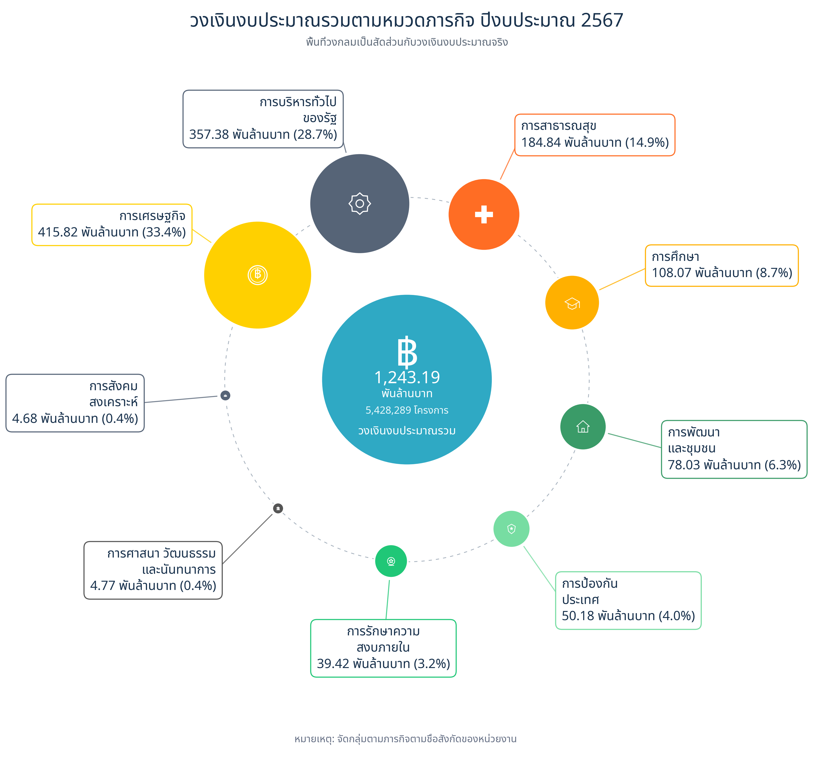](figure/10_budget_by_function_with_icons_2567.png) | [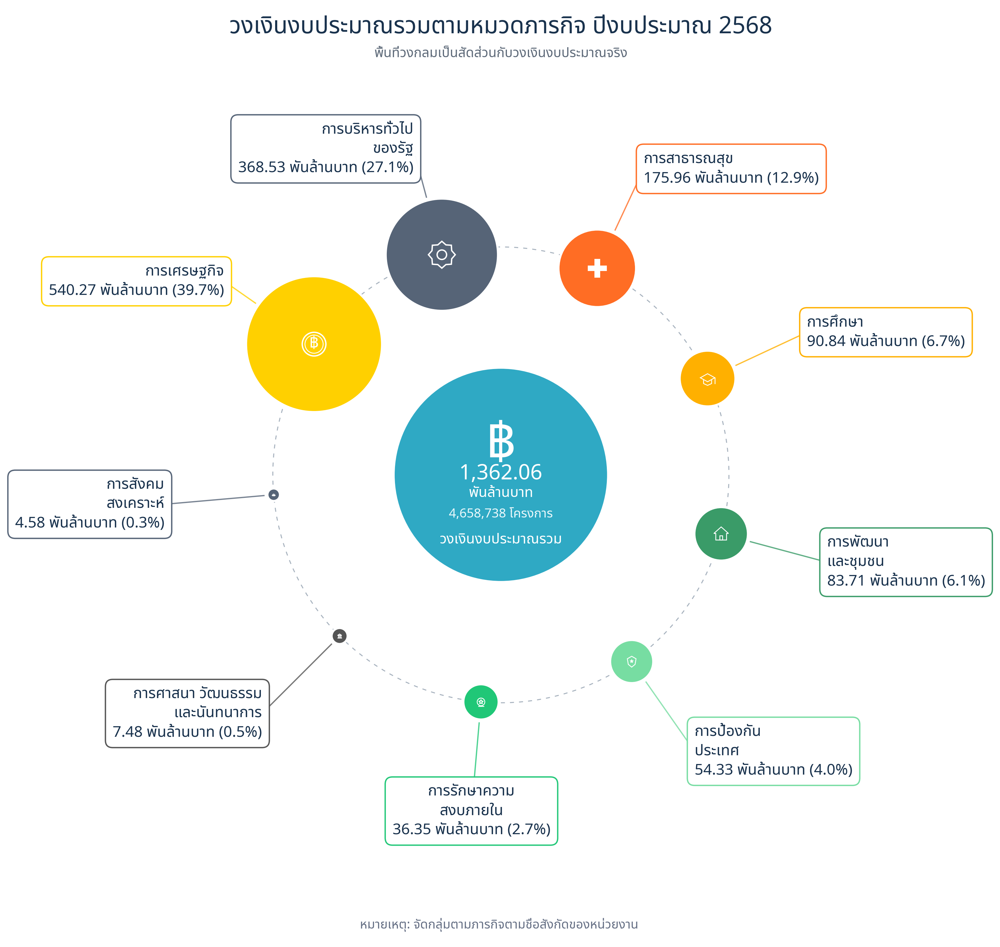](figure/10_budget_by_function_with_icons_2568.png) | [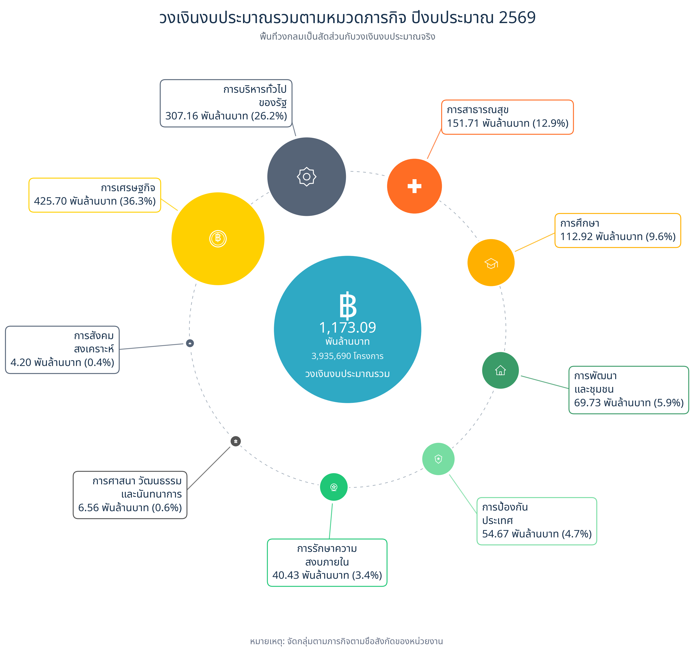](figure/10_budget_by_function_with_icons_2569.png) |

<em>ภาพที่ 1–3 วงเงินงบประมาณรวมจำแนกตามหมวดภารกิจ ปีงบประมาณ พ.ศ. 2567 - 2569 </em>

<b>ดูภาพขยาย — ปีงบประมาณ พ.ศ. 2567</b>

 

  

<b>ดูภาพขยาย — ปีงบประมาณ พ.ศ. 2568</b>

 

  

<b>ดูภาพขยาย — ปีงบประมาณ พ.ศ. 2569 (ข้อมูล ณ 30 กรกฎาคม 2569)</b>

 

  

### 1.2. การจัดซื้อจัดจ้างจำแนกตามประเภทโครงการ

สำหรับการพิจารณาจำนวนกับมูลค่าของโครงการแต่ละประเภทตามประเภทงานที่ระบุไว้ใน พ.ร.บ. การจัดซื้อจัดจ้างและการบริหารพัสดุภาครัฐ พ.ศ. 2560 และกฎระเบียบที่เกี่ยวข้องาน สามารถแบ่งได้เป็น 8 ประเภท ได้แก่ งานซื้อ งานจ้างทำของ/จ้างเหมาบริการ งานจ้างก่อสร้าง งานเช่า งานจ้างออกแบบ งานจ้างที่ปรึกษา งานจ้างควบคุมงาน และงานจ้างออกแบบและควบคุมงานก่อสร้าง (**ภาพที่ 4-6**)

| ปีงบประมาณ พ.ศ. 2567 | ปีงบประมาณ พ.ศ. 2568 | ปีงบประมาณ พ.ศ. 2569* (ข้อมูล ณ 30 กรกฎาคม 2569) |
| :---: | :---: | :---: |
| [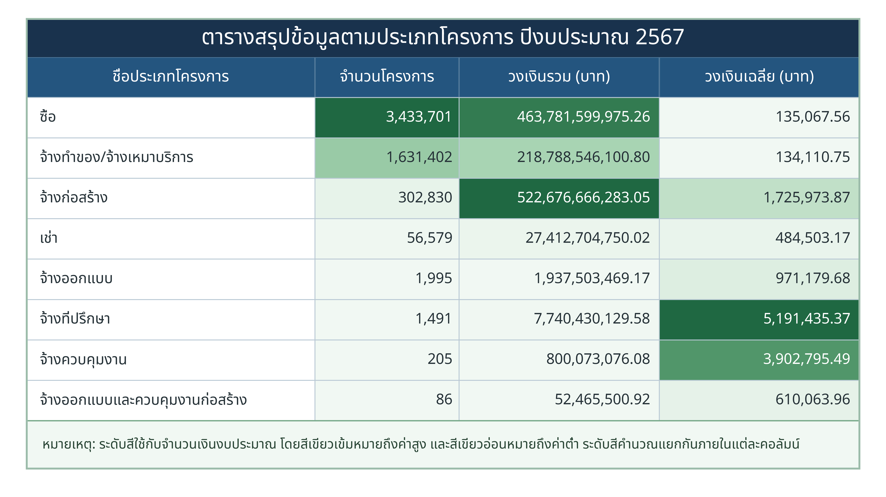](figure/03_project_type_summary_table_2567.png) | [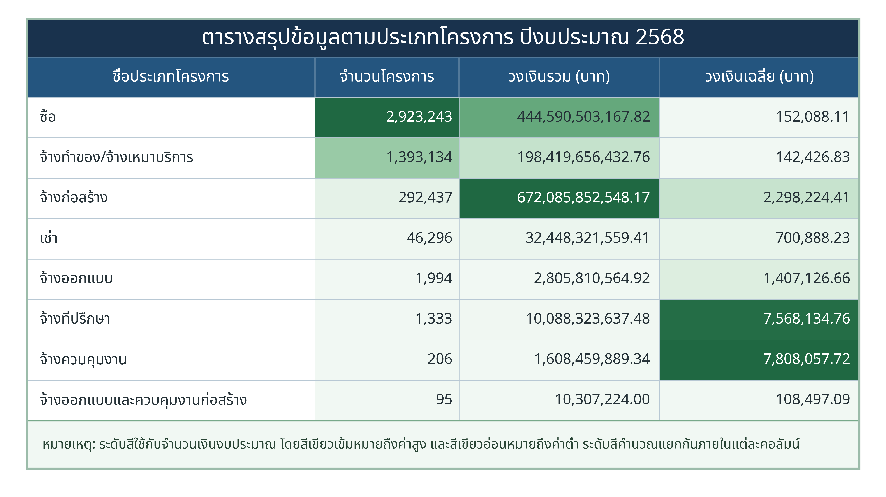](figure/03_project_type_summary_table_2568.png) | [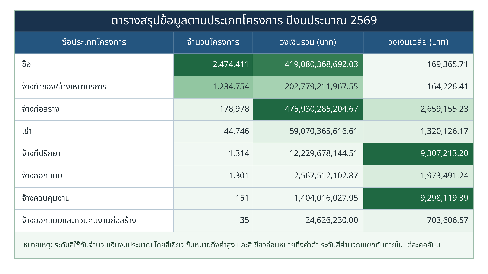](figure/03_project_type_summary_table_2569.png) |

<em>ภาพที่ 4–6 จำนวนโครงการ วงเงินรวม และวงเงินเฉลี่ย จำแนกตามประเภทโครงการ ช่วงปีงบประมาณ พ.ศ. 2567 - 2569 (คลิกที่ภาพเพื่อดูขนาดเต็ม)</em>

<b>ดูภาพขยาย — ปีงบประมาณ พ.ศ. 2567</b>

 

  

<b>ดูภาพขยาย — ปีงบประมาณ พ.ศ. 2568</b>

 

  

<b>ดูภาพขยาย — ปีงบประมาณ พ.ศ. 2569 (ข้อมูล ณ 30 กรกฎาคม 2569)</b>

 

  

ผลการจำแนกพบว่า **ประเภทของงานที่มีจำนวนโครงการที่มีจำนวนมากที่สุดไม่สอดคล้องกับประเภทของงานที่มีวงเงินรวมสูงที่สุด** หรือ กล่าวได้ว่าจำนวนโครงการกับวงเงินงบประมาณในการจัดซื้อจัดจ้างรวมมิใช่งานประเภทเดียวกัน

- โครงการประเภท **ซื้อ** มีจำนวนมากที่สุดในทุกปี ระหว่าง 2.47–3.43 ล้านโครงการ
- โครงการ **จ้างทำของ/จ้างเหมาบริการ** อยู่ในลำดับถัดมา ระหว่าง 1.23–1.63 ล้านโครงการ
- **งานจ้างก่อสร้าง** มีจำนวน 178,978–302,830 โครงการ (ปี 2569 ข้อมูล ณ 30 กรกฎาคม 2569: 178,978 โครงการ) แต่มีวงเงินรวมในการจัดซื้อจัดจ้างสูงที่สุดในทุกปีที่ศึกษา สรุปได้ดังนี้

| ปีงบประมาณ | จำนวนโครงการก่อสร้าง | สัดส่วนจำนวนโครงการทั้งหมด | วงเงินก่อสร้างรวม | สัดส่วนวงเงินทั้งหมด | วงเงินเฉลี่ยต่อโครงการ |
| :---: | ---: | ---: | ---: | ---: | ---: |
| **2567** | 302,830 | 5.58% | 522.68 พันล้านบาท | 42.04% | 1.73 ล้านบาท |
| **2568** | 292,437 | 6.28% | 672.09 พันล้านบาท | 49.34% | 2.30 ล้านบาท |
| **2569*** (ข้อมูล ณ 30 กรกฎาคม 2569) | 178,978 | 4.55% | 475.93 พันล้านบาท | 40.57% | 2.66 ล้านบาท |

จำนวนโครงการงานจ้างก่อสร้างแม้จะคิดเป็นสัดส่วนเพียง 4.55 – 6.28% ของจำนวนโครงการทั้งหมด แต่มีมูลค่างานคิดเป็น 40.57 – 49.34% ของวงเงินรวม ดังนั้น คณะผู้ศึกษาจึงได้พิจารณาศึกษาจึงพิจารณาเลือกงานจ้างก่อสร้างเป็นหลักในการศึกษาในครั้งนี้ ทั้งนี้ เนื่องจากปริมาณข้อมูลมีเป็นจำนวนมาก ประกอบกับทรัพยากรอันจำกัด คณะผู้ศึกษาจึงพิจารณาเฉพาะงานจ้างก่อสร้างในปีงบประมาณ พ.ศ. 2569 มาใช้ในการศึกษา

### 1.3. การกระจายตัวของวงเงินสัญญาก่อสร้างสำหรับหน่วยงานที่มีสัญญามากที่สุด

**ภาพที่ 7** แสดงภาพการกระจายตัววงเงินต่อสัญญาสำหรับโครงการที่มีมูลค่าต่ำกว่า 1 ล้านบาท ของ **8 หน่วยงานที่มีจำนวนสัญญาก่อสร้างมากที่สุด** ในปีงบประมาณ พ.ศ. 2569 และภาพขยายสำหรับช่วง 300,000–600,000 บาท

[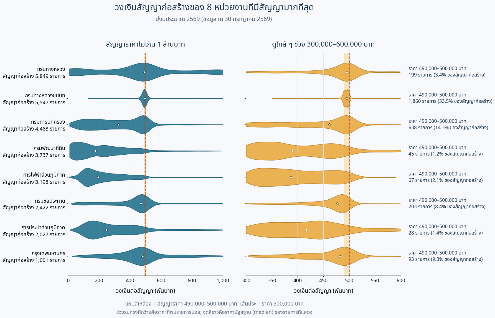](figure/violin_graph.png)

<em>ภาพที่ 7 การกระจายวงเงินสัญญาก่อสร้างของ 8 หน่วยงาน ปีงบประมาณ 2569 (คลิกที่ภาพเพื่อดูขนาดเต็ม)</em>

จากภาพดังกล่าวชี้ให้เห็นว่า **สัญญาก่อสร้างของบางหน่วยงานมีวงเงินกระจุกตัวอยู่ใกล้ 500,000 บาท** เช่น กรมทางหลวงชนบทมี 1,860 จาก 5,547 สัญญาอยู่ในช่วง 490,000–500,000 บาท (33.5%) แต่การกระจุกตัวของราคาเพียงอย่างเดียวยังไม่สามารถบ่งชี้ความผิดปกติได้ ทางคณะผู้จัดทำจึงได้ดำเนินการวิเคราะห์เพิ่มเติมตามรายละเอียดในหัวข้อถัดไป

---

## 2. การกระจายตัวของงานจัดซื้อจัดจ้างปีงบประมาณ พ.ศ.2569

> วัตถุประสงค์ | สำรวจรูปแบบการกระจายตัวของข้อมูลจัดซื้อจัดจ้างงานก่อสร้าง ปีงบประมาณ พ.ศ. 2569

จากงานจ้างก่อสร้างทั้งหมด จำนวน **179,716 โครงการ (CHECK!!!!!)** คณะผู้จัดทำวิเคราะห์ พบว่า มีจำนวนโครงการงานจ้างก่อสร้างที่ดำเนินการจัดจ้างด้วยวิธีเฉพาะเจาะจง และมีวงเงินไม่เกิน 500,000 บาท ทั้งหมดจำนวน **136,122 โครงการ** หรือคิดเป็นประมาณร้อยละ 75.74 ของจำนวนงานก่อสร้างทั้งหมด และมีประเด็นที่น่าสนใจเป็นพิเศษ คือ ในจำนวนนี้มีงานจ้างก่อสร้างที่มีวงเงินอยู่ในช่วง 490,000 - 500,000 บาท จำนวน **20,200 โครงการ** หรือ คิดเป็นคิดเป็นสัดส่วนกว่าร้อยละ 11.24 อาจเป็นสัญญาณที่ชี้ให้เห็นว่าการเลือกใช้วิธีเฉพาะเจาะจงไม่ได้ถูกจำกัดอยู่เพียงงานขนาดเล็กทั่วไป แต่มีโครงการจำนวนหนึ่่งที่อาจถูกออกแบบให้อยู่ใกล้กรอบวงเงินสูงสุดเท่าที่จะทำได้  (**ภาพที่ 8**)

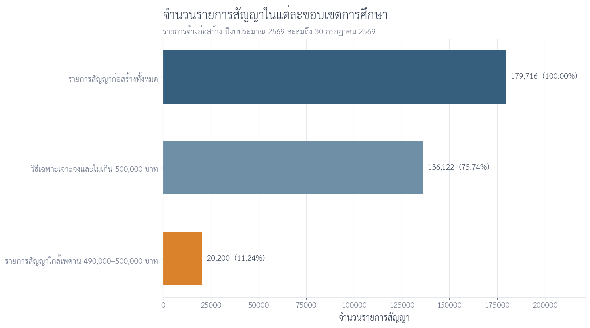

<em>ภาพที่ 8 แสดงจำนวนงานจ้างก่อสร้างทั้งหมด งานจ้างก่อสร้างที่ดำเนินการโดยวิธีเฉพาะเจาะจงที่มีวงเงินไม่เกิน 500,000 บาท และสัญญาที่มีวงเงินอยู่ในช่วงใกล้เคียง 500,000 บาท</em>

ความผิดปกตินี้ปรากฏชัดเจนที่สุดเมื่อดำเนินการวิเคราะห์การกระจายตัวของวงเงินรายสัญญาตามช่วงวงเงินรอบ 500,000 บาท (ภาพที่ 9) ซึ่งเผยให้เห็นรูปแบบจำนวนสัญญาเพิ่มขึ้นอย่างเด่นชัด (Cliff Edge Pattern) ในช่วงใกล้ระดับราคาสูงสุดตามเกณฑ์ (500,000 บาท)

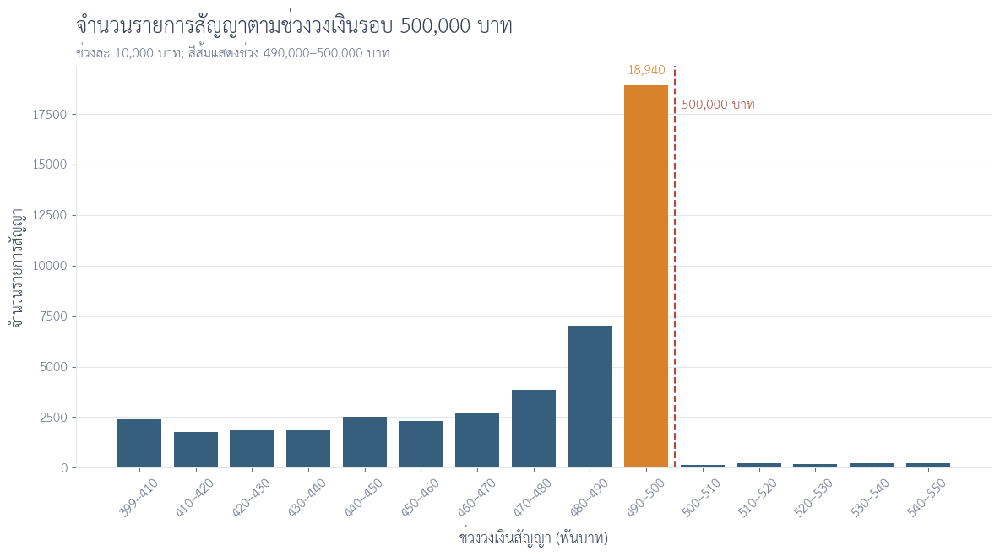

<em>ภาพที่ 9 แสดงการกระจายตัวของงานจ้างก่อสร้างที่ใช้วิธีเฉพาะเจาะจง </em>

เมื่อดูสัญญาใกล้เพดานทั้งหมด 20,450 รายการ พบว่า 20,200 รายการ หรือ 98.78% ใช้วิธีเฉพาะเจาะจง ส่วน e-bidding มี 238 รายการ และวิธีคัดเลือก 12 รายการ

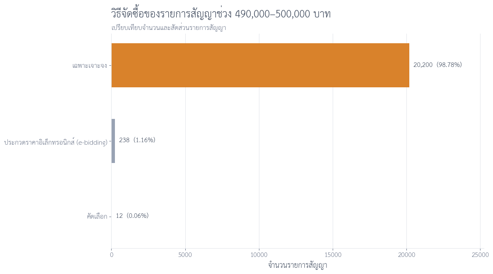

<em>ภาพที่ 10 แสดงจำนวนงานจ้างก่อสร้างทั้งหมด งานจ้างก่อสร้างที่ดำเนินการโดยวิธีเฉพาะเจาะจงที่มีวงเงินไม่เกิน 500,000 บาท และสัญญาที่มีวงเงินอยู่ในช่วงใกล้เคียง 500,000 บาท</em>

จากความเชื่อมโยงของทั้ง 3 ภาพ อาจพอสรุปได้ว่า การกำหนดวงเงินงานจ้างก่อสร้างของภาครัฐมีแนวโน้มในการกำหนดมูลค่าให้อยู่ต่ำกว่า 500,000 บาทเพียงเล็กน้อย อย่างไรก็ตามการกระจุกตัวของตัวจำนวนสัญญา อาจไม่สามารถสรุปเหตุและผลได้อย่างชัดเจน แต่อาจเป็นสัญญาณเตือนสำคัญ (Red Flag) ที่สะท้อนถึงความเสี่ยงต่อการหลีกเลี่ยงกระบวนการแข่งขันราคาซึ่งควรมีการศึกษาเพิ่มเติม

---
## 3. การวิเคราะห์รูปแบบงานจ้างก่อสร้างโดยวิธีเฉพาะเจาะจงภายใต้วงเงิน 500,000 บาท

ในหัวข้อนี้จะเป็นการศึกษารูปแบบการงานจ้างก่อสร้างโดยวิธีเฉพาะเจาะจงภายใต้วงเงิน 500,000 บาท คณะผู้จัดทำได้ดำเนินการปรับมิติการวิเคราะห์เพิ่มเติม โดยพิจารณาคู่ความสัมพันธ์ระหว่าง **ชื่อหน่วยงานผู้จัดจ้าง** และ **ชื่อผู้รับจ้าง** 
เพื่อเพื่อศึกษารูปแบบ (Pattern) สำหรับงานจ้างก่อสร้างที่มีวงเงินใกล็เคียงกับเกณฑ์ 500,000 บาท พบว่ามีโครงการทั้งสิ้นจำนวน 9,413 โครงการ ที่ปรากฎซ้ำอยู่ในคู่หน่วยงานและผู้รับจ้างจำนวน 1,580 คู่หน่วยงาน–ผู้รับจ้าง
ทั้งนี้ พบว่า 10 อันแรก (ภาพที่ 11) ซึ่งพบว่า ส่วนใหญ่เป็นงานจ้างก่อสร้างของกรมทางหลวงชนบทจำนวน 9 จาก 10 ลำดับ และมี 1 รายการเป็นงานจ้างก่อสร้างขององค์กรบริหารส่วนจังหวัดขอนแก่น

•	การครองสัดส่วนของกรมทางหลวงชนบท: ในบรรดา 10 อันดับแรก เป็นงานของกรมทางหลวงชนบทถึง 9 ลำดับ (มีเพียงอันดับที่ 6 ที่เป็นขององค์การบริหารส่วนจังหวัดขอนแก่น จำนวน 62 รายการ คิดเป็น 88.6%) 
•	ผู้รับจ้างที่ได้งานซ้ำสูงสุด: อันดับ 1 คือ กรมทางหลวงชนบท ร่วมกับ บริษัท ไบร์ท แอนด์ นอร์ท คอร์ปอเรชั่น จำกัด ได้รับงานใกล้เพดานสูงถึง 131 รายการ (คิดเป็นร้อยละ 86.2 ของงานทั้งหมดที่ได้จากหน่วยงานนี้) ตามมาด้วย ห้างหุ้นส่วนจำกัด ลำปาง ภาณุภัทร์ก่อสร้าง 2008 จำนวน 102 รายการ (ร้อยละ 82.3) และ ห้างหุ้นส่วนจำกัด เอส แอนด์ ซี แพรฟฟิค จำนวน 92 รายการ (ร้อยละ 92.9) 
•	สัดส่วนการได้งานใกล้เพดานแบบเบ็ดเสร็จ: บางคู่สัญญามีสัดส่วนงานใกล้เพดานสูงถึงร้อยละ 100 เต็มของสัญญาที่ได้ เช่น ห้างหุ้นส่วนจำกัด พยุหะการจราจร (64 รายการ) และ ห้างหุ้นส่วนจำกัด พี.อาร์.ซี.ทราฟฟิค (50 รายการ) ขณะที่ บริษัท บีพีเค โรด เซฟตี้ อีควิปเม้นท์ จำกัด อยู่ที่ร้อยละ 96.2 (50 รายการ) 

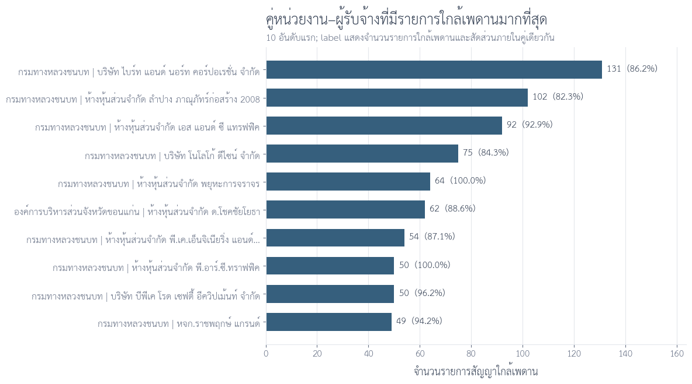

<em>ภาพที่ 11 แสดงจำนวนงานจ้างก่อสร้างทั้งหมด งานจ้างก่อสร้างที่ดำเนินการโดยวิธีเฉพาะเจาะจงที่มีวงเงินไม่เกิน 500,000 บาท และสัญญาที่มีวงเงินอยู่ในช่วงใกล้เคียง 500,000 บาท</em>

<b>ดูแผนที่ประกอบ — แผนที่การกระจายโครงการของกลมทางหลางชนบทและผู้รับจ้างที่ top 3 ที่ได้งานซ้ำในช่วง 490,000–500,000 บาท</b>

 

  <a href="figure/map3.png">
    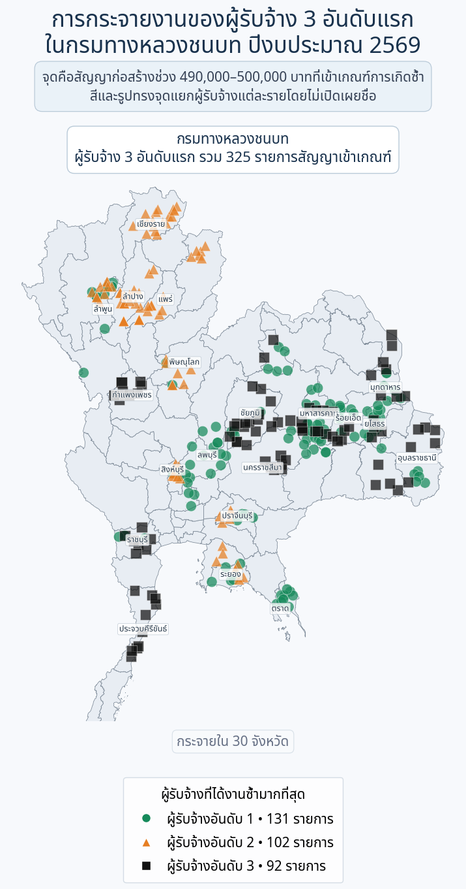
  </a>

<em>ภาพที่ 12 มุมมองเชิงพื้นที่ของกลมทางหลวงชนบทและผู้รับจ้างที่ได้รับงานซ้ำ 3 อันดับแรก</em>

Pattern 1 ครอบคลุม 46.60% ของรายการใกล้เพดาน จึงเหมาะเป็นตัวชี้ “พื้นที่เสี่ยงกว้าง” มากกว่าจะใช้ตัดสินลำพัง

---

## 4. ใช้สองสัญญาณร่วมกันเพื่อลดการหว่านแห
### 4.1. นิยามเกณฑ์ที่ใช้

| Flag | เกณฑ์ | บทบาทในการวิเคราะห์ |
|---|---|---|
| Pattern 1 | คู่ชื่อหน่วยงาน + ผู้รับจ้างเดียวกัน มีรายการวงเงิน 490,000–500,000 บาทอย่างน้อย 3 รายการ | ค้นหารูปแบบซ้ำใกล้เพดาน |
| Pattern 2 | ผู้รับจ้างมีอย่างน้อย 10 รายการ และครอง ≥80% ทั้งสัดส่วนจำนวนรายการและมูลค่าในหน่วยงาน | ค้นหาการกระจุกตัวสูง |
| Priority Review | Pattern 1 และ Pattern 2 เป็นจริงพร้อมกัน | จัดลำดับตรวจสอบเอกสาร |
| จังหวัด | แสดงและจัดเรียงผลลัพธ์เช่นเดียวกับ grain อื่น | ใช้เป็นบริบทเท่านั้น ไม่เข้า criteria |
| หน่วยงานย่อย | ไม่นำมาใช้ | ตัด mapping และ grain นี้ออก เพราะส่วนใหญ่ซ้ำกับหน่วยงาน |

ตัวเลข 3, 10 และ 80% เป็น **analyst-defined screening thresholds** ไม่ใช่เกณฑ์ทางกฎหมาย สามารถทำ sensitivity analysis เพิ่มเติมเพื่อดูว่าผลลัพธ์เปลี่ยนอย่างไรเมื่อปรับ threshold

จากสัญญาก่อสร้างทั้งหมด **179,716 รายการ** เราพบรายการที่อยู่ในขอบเขตวิธีเฉพาะเจาะจงและวงเงินไม่เกิน 500,000 บาท **136,122 รายการ** ภายในกลุ่มนี้มีสัญญาใกล้เพดาน 490,000–500,000 บาท **20,200 รายการ** เมื่อใช้สัญญาณ “คู่หน่วยงาน–ผู้รับจ้างซ้ำ” และ “ผู้รับจ้างครองสัดส่วนสูงในหน่วยงาน” ร่วมกัน เหลือ **161 รายการ** สำหรับตรวจเอกสารเป็นลำดับแรก

| จุดคัดกรอง | จำนวนรายการ | ความหมาย |
|---|---:|---|
| สัญญาก่อสร้างทั้งหมด | 179,716 | ฐานข้อมูลเริ่มต้น |
| วิธีเฉพาะเจาะจง และวงเงิน ≤ 500,000 บาท | 136,122 | ขอบเขตการวิเคราะห์ |
| วงเงิน 490,000–500,000 บาท | 20,200 | กลุ่มใกล้เพดาน |
| เข้าเกณฑ์ Pattern 1 | 9,413 | คู่หน่วยงาน–ผู้รับจ้างมีรายการใกล้เพดานซ้ำ |
| เข้าเกณฑ์ Pattern 2 | 1,343 | ผู้รับจ้างมีสัดส่วนสูงในหน่วยงาน |
| เข้าเกณฑ์ทั้งสองแบบ | **161** | ลำดับแรกสำหรับตรวจเอกสาร |

Pattern 2 มองอีกมุมหนึ่ง: ผู้รับจ้างที่มีจำนวนสัญญาอย่างน้อย 10 รายการ และครองอย่างน้อย 80% ของทั้งจำนวนรายการและมูลค่างานภายในหน่วยงานนั้น เมื่อซ้อน Pattern 1 กับ Pattern 2 จำนวนรายการลดจากหลักพันเหลือ **161 รายการ**

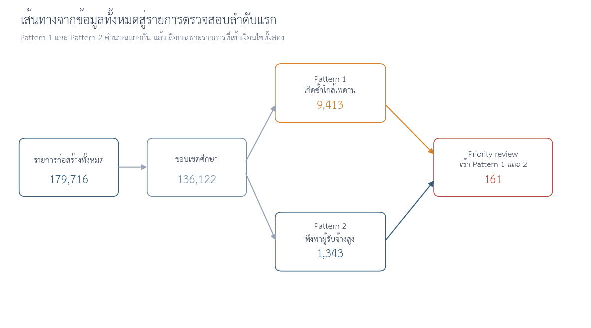

จุดตัดนี้คือรายการที่ควรตรวจเอกสารก่อน เพราะมีทั้งความถี่ใกล้เพดานในคู่เดิมและการกระจุกตัวของผู้รับจ้างในหน่วยงานเดียวกัน

### 4.2. ผลลัพธ์สุดท้ายคือคิวตรวจสอบที่ลงมือทำได้

กราฟต่อไปแสดงคู่หน่วยงาน–ผู้รับจ้างที่มีจำนวนรายการ Priority Review สูงสุด เพื่อให้ทีมตรวจสอบเริ่มจากกลุ่มที่มีหลักฐานเชิงข้อมูลหนาแน่นที่สุด

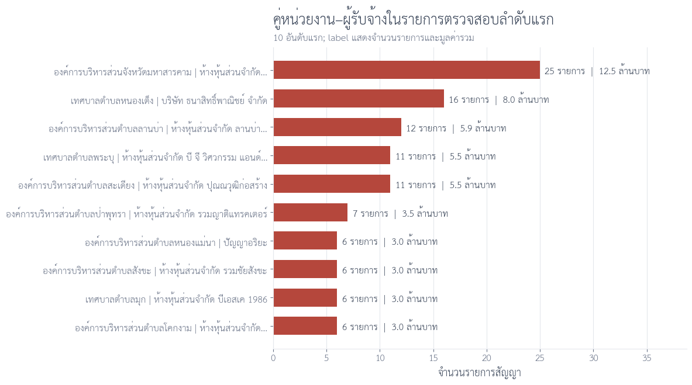

ควรตรวจเอกสารประกอบ เช่น ขอบเขตงาน ราคากลาง วันที่ประกาศและทำสัญญา ความเชื่อมโยงของโครงการ การแข่งขันเสนอราคา และประวัติผู้รับจ้าง ก่อนสรุปผลใด ๆ

---

## 5. สรุปผลการศึกษา ข้อเสนอแนะและข้อจำกัด
ผลการศึกษาข้อมุลผ่านการวิเคราะห์และสำรวจข้อมูล (Exploratory Data Analysis: EDA) ข้อมูลงานจ้างก่อสร้างภายโดยวิธีเฉพาะเจาะจงภายใต้วงเงิน 500,000 บาท พบว่าประมาณหนึ่งในห้าของจำนวนโครงการ มีค่างานสัญญาใกล้เคียงกับเกณฑ์วงเงินตามที่ 
พ.ร.บ. การจัดซื้อจัดจ้างและการบริหารพัสดุกำหนดไว้ (อยู่ในช่วง 490,000-500,000 บาท) ซึ่งอาจจะเป็นสัญญาณให้ผู้ที่มีหน้าที่กำกับดูแล ควรมีการศึกษา วิเคราะห์เชิงลึกเพิ่มเติมเชิงลึกว่าสาเหตุใดทำให้งานจ้างมีค่างานเข้าใกล้วงเงินที่กำหนด
นอกจากนี้ เมื่อวิเคราะห์การกระจายตัวของผู้รับจ้างสำหรับงานจ้างก่อสร้างด้วยวิธีเฉพาะเจาะจงภายใต้วงเงิน 500,000 บาท พบว่า มีผู้รับจ้างบางรายมีจำนวนการรับงานซ้ำในปริมาณที่ค่อนข้างสูงอย่างมีนัยสำคัญ 

ข้อเสนอแนะต่อการศึกษาในอนาคตควรมีการเพิ่มข้อมูลเชิงคุณภาพ เช่น บริบทในการจัดจ้าง รายละเอียดตามขอบเขตของงาน (TOR) คุณสมบัติผู้เสนอราคา หรือ คุณภาพการงานภายหลังงานแล้วเสร็จ จะช่วยให้การนำผลการศึกษาไปใช้ต่อยอดในอนาคตมีความเหมาะสมเพิ่มมากขึ้น
นอกจากนี้เห็นควรเสนอให้มีการเปิดเผยข้อมูลเชิงคุณภาพที่เกี่ยวข้องกับการใช้จ่ายภาครัฐ (Open Spending Data) ผ่านศูนย์กลางข้อมูลเปิดภาครัฐ ซึ่งจะเป็นการเปิดโอกาสสำคัญให้ทุกภาคส่วน ไม่ว่าจะเป็นภาควิชาการ ภาคเอกชน และภาคประชาสังคม เข้ามามีส่วนร่วมในการศึกษาเชิงวิเคราะห์ 
เพื่อค้นหาแนวทางเสริมสร้างประสิทธิภาพทางการคลัง พัฒนาขีดความสามารถของคู่สัญญา และสนับสนุนให้ระบบการจัดซื้อจัดจ้างภาครัฐเป็นฟันเฟืองขับเคลื่อนการเติบโตอย่างยั่งยืน

> **ข้อจำกัดในการศึกษา:**
> 1. การศึกษาในครั้งนี้เป็นเพียงการวิเคราะห์ข้อมูล (Exploratory Data Analysis: EDA) ซึ่งสามารถพิจารณาได้เฉพาะรูปแบบ (Pattern) ที่สามารถตรวจพบได้จากข้อมูลเชิงปริมาณ
> 2. ผลการศึกษาไม่ใช่ข้อพิสูจน์การทุจริตหรือการหลีกเลี่ยง พ.ร.บ. กฎหมาย และกฎระเบียบ
> 3. ชื่อหน่วยงานและผู้รับจ้างอาจมีความคลาดเคลื่อนจากการสะกดหรือรูปแบบการบันทึก

---
## เอกสารอ้างอิง
1. สำนักงานพัฒนารัฐบาลดิจิมัล (2569). ระบบข้อมูลการใช้จ่ายภาครัฐ (Thailand Government Spending). สืบค้นข้อมูลเมื่อวันที่ 30 สิงหาคม 2569. https://govspending.data.go.th/home
2. พระราชบัญญัติการจัดซื้อจัดจ้างและการบริหารพัสดุภาครัฐ พ.ศ. 2560. ราชกิจจานุเบกษา, เล่ม 134, ตอนที่ 24 ก, หน้า 13, วันที่ 24 กุมภาพันธ์ 2560
3. กระทรวงการคลัง. (2560). ระเบียบกระทรวงการคลังว่าด้วยการจัดซื้อจัดจ้างและการบริหารพัสดุภาครัฐ พ.ศ. 2560. ราชกิจจานุเบกษา, เล่ม 134, ตอนที่ 132 ก, หน้า 1-35.

## (ตัดทิ้งไหมครับ)คู่มือสำหรับผู้ที่ต้องการทดลองรันโค้ด

**เริ่มรันใน Google Colab**

1. เปิด [รายการ Notebook ทั้ง 7 ไฟล์และลิงก์ Open in Colab](notebook/README.md) แล้วเลือกหัวข้อที่สนใจตามตารางด้านล่าง สามารถเปิดดูรูปผลลัพธ์ที่ฝังไว้ใน Notebook ก่อนตัดสินใจรันได้
2. ตรวจว่าเข้าถึง [ข้อมูลบน Google Drive](https://drive.google.com/drive/folders/1ssVrUcY4TiYee9T2B0pwgr5SwvPp_lAq) ได้ หากเปิดไม่ได้ ให้ติดต่อเจ้าของข้อมูล
3. สำหรับ Notebook 01 ตั้งค่า `YEAR` เป็น 2567, 2568 หรือ 2569 ส่วน Notebook 02–07 ใช้ปี 2569
4. กด **Runtime → Run all** เพื่อคำนวณผลจากข้อมูลอีกครั้ง ค่าเริ่มต้นแสดงตารางและกราฟใน Colab โดยไม่ต้อง Mount Drive หรือกำหนดโฟลเดอร์บันทึกผล Notebook 07 จะบันทึก PNG/SVG ลง Drive เฉพาะเมื่อเปลี่ยน `SAVE_FIGURE = True`

| Notebook | ใช้ทำอะไร |
|---|---|
| [01 — ภาพรวม](notebook/01_overview_plot.ipynb) | ดูภาพรวมการจัดซื้อจัดจ้างปีที่เลือก |
| [02 — เตรียมข้อมูล](notebook/02_construction_data_preparation_2569.ipynb) | คัดเลือกและตรวจข้อมูลก่อสร้าง |
| [03 — สำรวจข้อมูล](notebook/03_construction_eda_2569.ipynb) | ดูการกระจายวงเงินและวิธีจัดซื้อจัดจ้าง |
| [04 — ตัวชี้วัด](notebook/04_construction_review_indicators_2569.ipynb) | วิเคราะห์ตัวชี้วัดระดับโครงการ |
| [05 — กราฟสรุป](notebook/05_construction_storytelling_visuals_2569.ipynb) | ดูกราฟจากไฟล์ผลวิเคราะห์โครงการก่อสร้าง |
| [06 — แผนที่](notebook/06_top_entities_longlat_maps_2569.ipynb) | ดูการกระจายงานของหน่วยงานและผู้รับจ้าง |
| [07 — Violin plot](notebook/07_construction_contract_value_violin_2569.ipynb) | เปรียบเทียบวงเงินสัญญาก่อสร้างของ 8 หน่วยงานที่มีสัญญามากที่สุด |

แต่ละ Notebook รันแยกได้ ไม่ต้องส่งไฟล์ผลลัพธ์ต่อกัน หากต้องการศึกษาขั้นตอนวิเคราะห์ แนะนำอ่าน 02 → 03 → 04 ส่วน 05–07 ใช้สำหรับดูกราฟและแผนที่

**ข้อมูลที่ใช้**

ข้อมูล CSV อยู่ใน Drive รวม 21 ไฟล์ ประมาณ 9.08 GB โดยแต่ละ Notebook ดาวน์โหลดเฉพาะไฟล์ที่ใช้ลงพื้นที่ชั่วคราวของ Colab; Notebook 07 สามารถตั้ง `LOCAL_DATA_DIR` ในเซลล์ตั้งค่าเพื่ออ่านไฟล์ที่มีอยู่แล้วใน Drive แทนการดาวน์โหลดได้

| Notebook | ข้อมูลที่ใช้ |
|---|---|
| 01 | `project_overview`, `07_top10_project_budget` และ `07_lower10_project_budget` ของปีที่เลือก |
| 02–04 | `2569-egp-contract-1.csv` ถึง `2569-egp-contract-8.csv` |
| 05 | `construction_contract_supplier_study_scope_2569.csv`, `construction_contract_review_indicators_2569.csv`, `repeated_near_500k_agency_supplier_2569.csv` และ `priority_review_contracts_2569.csv` |
| 06 | `construction_contract_review_indicators_2569.csv` |
| 07 | `construction_contract_supplier_study_scope_2569.csv` |

ดูชื่อไฟล์ ลิงก์ดาวน์โหลด และตำแหน่งต้นทางทั้งหมดใน [DATA_FILES.md](DATA_FILES.md) หรือดูรายการสำหรับตรวจสอบใน [data_manifest.json](data_manifest.json)

**ข้อควรทราบก่อนรัน**

- Notebook 01–06 ไม่บันทึกผล CSV/PNG/SVG ลง Drive และไม่เขียนทับรูปใน `figure/` เมื่อรันจบจะลบไฟล์พัก แต่เก็บ DataFrame ไว้ใช้งานต่อ ส่วน Notebook 07 ค่าเริ่มต้นแสดงผลอย่างเดียว และจะบันทึก PNG/SVG ลง Drive เมื่อ `SAVE_FIGURE = True`
- Notebook 02–04 อ่านต้นทางประมาณ 4.23 GB ต่อ Runtime จึงอาจใช้เวลา แนะนำแยก Runtime แต่ละ Notebook หาก RAM ไม่พอให้ Restart runtime แล้วรันใหม่
- Notebook 05–06 ใช้ไฟล์ผลวิเคราะห์คนละรุ่นกับขั้นตอนคำนวณใน Notebook 04 และ Notebook 06 ใช้เกณฑ์ 75% ซึ่งต่างจากเกณฑ์ 80% ของผล 161 รายการในเนื้อหาหลัก ตัวเลขจากการรันแยก Notebook จึงอาจไม่ตรงกันทุกจุด ดูรายละเอียดใน [คู่มือข้อมูล](DATA_FILES.md)
- หากดาวน์โหลดติดข้อจำกัดของ Drive ให้ดาวน์โหลดข้อมูลเองแล้วตั้ง `LOCAL_DATA_DIR` ตาม [คู่มือข้อมูล](DATA_FILES.md)

---

  

### Thailand Government Procurement Spending Analysis

การวิเคราะห์ข้อมูลการจัดซื้อจัดจ้างภาครัฐของประเทศไทย  
ปีงบประมาณ พ.ศ. 2567–2569

 

**Data Source**

Thailand Government Spending  
[https://govspending.data.go.th/](https://govspending.data.go.th/)

 

`Data Preprocessing` · `Data Cleaning` · `Exploratory Data Analysis` · `Data Visualization`

 

โครงการนี้จัดทำขึ้นเพื่อวัตถุประสงค์ด้านการศึกษาและการวิเคราะห์ข้อมูล

  

[**กลับสู่ด้านบน**](#top)

