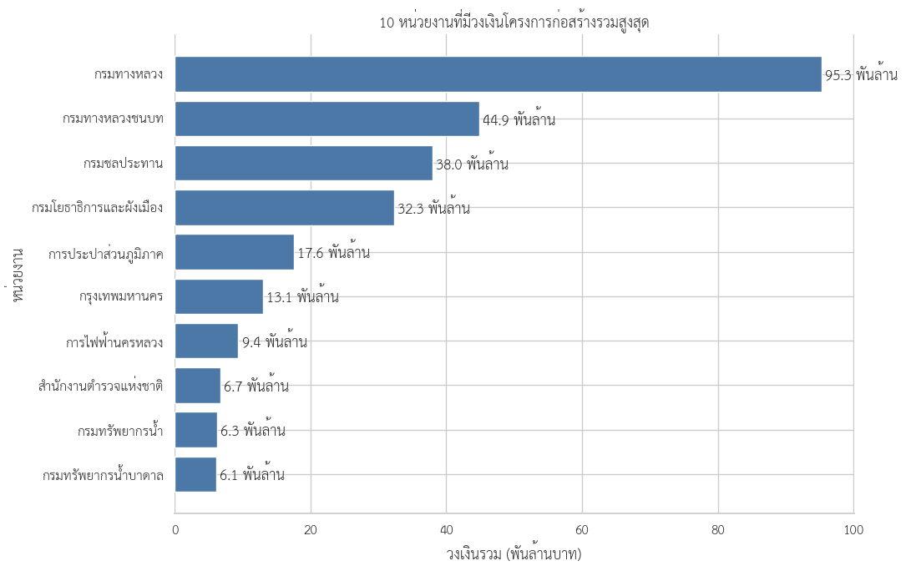

# การวิเคราะห์โครงการจ้างก่อสร้างจากข้อมูลจัดซื้อจัดจ้างภาครัฐ ปีงบประมาณ 2569

> DADS5001 Data Tools and Programming — Mini Project

โครงการนี้สำรวจข้อมูลสัญญาจัดซื้อจัดจ้างภาครัฐ (e-GP) เพื่อทำความเข้าใจโครงสร้างของโครงการจ้างก่อสร้าง และพัฒนาตัวชี้วัดสำหรับคัดกรองรายการที่ควรตรวจสอบเพิ่มเติม การวิเคราะห์มุ่งค้นหา “รูปแบบที่น่าสนใจในข้อมูล” ไม่ได้ใช้เพื่อตัดสินว่าหน่วยงานหรือผู้รับจ้างมีการทุจริต

README ฉบับนี้นำเสนอเฉพาะส่วน **โครงการจ้างก่อสร้าง ปีงบประมาณ 2569** ส่วนภาพรวมสัญญาจัดซื้อจัดจ้างปี 2567–2569 จะนำมาเชื่อมต่อในฉบับส่งงานภายหลัง

## คำถามของการวิเคราะห์

1. โครงการจ้างก่อสร้างมีขนาดและวิธีจัดซื้อจัดจ้างกระจายตัวอย่างไร
2. งบประมาณ ราคากลาง และราคาที่ตกลงมีความสัมพันธ์กันอย่างไร
3. หน่วยงานและผู้รับจ้างมีบทบาทหรือการกระจุกตัวในลักษณะใด
4. สามารถพัฒนาตัวชี้วัดที่โปร่งใสเพื่อจัดลำดับโครงการสำหรับตรวจสอบเพิ่มเติมได้หรือไม่

## ข้อมูลและขอบเขต

ข้อมูลต้นทางปีงบประมาณ 2569 ประกอบด้วยไฟล์ CSV จำนวน 8 ไฟล์ รวม 3,964,924 รายการ เมื่อกรอง `ชื่อประเภทโครงการ = 'จ้างก่อสร้าง'` พบ 180,079 รายการ หรือ 4.54% ของข้อมูลทั้งหมด

หนึ่งโครงการอาจมีมากกว่าหนึ่งแถวจากหลายสัญญาหรือหลายคู่สัญญา จึงใช้ `รหัสโครงการ` เป็นหน่วยวิเคราะห์หลัก หลังจัดข้อมูลให้อยู่ในระดับโครงการ เหลือโครงการไม่ซ้ำ 178,978 โครงการ ส่วนข้อมูลระดับสัญญายังคงใช้สำหรับตรวจสอบโครงสร้างคู่สัญญาและกรณีศึกษา

## การเตรียมข้อมูล

กระบวนการเตรียมข้อมูลประกอบด้วย:

- อ่านไฟล์ขนาดใหญ่แบบแบ่งชุดข้อมูล (chunk) เพื่อลดการใช้หน่วยความจำ
- กรองเฉพาะโครงการประเภทจ้างก่อสร้าง
- ตรวจจำนวนแถวก่อนและหลังการกรอง
- ตรวจโครงการที่ปรากฏมากกว่าหนึ่งแถว
- สร้างข้อมูลระดับโครงการโดยเก็บค่าที่คงที่ภายในแต่ละ `รหัสโครงการ`
- แยกแถวสมาชิกกิจการร่วมค้าออกจาก Supplier Entity เพื่อหลีกเลี่ยงการนับมูลค่าซ้ำ
- คำนวณส่วนต่างระหว่างงบประมาณ ราคากลาง และราคาที่ตกลง

## ผลการวิเคราะห์เชิงสำรวจ

### 1. การกระจายของวงเงินงบประมาณ

วงเงินงบประมาณมีการกระจายแบบเบ้ขวาอย่างชัดเจน โครงการส่วนใหญ่มีมูลค่าไม่สูง แต่มีโครงการมูลค่าสูงมากจำนวนเล็กน้อย ทำให้ค่าเฉลี่ยสูงกว่าค่ามัธยฐานมาก โดย 99% ของโครงการมีวงเงินไม่เกิน 32.50 ล้านบาท

เมื่อแบ่งตามช่วงวงเงิน พบว่า 76.34% ของโครงการมีงบประมาณไม่เกิน 500,000 บาท และช่วง 400,000–500,000 บาทมีสัดส่วนสูงที่สุด 25.09% นอกจากนี้ วงเงินที่พบมากที่สุดคือ 500,000 บาท จำนวน 6,523 โครงการ และมีรายการจำนวนมากอยู่ที่ 499,000, 498,000, 497,000, 496,000, 495,000 และ 490,000 บาท

### 2. งบประมาณ ราคากลาง และราคาที่ตกลง

ราคาที่ตกลงของโครงการส่วนใหญ่อยู่ใกล้หรือต่ำกว่างบประมาณและราคากลาง จุดส่วนใหญ่จึงเรียงตัวใกล้เส้นราคาเท่ากัน อย่างไรก็ตาม ยังพบค่าผิดสังเกตบางรายการซึ่งต้องแยกระหว่างปัญหาคุณภาพข้อมูลกับตัวชี้วัดด้านการจัดซื้อจัดจ้างก่อนตีความ

จากโครงการทั้งหมด 67.42% มีราคาที่ตกลงต่ำกว่างบประมาณ และ 77.81% ต่ำกว่าราคากลาง การใช้ค่าร้อยละเพียงอย่างเดียวอาจทำให้โครงการที่ราคากลางผิดสังเกตสร้างผลลัพธ์รุนแรงเกินจริง จึงตรวจคุณภาพราคากลางก่อนนำไปสร้างตัวชี้วัด

### 3. ความแตกต่างตามวิธีจัดซื้อจัดจ้าง

วิธีเฉพาะเจาะจงมีจำนวนมากที่สุด คิดเป็น 76.35% ของโครงการ แต่มีสัดส่วนวงเงินรวมเพียง 9.33% และมีวงเงินมัธยฐาน 283,000 บาท ในทางตรงกันข้าม e-bidding มี 21.22% ของโครงการ แต่ครองวงเงินรวม 83.34% และมีวงเงินมัธยฐานประมาณ 3.10 ล้านบาท

ผลดังกล่าวแสดงว่า “จำนวนโครงการ” และ “มูลค่าโครงการ” ให้ภาพคนละด้าน วิธีเฉพาะเจาะจงเป็นกลไกหลักของโครงการขนาดเล็ก ขณะที่ e-bidding รองรับมูลค่างบประมาณส่วนใหญ่

### 4. หน่วยงานที่มีบทบาทสูง

กรมทางหลวงมีทั้งจำนวนโครงการและวงเงินรวมสูงที่สุด โดยมี 5,774 โครงการ วงเงินรวมประมาณ 95.33 พันล้านบาท หรือ 20.03% ของวงเงินทั้งหมด รองลงมาในด้านมูลค่าคือกรมทางหลวงชนบทและกรมชลประทาน

กรุงเทพมหานครมีจำนวนโครงการ 4,825 โครงการ แต่มีวงเงินรวมสูงถึง 177.54 พันล้านบาทเมื่อวิเคราะห์ตามจังหวัด สะท้อนว่าการเปรียบเทียบเชิงพื้นที่ควรพิจารณาทั้งจำนวนโครงการ มูลค่ารวม และขนาดโครงการมัธยฐานควบคู่กัน

### 5. การกระจายมูลค่าในกลุ่มผู้รับจ้าง

หลังจัดกิจการร่วมค้าให้เป็น Supplier Entity อย่างเหมาะสม พบผู้รับจ้าง 33,570 ราย ผู้รับจ้างรายใหญ่ที่สุดครองมูลค่า 1.51% ขณะที่ 10 อันดับแรกครอง 7.42% และ 100 อันดับแรกครอง 27.83%

ผู้รับจ้าง 1,870 ราย หรือ 5.57% ครองมูลค่า 80% ของทั้งหมด จึงพบการกระจุกตัวในเชิง Pareto แต่ไม่ได้ถูกครองโดยผู้รับจ้างรายเดียว การพิจารณาความกระจุกตัวจึงควรเจาะลงไปที่ความสัมพันธ์ระหว่าง “หน่วยงานย่อย–ผู้รับจ้าง”

## ตัวชี้วัดเพื่อการตรวจสอบเพิ่มเติม

ตัวชี้วัดถูกแยกเป็นสองกลุ่ม เพื่อไม่ให้ปัญหาคุณภาพข้อมูลถูกตีความเป็นความผิดปกติด้านการจัดซื้อจัดจ้าง

### ตัวชี้วัดคุณภาพข้อมูล

พบ 822 โครงการที่มีประเด็นด้านคุณภาพข้อมูลอย่างน้อยหนึ่งข้อ ได้แก่:

- ราคากลางสูญหายหรือมีสัดส่วนผิดสังเกตเมื่อเทียบกับงบประมาณ
- ผลรวมมูลค่าระดับ Supplier Entity ไม่สอดคล้องกับยอดระดับโครงการเกินค่าคลาดเคลื่อน 1 บาท

ในขั้นแรกพบยอดไม่ตรงกัน 362 โครงการ แต่ทั้งหมดมีหลายแถวและหลายผู้รับจ้าง เมื่อตรวจโครงสร้างกิจการร่วมค้า พบแถวสมาชิก 710 แถวใน 362 โครงการ มูลค่ารวม 13.06 พันล้านบาท หลังตัดแถวสมาชิกออก เหลือยอดไม่ตรงกันเพียง 11 โครงการจาก 178,978 โครงการ

### ตัวชี้วัดด้านการจัดซื้อจัดจ้าง

กำหนดตัวชี้วัด 3 มิติ:

1. **ส่วนต่างของราคาอย่างมีสาระสำคัญ**  
   ราคาที่ตกลงสูงกว่างบประมาณหรือราคากลางที่ใช้งานได้มากกว่า 10,000 บาทและมากกว่า 1% พบ 406 โครงการ

2. **รูปแบบโครงการเฉพาะเจาะจงใกล้ 500,000 บาทที่เกิดซ้ำ**  
   โครงการวงเงิน 490,000–500,000 บาท ที่มีหน่วยงานย่อย ผู้รับจ้าง และวันที่เกิดรายการเดียวกันตั้งแต่ 3 โครงการขึ้นไป พบ 5,623 โครงการ หรือ 3.14% ของโครงการทั้งหมด

3. **การกระจุกตัวสูงของผู้รับจ้างภายในหน่วยงานย่อย**  
   ผู้รับจ้างได้รับอย่างน้อย 10 โครงการ และครองอย่างน้อย 75% ทั้งจำนวนโครงการและมูลค่าในหน่วยงานย่อย พบ 55 ความสัมพันธ์ ครอบคลุม 886 โครงการ

## การจัดลำดับโครงการ

| ลำดับการตรวจสอบ | เงื่อนไข | จำนวนโครงการ | สัดส่วน |
|---|---|---:|---:|
| High priority | พบตัวชี้วัด 2 มิติ | 103 | 0.06% |
| Standard review | พบตัวชี้วัด 1 มิติ | 6,709 | 3.75% |
| No indicator | ไม่พบตัวชี้วัด | 172,166 | 96.19% |

ไม่พบโครงการที่ผ่านตัวชี้วัดครบทั้ง 3 มิติ ในกลุ่ม High priority จำนวน 103 โครงการ มี 102 โครงการที่พบทั้งรูปแบบใกล้ 500,000 บาทและการกระจุกตัวของผู้รับจ้าง อีก 1 โครงการพบทั้งรูปแบบใกล้ 500,000 บาทและส่วนต่างราคา

## กรณีศึกษา

### กรณีที่ 1: โครงการเดียวมีสัญญา 2 ฉบับ

โครงการรหัส `69049225316` มีงบประมาณและราคากลาง 491,000 บาท แต่มีราคาที่ตกลงรวม 980,000 บาท ข้อมูลระดับสัญญาพบสัญญา 2 ฉบับกับผู้รับจ้างรายเดียวกัน ฉบับละ 490,000 บาท ยอดรวมจึงตรงกับยอดระดับโครงการ แต่สูงกว่างบประมาณเริ่มต้นเกือบสองเท่า

ควรตรวจเอกสารขอบเขตงาน เหตุผลของสัญญาฉบับที่สอง การอนุมัติงบประมาณเพิ่มเติม และประวัติการแก้ไขโครงการก่อนสรุปสาเหตุ

### กรณีที่ 2: โครงการลักษณะคล้ายกัน 65 โครงการในวันเดียวกัน

กลุ่มที่ใหญ่ที่สุดเป็นโครงการระบบน้ำบาดาลของสำนักงานทรัพยากรธรรมชาติและสิ่งแวดล้อมจังหวัดมุกดาหาร มีบริษัท บ้านบุ่ง วิศวกรรม จำกัด เป็นผู้รับจ้าง พบ 65 โครงการในวันที่ 29 ธันวาคม 2568 งบประมาณส่วนใหญ่ 498,000 บาท และราคาที่ตกลงส่วนใหญ่ 489,900 บาท คิดเป็นงบประมาณรวมประมาณ 32.37 ล้านบาท

โครงการดำเนินการต่างหมู่บ้านและตำบล จึงอาจมีเหตุผลด้านพื้นที่หรือแผนดำเนินงาน การตรวจสอบต่อควรใช้แผนจัดซื้อ ขอบเขตงาน แหล่งงบประมาณ ข้อมูลผู้เสนอราคารายอื่น และเหตุผลในการแยกโครงการ

## ข้อจำกัด

- ข้อมูลครอบคลุมเฉพาะปีงบประมาณ 2569 จึงยังวิเคราะห์ความต่อเนื่องข้ามปีไม่ได้
- มีเฉพาะข้อมูลผู้ชนะ ไม่มีรายชื่อผู้เสนอราคารายอื่น จำนวนผู้แข่งขัน และราคาที่เสนอ
- โครงการเฉพาะเจาะจงไม่มีวันที่ประกาศ จึงใช้วันที่เกิดรายการในการจับกลุ่ม
- การกระจุกตัวอาจเกิดจากความเชี่ยวชาญ ทำเล หรือจำนวนผู้ประกอบการในพื้นที่
- ความต่างของราคาอาจเกิดจากการแก้ไขขอบเขตงาน สัญญาเพิ่มเติม หรือการบันทึกข้อมูล
- เกณฑ์ทั้งหมดเป็นเกณฑ์คัดกรองจากรูปแบบในข้อมูล ไม่ใช่เกณฑ์ตัดสินการปฏิบัติตามกฎหมาย

## สรุป

การวิเคราะห์ลดขอบเขตจากโครงการจ้างก่อสร้าง 178,978 โครงการ เหลือ 6,812 โครงการที่พบตัวชี้วัดอย่างน้อยหนึ่งมิติ และเหลือ 103 โครงการสำหรับตรวจสอบเป็นลำดับแรก จุดสำคัญคือการแยกปัญหาคุณภาพข้อมูลออกจากรูปแบบด้านการจัดซื้อจัดจ้าง และการใช้หลายมิติร่วมกันแทนการสรุปจากตัวเลขผิดสังเกตเพียงค่าเดียว

ผลลัพธ์นี้เป็น **เครื่องมือจัดลำดับการตรวจสอบ** ไม่ใช่หลักฐานหรือข้อสรุปว่ามีการทุจริต

## Notebook และไฟล์ผลลัพธ์

| Notebook | หน้าที่ |
|---|---|
| [02_construction_data_preparation_2569.ipynb](02_construction_data_preparation_2569.ipynb) | อ่านข้อมูลขนาดใหญ่ กรองงานก่อสร้าง และสร้างชุดข้อมูลสำหรับวิเคราะห์ |
| [03_construction_eda_2569.ipynb](03_construction_eda_2569.ipynb) | วิเคราะห์งบประมาณ ราคา วิธีจัดซื้อ หน่วยงาน พื้นที่ และผู้รับจ้าง |
| [04_construction_review_indicators_2569.ipynb](04_construction_review_indicators_2569.ipynb) | ตรวจคุณภาพข้อมูล สร้างตัวชี้วัด จัดลำดับ และศึกษารายกรณี |

ไฟล์ผลลัพธ์หลักประกอบด้วย `project_review_indicators_2569.csv`, `high_priority_projects_2569.csv`, `repeated_near_500k_clusters_2569.csv` และ `high_supplier_concentration_2569.csv` โดยไม่จัดเก็บไฟล์ข้อมูลขนาดใหญ่ไว้ใน GitHub
